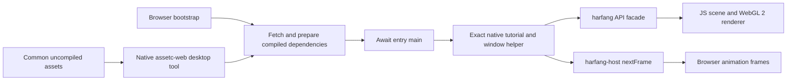

# HarfangJS Web: Running the Native Many-Nodes Tutorial Unchanged

Date: 2026-10-05

Status: feasibility study and proposed implementation plan. A dedicated experiment
and executable baseline probe are provided; the compatibility runtime, original
shadowed tutorial and standalone Web compiler are **not implemented by this work**.

## 1. Decision

**The target is feasible in principle, but copying the file into today's Web
runtime is insufficient.** The work spans native-shaped API adapters, browser
hosting, Web program assets, spotlight shadows and scene/rendering performance.
Recompiling assets alone cannot close these gaps.

Recommend an isolated experiment around the exact native
[`scene_many_nodes.js`](../tutorials/scene_many_nodes.js), progressively building
the Web implementation behind its existing calls. Keep native HG JS behavior as
the JavaScript reference and preserve the established direction:
**HG Lua -> native HG JS -> Web HG JS**. Browser limits must not redefine native
functionality. This follows the
[compatibility policy](../../harfangjs/docs/contract.md#compatibility-priorities).

The useful common surface is **application source, API semantics and logical asset
names**, backed by different host services, renderers and compiled asset formats.
It is neither identical implementation machinery nor every native API at once.

The dedicated workspace is
[`harfangjs/experiments/native-scene-many-nodes/`](../../harfangjs/experiments/native-scene-many-nodes/README.md).
It is separate from the existing Web tutorial gallery and its reduced examples.

## 2. What “Copy It Unchanged” Means

There are three distinct claims to validate:

| Claim | Acceptance |
| --- | --- |
| Unchanged entry | The copied `scene_many_nodes.js` has exactly the original bytes. Its imports and `main(options)` remain unchanged. No rewriting, transpilation or injected application branches. |
| Unchanged module pair | The imported `js/window.js` also has exactly the original bytes. Browser implementations of `harfang` and `harfang-host` supply the required services. This is the recommended final experiment target. |
| Equivalent tutorial behavior | All 10,201 spheres, the original camera, ground, materials, wave motion and requested spotlight shadows are retained. Host timing/presentation differences are documented, and rendering is compared within declared tolerances. |

Matching source hashes does not by itself establish matching behavior or speed.
Conversely, a similar image from an independently rewritten Web example does not
establish source compatibility.

The eventual user workflow should be: place the native entry in the experiment's
input location, run asset preparation and packaging, then open the generated page.
The tooling stages dependencies automatically. Copying only the entry into an
otherwise empty directory cannot resolve its relative `./js/window.js` import.
The reusable browser shell, import map and compiled assets are prerequisites.

## 3. Baseline Evidence

The inspected baseline is `harfang3d` revision `006688ce9aafab2ecd65301ed53634e741e269e0`
and `harfangjs` revision `52d61c77b9dc2eaf3b359c289e14555b150b8493`.

The new [probe](../../harfangjs/experiments/native-scene-many-nodes/probe.py) was run
in Chromium `154.0.8037.97`, with an additional non-rendering probe of the installed
native `hgjs` executable. It observed:

- 43 distinct `hg.*` names referenced by the entry and window helper; 31 are absent
  from the current Web module. This is an export-presence inventory, not a count
  of 31 equally difficult features. It includes optional helper branches.
- `Scene.Update` and `Scene.Clear` are absent; `Scene.dispose` exists.
- Node creation fails with `RESOURCE_BUDGET` at 10,000 nodes.
- With `harfang` mapped to the current Web module, importing the exact copied
  module pair fails because `harfang-host` has no browser resolution.
- Web transform getters and setters copy position values as needed by the wave
  loop. The selected three-argument `Vec4` cases also agree with native HG JS.
- Native reset values are `RF_VSync = 128` and `RF_MSAA4X = 32`. The native scene
  remains reusable after `Clear()`; Web terminal `dispose()` is not its equivalent.

The generated [baseline report](../../harfangjs/build/experiments/native-scene-many-nodes/baseline-probe.json)
records source hashes, export types, selected semantic checks and the native
executable hash. It is a local generated artifact, reproducible with the command
in section 9. No full tutorial rendering, GPU benchmark or new asset compilation
was performed for this study.

### Actual workload

The following counts and requirements come from the native source, rather than a
successful execution of that source in the browser:

| Requirement | Original tutorial |
| --- | --- |
| Moving objects | 101 x 101 = 10,201 spheres; every transform is updated each frame |
| Total scene nodes | 10,204: spheres, ground, camera and spotlight |
| Object components | 10,202: one per sphere and one ground object |
| Models | Two runtime-generated models: radius-0.1 sphere with subdivisions `(8, 16)`; cube dimensions `(60, 0.001, 60)` |
| Materials | Default/Phong family, red spheres, white ground, authored specular colors |
| Camera | Position `(15.5, 5, -6)`, rotation `(0.4, -1.2, 0)`, near/far `0.01/100`; native helper default FOV 45 degrees |
| Light | One spotlight; radius 0, inner/outer angles 5/30 degrees, map shadows, bias `0.000005`; helper default shadow range `0.1/100` |
| Pipeline | `CreateForwardPipeline(4096)` |
| Presentation | Default 1280 x 720, `RF_VSync | RF_MSAA4X` |
| Explicit external asset | `core/shader/default.hps` |
| Frame contract | `await nextFrame(window)` supplies `dtNs`; the helper calls `draw`, then `hg.Frame()` |

This is a programmatic scene. It does not load a `.scn`, `.geo`, texture, HDR probe,
physics world, authored animation or script VM. A complete scene/texture/HDR compiler
is still required by the broader roadmap, but those features are not prerequisites
for this particular tutorial. Procedural models must work at runtime; assetc cannot
replace their missing APIs without introducing tutorial-specific substitution.

The existing
[`scene_many_nodes.small.no_shadows`](../../harfangjs/examples/tutorials/lighting-application.js)
uses 121 spheres, a different camera, compiled sphere geometry and one shared
object component. It omits shadows. It remains useful W2 evidence, but cannot
serve as the unchanged-entry or full-workload acceptance gate.

## 4. Compatibility Gaps and Proposed Solutions

The authoritative sources for this table are the native
[window helper](../tutorials/js/window.js),
[bindings](../binding/bind_harfang.py),
[Web exports](../../harfangjs/src/index.js),
[scene implementation](../../harfangjs/src/scene/scene.js) and
[Web renderer](../../harfangjs/src/render/static.js).

| Area | Current problem | Proposed Web implementation |
| --- | --- | --- |
| Module entry | No automatic invocation of exported `main`; `harfang-host` is unresolved | Browser bootstrap imports the staged module and awaits `main(options)` after readiness; import map selects both host modules. |
| Window lifecycle | `InputInit`, `WindowSystemInit`, `NewWindow`, `RenderInit` and their shutdown counterparts are absent | One session-owned canvas/window handle, synchronous setup after asynchronous preparation, and deterministic cleanup. Preserve the helper's call order and boolean renderer-init result. |
| Scheduling/input | The current Web runner uses callbacks; native uses `nextFrame` and `ReadKeyboard` | Supply one animation-frame scheduler returning `{closed, dtNs}` with BigInt nanoseconds; snapshot input before resolving it. Map native keyboard tokens to DOM input internally. |
| Resource paths | `AddAssetsFolder('resources_compiled')` assumes a local compiled folder | Register a logical mount backed by a preloaded Web manifest and its package base URL. Do not interpret it as arbitrary local filesystem access. |
| Pipeline/resources | `CreateForwardPipeline`, `DestroyForwardPipeline`, `PipelineResources`, `GetForwardPipelineInfo` are absent | Native-shaped descriptors and resource registries over Web rendering services. Implement ownership and reference validity, not only names. |
| Program lookup | No `LoadPipelineProgramRefFromAssets`; programs are currently selected from a hardcoded family registry | Resolve a compiled program descriptor by its unchanged logical `.hps` name. Validate adapter version/capabilities and return a synchronous program reference from prepared data. |
| Materials | Lowercase `createMaterial(JSON)` exists; native `CreateMaterial(program, name, value, name, value)` does not | Implement the used native overload over the material backend, preserving values, defaults and native copy/ownership semantics. |
| Procedural sphere | `CreateCubeModel` exists; `CreateSphereModel` is absent | Port the actual native sphere algorithm and validate topology, radius, normals, winding and bounds. Avoid a visually similar primitive with different tessellation. |
| Scene helper functions | Component methods exist, but top-level `CreateCamera`, `CreateObject`, `CreateSpotLight` do not | Compose node, transform and component creation with native argument order/defaults. Each object call creates its own component; render batching must not change observable object/material mutation behavior. |
| Scene update | No `Scene.Update(dt)` | Establish the transform-update contract and world-matrix cache; match the behavior required by this scene. Do not advertise support for native animation systems merely because this method exists. |
| Submission | No `IntRect` or `SubmitSceneToPipeline` | Implement the exact used overload: view ID, rectangle, horizontal-FOV flag, current camera, pipeline and resources. Preserve native output conventions even though this entry ignores the result. |
| Shadow settings | No `LST_Map`, shadow fields or shadow rendering | Add a declared spotlight-shadow capability and its real depth/render passes. Reject unavailable required shadows in strict mode. |
| Reset flags | `RF_*` are absent; canvas currently requests generic antialiasing | Export compatible numeric flags and implement negotiated presentation/MSAA policy with observable effective settings. |
| Cleanup | Web scene disposal is terminal; resource lifetimes differ | Implement reusable `Scene.Clear`; implement `DestroyAllTextures/Models/Programs` and pipeline destruction with generation-safe references and GPU release. |
| Optional host branches | `WV_Hidden`, screenshot API, framebuffer sentinel and explicit renderer selection are absent | Support or clearly reject each option when requested. Default execution need not provide native disk screenshot writing. The test harness can capture the canvas externally. |

Do not report export presence as overload or semantic conformance. Constructors,
constants, argument defaults, return shapes and ownership need separate cases.
For example, checking only C++ `Vec4` defaults would miss the native JS generator's
constructor rules; the probe deliberately checks the installed JavaScript binding.

The scene helpers must also preserve material independence. The current Web
component API stores shared `Material` objects, whereas native construction copies
material values into object components. The tutorial does not mutate these values
after creation, but a reusable facade must not introduce cross-object mutations.

## 5. Recommended Host Architecture

### Preferred: preserve both native modules

Use the native entry and window helper unchanged. A browser bootstrap owns the
asynchronous preparation and maps `harfang` to the compatibility facade and
`harfang-host` to its browser scheduler. Reuse the existing math, scene, asset,
input and rendering services behind that facade.



Illustrative future import map, with URLs relative to the packaged page:

```html
<script type="importmap">
{"imports": {
  "harfang": "./runtime/native-compatible.js",
  "harfang-host": "./runtime/browser-host.js"
}}
</script>
```

These modules are proposed, not present today. The import map must precede module
loading; browser import maps resolve bare module specifiers to module URLs.
[MDN import-map reference](https://developer.mozilla.org/en-US/docs/Web/HTML/Reference/Elements/script/type/importmap).

The bootstrap has a mandatory sequence:

1. Read the experiment recipe and compiled manifest; check required features and
   device limits before starting the large scene.
2. Fetch, validate and prepare the declared program/dependency closure. Register
   the package's `resources_compiled` mount. Network errors occur here.
3. Create the host session, import the exact entry and await `main(options)`.
   Rendering setup may create GPU objects synchronously from prepared data.
4. Resolve each `nextFrame` exactly once, with one owner of scheduling, input and
   presentation. End or reject pending waits on stop/context loss so `finally`
   can execute. Release remaining session-owned allocations on startup failure.

The current `createBrowserApplication/createRunner` must not run a second frame
loop alongside `nextFrame`. Reuse its services and lifecycle policies, or refactor
those services for both hosts. Keep the initial compatibility session explicitly
single-window; multiple simultaneous applications require additional scoping.

### Synchronous loads after asynchronous preparation

The native `create()` callback is synchronous. Changing
`LoadPipelineProgramRefFromAssets` to return a Promise would change the tutorial.
Instead, make readiness a host responsibility and keep that lookup synchronous.
A missing or unprepared dependency must produce a named error such as
`ASSET_NOT_PRELOADED`; it must not start an invisible fetch and return a placeholder.

The experiment recipe declares the program entry explicitly. Static analysis can
assist dependency discovery, but is not a general solution for computed asset
paths. Future projects can declare asset groups or use explicit asynchronous APIs
where their source already permits them.

### Timing, dimensions and options

`nextFrame` maps naturally to `requestAnimationFrame`; the existing native loop
already yields. Browser callbacks usually follow display refresh and often pause
in hidden tabs. They cannot promise native wall-clock scheduling or a desktop
swap-interval toggle.
[MDN animation-frame reference](https://developer.mozilla.org/en-US/docs/Web/API/Window/requestAnimationFrame).

Document the first-frame delta and background/resume policy. The current Web
runner clamps deltas to 100 ms and resets its clock after suspension, while the
native launcher uses its steady-clock interval. Keep that adaptation observable;
inject identical delta sequences for comparison tests. A deterministic clock seam
in both test hosts is additional work; the current native `runWindow` options do
not offer it. Add this outside the copied tutorial modules.

Initially keep the drawing buffer at the helper's requested 1280 x 720 and scale
presentation with CSS. The unchanged helper passes its original `width/height`
to every draw; silently resizing the buffer with device pixel ratio would produce
a viewport/camera discrepancy. Responsive logical resizing is a later common-host
contract, not an implicit change in this experiment.

`frameLimit` should work on both hosts. Treat native `hidden`, `renderer` and
`capturePath` options explicitly: a headless validation session is not an ordinary
hidden browser tab, native renderer choices do not select WebGL backends, and a
browser cannot silently write to a native filesystem path. Report unsupported
option use rather than successfully ignoring it.

### Lower-cost intermediate alternative

An entry-only pilot can place a browser-specific `js/window.js` beside the exact
copied entry. This adapter can call the existing Web runner, avoiding immediate
emulation of every desktop window call. It still needs the scene/pipeline API,
assets, shadows and performance work described above.

Use this only as a labeled intermediate result if host work delays rendering.
It changes the helper dependency and therefore passes only the unchanged-entry
gate. A source rewrite, a smaller grid, or silent removal of `LST_Map` cannot pass
the original tutorial gate. A Wasm engine/QuickJS port would also contradict the
established pure-JavaScript/WebGL 2 runtime constraint.

## 6. Work Required in assetc-web

The governing [Web compiler specification](SPECS_HARFANG_WEB_ASSETC.md) remains
authoritative: an independent native desktop executable under
`harfangjs/tools/native/`, an assetc-compatible CLI, one fixed WebGL 2 target,
and Windows/macOS/Linux packages for x86-64 and ARM64. Native JS continues to use
the same native assetc output as HG Lua/Python. No native/Web compiler merger is
proposed here.

### Current gap

[`assetc_web.py`](../../harfangjs/tools/assetc_web.py) is a Python writer using an
external native reader bridge. It emits scenes, meshes, images and bytes from
explicit entry lists. It does not provide the standalone product, program assets
for the native loading API, automatic recursive product workflow or HDR probes.
The current [manifest validator](../../harfangjs/src/profile.js) has no program
asset kind; material programs are selected from a runtime registry.

The gallery's [`build_assets.py`](../../harfangjs/tools/build_assets.py) builds
generated fixtures and native comparison assets. It is not the appropriate
long-term “compile this native project's source assets for Web” entry point.

### Minimal compiler slice for this tutorial

1. Accept the original source program `core/shader/default.hps`, its source
   shaders, relevant metadata and transitive include dependencies. Track hashes
   and preserve the logical program name used by the JavaScript source.
2. Emit a versioned program descriptor naming the reviewed Web adapter, uniform
   contract and required passes: default forward shading and spotlight depth/shadow
   sampling. Record compiled dependencies and adapter provenance in the manifest.
3. Package the reviewed GLSL ES sources or a versioned adapter identity tied to
   the runtime. Compile/link GPU shaders during browser preparation. This is not
   loading native bgfx `.bin` shaders or translating arbitrary `.sc` at runtime.
4. Represent unsupported optional variants precisely. The original `.hps`
   advertises `OptionalSkinning`; this scene does not use skinning. Preserve the
   source descriptor and declare the supported unskinned subset. A request for
   a skinned variant must fail; it must not require editing the shared `.hps`.
5. Extend the writer, runtime manifest validator, loader and capability/profile
   declarations together. Version the new program contract so older runtimes
   reject unsupported data clearly. Do not label an old `web-forward/1` runtime
   as shadow-capable simply by adding a flag to its manifest.
6. Test missing dependencies, changed shader/include hashes, incremental rebuild,
   removed inputs and failure preservation of the previous valid output. Keep
   pass-through dependencies in the compiler graph.

The two procedural models and dynamic shadow map are runtime products, not files
for this compiler to bake. There is no reason to export a manufactured `.scn` just
to run this tutorial.

For development, the experiment may assemble an unchanged subset of the common
source assets under `asset-input/`; record every input path/hash. A compiler that
recursively scans the entire tutorial resource corpus will encounter unrelated
unsupported content. A declared subset makes the pilot reproducible without
silently skipping those errors or creating separately authored Web assets.

Illustrative **future** commands, after that native compiler exists:

```text
assetc -api GL build/experiments/native-scene-many-nodes/asset-input build/experiments/native-scene-many-nodes/assets-native
assetc-web build/experiments/native-scene-many-nodes/asset-input build/experiments/native-scene-many-nodes/resources_compiled
```

The native comparison must select the matching OpenGL renderer. Normal native
launches retain their ordinary renderer and matching compiled assets. Both
compilers consume the same source subset and write different output namespaces.
Do not use native compiled files as the required Web compiler input.

The Python prototype can help validate an intermediate descriptor, but completion
of this experiment must be reported separately from delivery of the native
compiler product. Scene/model conversion, authored textures/mips and real HDR
probe generation remain mandatory follow-up gates under the existing compiler
contract; an untextured Phong tutorial cannot validate them.

## 7. Shadows, MSAA and Full-Scale Performance

### Spotlight shadows are a real rendering milestone

W2 currently advertises zero shadow maps. The source explicitly requests a 4096
map. Add the relevant W3 subset: spotlight light-space projection, depth target,
caster submission, depth comparison, bias and filtering in the default shader.

Use the native
[forward pipeline](../harfang/engine/forward_pipeline.cpp) and
[default fragment shader](../tutorials/resources/core/shader/default_fs.sc) as
references. Match the 60-degree spotlight projection, near/far range, coordinate
orientation and four-tap PCF behavior. Validate the authored bias before considering
any documented precision adjustment. A shadow-looking approximation is insufficient
without matching light/shadow state and visual comparison.

Native `CreateForwardPipeline(4096)` defaults to a 16-bit spotlight depth map.
A 4096 x 4096 D16 payload alone is 32 MiB; a 32-bit alternative is 64 MiB, excluding
driver overhead and other targets. The native pipeline also eagerly creates a
directional atlas; the Web implementation can allocate only passes needed by this
scene. Reproducing unused native allocations is not a source-compatibility goal.

Check actual texture/renderbuffer limits, depth-format support and framebuffer
completeness. Track shadow and multisample attachments in the resource budget;
the current `gpuStaticBytes` counter covers meshes/textures, not this new cost.
If 4096 is unavailable, strict mode fails explicitly. A reported 2048/no-shadow
fallback is a separate adapted result.

### MSAA requires more than `antialias: true`

The current canvas creation only requests generic antialiasing. Exact four-sample
rendering needs supported multisample attachments and a resolve path, or evidence
that the actual drawing buffer provides the requested sample count. Query supported
sample counts for the selected formats and report the effective result. WebGL 2
provides these operations through
[multisample storage](https://developer.mozilla.org/en-US/docs/Web/API/WebGL2RenderingContext/renderbufferStorageMultisample),
[format queries](https://developer.mozilla.org/en-US/docs/Web/API/WebGL2RenderingContext/getInternalformatParameter)
and [framebuffer resolve](https://developer.mozilla.org/en-US/docs/Web/API/WebGL2RenderingContext).

Browser-controlled presentation is an explicit adaptation of `RF_VSync`.
Unsupported four-sample rendering must not be reported as exact MSAA4X conformance.

### Node count and CPU/GPU cost

The 10,000-node budget is enforced in programmatic creation, scene validation and
the prototype compiler. Introduce a consistent, versioned experiment budget of at
least 10,204 nodes, with an initial proposed ceiling of 16,384. The compiler's
literal 10,000 check must be reconciled with the runtime contract for future scene
loading; this programmatic entry does not pass through that scene check.

The current renderer enumerates nodes, reconstructs world matrices and submits
each submesh separately, without frustum culling or GPU instancing. With its current
strategy, the full scene implies 10,202 mesh draws per main pass before adding
shadows. The native sphere algorithm yields 288 triangles for `(8,16)`, giving
about 2.94 million submitted triangles per unculled main pass including the ground.
These are source-derived estimates, not measured Web performance.

The wave loop also allocates 10,201 returned position values per frame, and the
current setter creates another copy for each position. Changing the getter into
a borrowed live view would violate its semantics. Optimize private storage,
in-place setter copies, dirty world-matrix caches and submission allocations first.

Then benchmark culling and automatic batching/instancing of objects with compatible
model/material/render state in both forward and shadow passes. Preserve all scene
nodes, component independence, motion and observable material changes. Replacing
the scene with 121 nodes or one object component is not an optimization of the same
API behavior. GPU draw instancing is distinct from the deferred scene-instance
feature.

Record initialization time, first visible frame, update/submission time, frame-time
median/p95, draw calls, triangles, live resources and accounted GPU bytes. Use a
named hardware/browser configuration and a sustained run, not the existing software
renderer capture timings as a hardware claim. A provisional usability target is
30 FPS at 1280 x 720 on a declared desktop baseline; confirm the budget with actual
measurements before making a performance commitment.

## 8. Common Surface to Promote

| Layer | Shared contract | Host-specific responsibility |
| --- | --- | --- |
| JavaScript module | `import * as hg from 'harfang'`; exported `main(options)`; ordinary ES modules | Native loader versus browser import map/bootstrap |
| Math and values | Native-JS overloads, float32 values, BigInt time, copied getters/setters | Browser clock precision and renderer projection conversion |
| Scene | Nodes, transforms, camera, object/light helpers, update/clear semantics | Internal storage, caching and budgets |
| Rendering intent | Pipeline creation, resource references, material values, scene submission | bgfx native backend versus reviewed WebGL 2 passes |
| Assets | Same source tree, logical paths and visible loading result types | Native compiled assets versus Web descriptors/payloads and asynchronous preload |
| Frame host | `nextFrame` result and stop/error behavior | Desktop event pump versus browser scheduling, visibility and input |

Start with reviewed overloads actually used here, with capability/error tests.
Promote reusable implementations from the experiment into `src/`; keep the
experiment as a regression consumer. The public `harfang` module should eventually
expose these compatible calls without requiring application code to import a
tutorial-specific library.

Do not expose only a silent stub of unsupported native functionality. Capability
negotiation belongs in the launch recipe/host, so this unchanged tutorial need not
grow `if (web)` branches. Keep native-only APIs available on native HG JS.

After this target, reuse the same surface for `draw_model_no_pipeline.js`, then
`filesystem_assets.js` and `scene_pbr.js`. Those neighboring cases test whether the
facade generalizes and extend evidence to texture loading, scene assets and HDR
environment requirements. One successful tutorial cannot define the entire common
surface or prove complete binding parity.

## 9. Experiment Space and Reproduction

Created now:

```text
harfangjs/experiments/native-scene-many-nodes/
  README.md
  probe.py
```

From `harfangjs/`, the executed baseline command is:

```powershell
.venv/Scripts/python.exe experiments/native-scene-many-nodes/probe.py --native ../install/js_bullet/hgjs/hgjs.exe
```

Use `.venv/bin/python` on Unix, omit `--native` for Web-only inspection, and pass
`--browser PATH` if needed. This uses the repository's existing Playwright development
dependency. The probe stages exact source bytes into the ignored `build/` tree,
uses a temporary local server and closes the browser/server afterwards. A zero
exit status means the audit completed, including its expected incompatibility
findings; it does not mean the tutorial ran.

Planned organization, extending the workspace without mixing assets and sources:

```text
harfangjs/
  experiments/native-scene-many-nodes/
    bootstrap/                 # future browser page and host wiring
    adapters/                  # temporary compatibility work before promotion
    recipes/                   # declared source/program closure and launch options
  tools/native/                # reusable standalone Web compiler implementation
  build/experiments/native-scene-many-nodes/
    source/                    # generated exact JS module copies
    asset-input/               # optional unchanged source subset
    assets-native/             # compiled native reference assets
    resources_compiled/        # compiled Web assets and manifest
    reports/                   # comparisons, captures, metrics
  dist/experiments/native-scene-many-nodes/
                               # isolated self-contained HTTP package
```

Only the README/probe and generated probe outputs exist at this stage. The future
packager must include both copied modules and the host import-map dependencies.
Today's [`build.py`](../../harfangjs/tools/build.py) packages a fixed gallery file
list and only recognizes `harfang` and `harfang/browser` as bare imports; it neither
packages this experiment nor accepts `harfang-host`. Extend package auditing for
the concrete host module and dependency graph when that milestone is implemented.

## 10. Delivery Order and Acceptance Gates

| Milestone | Work | Required evidence |
| --- | --- | --- |
| E0: baseline | Preserve sources and measure current gaps | Exact source hashes, export/semantic probe, reproducible report. Completed for the inspected baseline. |
| E1: host and API | Resolve the exact module pair; implement used overloads, resource ownership, scheduling and preload boundary | Byte-identical entry/helper; deterministic short host tests; errors identify unsupported required features. Import success alone is insufficient. |
| E2: full unshadowed diagnostic | Runtime sphere, scene capacity/update, forward submission, minimal compiled program asset | All 10,204 nodes and full wave motion; original camera/materials; declared `full.no_shadows` adaptation. This does not close original visual parity. |
| E3: original shadowed workload | Spotlight W3 subset, 4096 map, effective MSAA policy, measured scaling | Original source pair, full population, shadow/light state and captures compared with native; lifecycle/resource tests pass. Any fallback gets a separate result. |
| E4: reusable contract | Promote APIs, finish isolated packaging, extend neighboring tutorial gates | No source edits for accepted cases; source assets shared; Web loads only Web compiled output; capability/profile and compiler versions recorded. |

For E2, an explicitly selected diagnostic host policy may suppress requested
shadows while retaining and reporting both requested and effective settings. The
copied source stays intact. Strict E3 execution must reject that policy as evidence
of original-behavior conformance.

The main effort/risk is E3 rendering fidelity and performance, followed by E1
ownership/host semantics. Source staging and simple API helper composition are
smaller tasks. Standalone compiler packaging across six hosts is a separate
product milestone; do not make this first rendering investigation wait for the
whole release matrix, and do not claim the matrix is delivered by this pilot.

Acceptance should cover the following independent dimensions:

1. **Source integrity:** compare both staged modules byte for byte on every build;
   record source/asset/compiler/adapter hashes. Preserve the original native files.
2. **State:** assert 10,204 nodes, 10,202 object components, model parameters,
   camera/light/shadow state and material values. Inject equal delta sequences;
   compare sampled corner/center sphere positions at several cumulative times.
   Start with `1e-4` absolute tolerance for float32 state, refined from evidence.
3. **Images:** run native HG JS with matching compiled shaders and the browser at
   the same logical resolution, FOV, time and declared sample count. Capture
   foreground, ground and shadow regions; record image differences with separately
   justified edge/PCF tolerances. Set thresholds from baselines before declaring a
   pass. A visually judged single screenshot is insufficient.
4. **Lifecycle:** finite `frameLimit`, Escape, host stop, suspend/resume, repeated
   restart, failed preload and context loss. Confirm pending waits settle, scene
   resources release, GPU counts return to baseline, and initialization failures
   do not leak a partially constructed pipeline/models.
5. **Assets/package:** verify no native shader binaries, source shaders awaiting
   runtime conversion, source textures bypassing assetc, Wasm or Python dependency
   enter the browser package. Serve from the isolated release folder with the
   HARFANG source checkout unavailable and test missing/corrupted dependencies.
6. **Scale/device limits:** sustained full-grid measurements with the requested
   4096 map; resource budgets and MSAA support recorded. Unsupported device limits
   produce actionable diagnostics, not a silent smaller grid or shadow map.

There is no architectural need to edit this tutorial's application logic for the
recommended path. Whether its original settings are practical on each browser/GPU
remains an implementation and measurement question. The experiment makes that
question testable while growing a reusable native/Web JavaScript contract.
