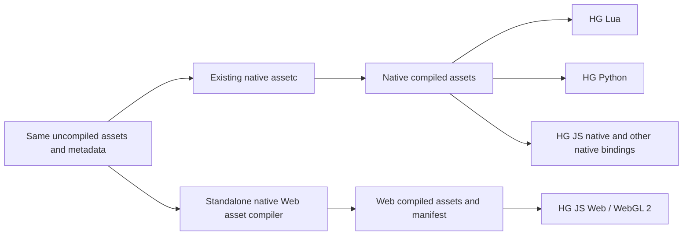

# HARFANG Web: Standalone Native Asset Compiler

Date: 2026-10-05

Status: required product contract and acceptance gates. The standalone compiler
and host matrix below are not implemented or validated by this documentation
change. The current Python/C++ prototype is described separately in
[harfangjs static assets](../../harfangjs/docs/static-assets.md).

This contract clarifies and supersedes the earlier single-executable
`assetc --target web` proposal in the [feasibility study](SPECS_HYBRID_CPP_JS_WEBGL_FEASIBILITY.md).
Delivery belongs to W1, W2/W4 and W10 of the
[roadmap](SPECS_HYBRID_CPP_JS_WEBGL_DELIVERY_SLICES.md).

## 1. One Authoring Tree, Two Compiled Outputs

**The common input is the same uncompiled asset tree, regardless of destination.**
HARFANG scenes, source models, textures, HDR environment sources and their authored
metadata are shared. A Web build must not require a separately authored scene or
copies of source assets maintained for JavaScript.



HG JS native continues to consume the same compiled asset types as Lua, Python
and the other native bindings, subject to ordinary engine-format and renderer
compatibility. It does not use the Web compiler or need a JS-specific native
asset preparation step. Compiled native files are not the mandatory intermediate
input to the Web compiler; optional legacy binary-scene import is separate from
the shared source workflow.

## 2. Independent Desktop Tool

Deliver a standalone native command-line application, provisionally named
`assetc-web`, executed on a desktop or build machine to prepare content for the
browser runtime. Its initial output target is fixed to WebGL 2.

**Implementation location: `harfangjs/tools/native/`.** The native compiler's
sources and CMake target belong in that directory, in the `harfangjs` repository.
The existing `harfang_web_asset_bridge` there is a prototype starting point, not
the completed compiler. Existing native `assetc` remains in
`harfang3d/tools/assetc/`; do not create the Web compiler in a parallel directory
under `harfang3d`. Build products and release packages stay outside source files.

The distribution must run without a HARFANG checkout, pre-existing HARFANG build,
editor, native runtime installation, Python, Node.js, browser or build SDK.
Required libraries and offline encoders are built into the executable or shipped
with its package for the same host architecture. Standalone does not require a
single statically linked file. Building the compiler from source may use normal
development dependencies.

For the current roadmap, keep a separate executable, compilation pipeline and
release lifecycle. Web conversion, optimization and encoding logic may diverge
substantially from native compilation. There is no planned merger into a single
`assetc --target web` binary; any later consolidation needs a separate decision.

Reuse stable HARFANG readers or libraries only where useful; code sharing is
optional and must not force common conversion rules for different runtime needs.
The shared authoring formats and retained CLI conventions are the common contract.
The Web compiler must not require launching existing native `assetc` or installing
a separate reader bridge. The Python writer plus externally built C++ bridge is
a prototype, not the delivered compiler.

Compilation, including HDR probe generation, needs a portable CPU path. Optional
acceleration must not make a particular graphics backend or GPU a prerequisite.

## 3. Required Host Matrix

| Desktop OS | Intel/AMD x86-64 | ARM64 |
| --- | --- | --- |
| Windows | Native package and execution test required | Native package and execution test required |
| macOS (OS X) | Native package and execution test required | Native package and execution test required |
| Linux | Native package and execution test required | Native package and execution test required |

These are six required release targets, not current support claims. Emulating
x86-64 on ARM does not satisfy the ARM64 gate. Host OS/architecture selects the
downloaded executable, not a different browser asset target. Minimum OS versions
and package dependencies must be recorded when the build matrix is implemented.

## 4. assetc-Compatible CLI

Keep native `assetc`'s positional syntax and the spelling, aliases and behavior
of retained switches. The executable name is provisional; the CLI contract is:

```text
assetc-web [options] <input-directory> [output-directory]
```

As in existing `assetc`, omitted output means `<input-directory>_compiled`.
Use explicit, separate outputs when compiling the same sources for both products:

```text
assetc resources build/assets-native
assetc-web resources build/assets-web
assetc-web -j 4 -progress resources build/assets-web
```

The Web commands above are the required future CLI, not commands implemented by
the current Python prototype. The native reference is the `CmdLineFormat` in
[`tools/assetc/assetc.cpp`](../tools/assetc/assetc.cpp).

| Option group | Required Web CLI behavior |
| --- | --- |
| `-job` / `-j`, `-quiet` / `-q`, `-verbose` / `-v`, `-progress`, `-log_errors_to_stderr` / `-l` | Retain names, aliases and native meaning; zero jobs means automatic selection. |
| `-fast_check` / `-f`, `-no_clean_removed_inputs` / `-n` | Retain incremental-check and removed-input cleanup semantics. |
| `-api`, `-platform` / `-p` | Omitted from the Web CLI; reject them with a clear diagnostic. The target is always WebGL 2, independently of host OS. |
| `-daemon` / `-d`, `-poll_pid`, `-debug`, `-defines` / `-D`, `-toolchain` / `-t` | Inventory during implementation; retain only where the same native meaning is supported, otherwise document and reject. A default installation must locate its bundled tools without extra setup. |

There is no required `--target webgl2` or graphics-backend selection step.
Recursive input discovery and dependency resolution follow the native assetc
workflow; users do not have to enumerate every scene with prototype-only
`--scene`, `--forward-scene` or `--bridge` arguments. Unsupported switches and
required content features fail explicitly. Success returns zero; compilation
failure returns nonzero and identifies the input and failing dependency.

## 5. Required Content

| Shared source content | Web compiler responsibility |
| --- | --- |
| Scenes | Read authored HARFANG scenes, preserve supported scene semantics and logical IDs, resolve dependencies, emit Web scene data and a capability/dependency manifest. |
| Models | Convert source geometry into explicit browser vertex/index buffers, submesh/material assignments and bounds; extend animation/skinning data with the corresponding runtime slices. |
| Textures | Apply authored metadata, color/channel/alpha rules, orientation and mip generation; emit browser-readable payloads and declared compressed variants/fallbacks. |
| HDR probes | Convert HDR environment sources offline into diffuse irradiance, prefiltered specular radiance with roughness mip levels, and the required BRDF data/reference. Record encoding, HDR range, cube-face orientation, mip interpretation and dependencies. |

HDR probes are a required compiler deliverable, not merely preserved paths or an
ambient-color replacement. Keep HDR information and validate the emitted encoding
against the Web runtime; do not silently clip it to LDR. Probe generation and
convolution happen offline. The browser loads and samples the compiled result.
The initial environment scope can remain one prefiltered environment as defined
by W2/W4; local probe volumes are separate runtime work.

Reviewed WebGL shader/material adapters and pass-through dependencies remain in
the Web asset graph. Web capability limits may produce explicit diagnostics or
reported adaptations; they do not alter the common source tree or reduce native
runtime capabilities. All runtimes load their own compiled output namespace.

## 6. Delivery And Acceptance

1. **W1:** build the separate native Web compiler, reusing readers where useful,
   implement the CLI subset, scenes/models/basic textures and dependency manifest.
   Remove Python and an external HARFANG build from the delivered user's workflow.
2. **W2/W4:** complete texture metadata/mips/variants and HDR probe compilation,
   then validate actual environment sampling in the browser. An ambient-only W2
   pilot remains explicitly partial and cannot close the HDR probe gate.
3. **W10:** ship and execute the complete compiler on all six host targets. Check
   the same source corpus and CLI cases on clean installations; a Windows x64
   bridge build alone does not establish cross-platform support.

For acceptance, use the same source hashes and metadata for native and Web builds.
HG Lua, Python and JS native share the native output; HG JS Web consumes only the
Web output. Verify that neither compilation changes the source tree or overwrites
the other target's output. Include paths with spaces/non-ASCII characters,
incremental rebuild/removal, missing dependencies, unsupported switches and
failure rollback in the CLI tests.

On every host, compile a scene containing a model, texture and HDR environment,
then load its outputs in HG JS Web. Check hierarchy/material state, geometry,
texture orientation/color/mips, probe face directions, HDR values above 1 and
roughness-dependent reflections. Run ordinary native references using the same
source assets. Record compiler/encoder versions, hashes and output schema, and
document numerical tolerances where host encoder results are not byte-identical.

The current `harfangjs/tools/assetc_web.py` and `tools/build_native.py` do not pass
these standalone, CLI, host-matrix or HDR-probe gates. Existing W1/W2 prototype
results remain useful evidence for their declared subset only.
