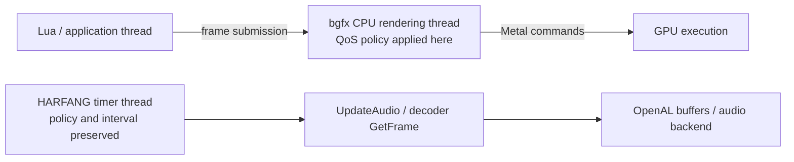

# HARFANG Lua on macOS: Low-Power Mode Feasibility

Date: 2026-10-03

Status: Feasibility study and implementation proposal; not implemented

Source baseline: `27edc9be6a0454efdae4abd85c8f1fcb220d152b`

## 1. Recommendation

**Both a build-time variant and a runtime C++ switch exposed to Lua through
FabGen are feasible. Implement one shared policy and let the build select its
initial value. Prefer runtime switching for the main distribution.**

The first useful implementation is a **30 FPS application frame limiter** in a
new HARFANG C++ wrapper around `bgfx::frame()`. Route the existing Lua
`hg.Frame()` binding through this wrapper. Applications with the usual
update/draw/`hg.Frame()` loop then need only one call to enable or disable the
policy. A build with the policy enabled by default can benefit existing scripts
without that call.

This initial mode should preserve rendering quality, render targets, audio and
the application's VSync settings. Optional later work can follow the macOS
system power setting, suspend unnecessary rendering when windows are hidden,
and apply application-specific quality reductions.

**A second feasible variant specifically lowers the QoS of bgfx's rendering
thread while preserving the audio decoding/update path.** It can be enabled
without a frame cap. This directly addresses selective rendering throttling,
but requires a small bgfx integration and has a less predictable energy benefit
than reducing frame production. Prototype it independently and compare it with
the cap and with their combination; section 6.6 details the design.

There is no evidence from this inspection that a bgfx backend rewrite is needed
for the initial limiter. There is also **no measured energy-saving result yet**:
the benefit must be established on representative Lua applications and Macs.

| Approach | Feasibility | Main tradeoff | Recommendation |
| --- | --- | --- | --- |
| Two builds, each with a fixed policy | High | Works with existing scripts, but doubles runtime distribution and validation | Support if a permanently limited edition is required |
| One build, runtime C++/Lua switch | High | Small API and frame-path change; scripts opt in | Preferred public interface |
| One implementation, configurable build default and optional runtime lock | High | Slightly more configuration, shared maintenance | Recommended architecture |
| Automatically follow macOS Low Power Mode | High, additional platform work | Availability, notification lifecycle and thread handling | Second phase |
| Lower only the bgfx rendering thread's QoS | High with a small backend integration | Preserves audio policy; does not directly limit GPU work or FPS | Independent prototype alongside the frame cap |
| Pin the application to specific Apple silicon cores | No supported public equivalent to a Linux CPU mask identified | Mach affinity tags are not CPU identifiers | Do not promise this API |
| Select a low-power Intel GPU at startup | Conditional | Hardware-specific; resource and display compatibility | Separate optional feature |
| Switch GPUs live without reloading resources | High complexity in this tree | Current renderer resources belong to one Metal device | Outside the initial scope |

## 2. What “low-power mode” means

Three different mechanisms must remain distinct:

1. **HARFANG low-power policy:** reduce the work HARFANG and its application
   request. A frame cap is the first mechanism; lower quality and idle rendering
   are additional mechanisms.
2. **macOS Low Power Mode:** an operating-system setting chosen by the user.
   Foundation exposes a read-only state and a notification. The proposed
   HARFANG setter changes HARFANG's policy; it does not change the system setting.
   The public property is available on macOS 12 and later.
   [Apple: `isLowPowerModeEnabled`](https://developer.apple.com/documentation/foundation/processinfo/islowpowermodeenabled)
3. **A low-power GPU:** a device-selection property relevant to Intel Macs with
   multiple GPUs. Apple silicon Macs expose a single GPU in this model, so there
   is no separate integrated/discrete GPU choice to use as an economy switch.
   [Apple: finding multiple GPUs](https://developer.apple.com/documentation/metal/finding-multiple-gpus-on-an-intel-based-mac)

This study prioritizes desktop HARFANG Lua applications on macOS with GLFW and
Metal. Intel support is considered separately from Apple silicon. XR, offline
rendering, compute-only workloads and headless throughput are not targets for
an automatic 30 FPS policy.

The inspected local CMake cache describes a Release, arm64, GLFW-enabled Lua
build with the macOS 14 SDK. This is build configuration evidence, not a claim
that every existing artifact was rebuilt from the inspected commit. The cache
does not explicitly set `CMAKE_OSX_DEPLOYMENT_TARGET`; a release must establish
its supported minimum independently.

## 3. Findings in the current source

Paths below are relative to the repository. Current source takes precedence
over earlier feasibility documents, especially for framebuffer sizing.

### 3.1. Lua owns the application loop

[`languages/hg_lua/launcher.cpp`](../languages/hg_lua/launcher.cpp) initializes
Lua and executes the application entry point. It does not own a recurring
render/update scheduler.

[`tutorials/render_resize_to_window.lua`](../tutorials/render_resize_to_window.lua)
illustrates the usual loop: submit rendering, call `hg.Frame()`, then call
`hg.UpdateWindow(win)`.

In [`binding/bind_harfang.py`](../binding/bind_harfang.py), `bind_render()` binds:

```python
gen.bind_function('bgfx::frame', 'uint32_t', [], bound_name='Frame')
```

There is currently no HARFANG-owned pacing point on this path. Adding a setting
only to the launcher, or storing a boolean without changing this path, would
not limit an arbitrary Lua render loop.

### 3.2. Existing primitives permit a Lua experiment

The bindings already expose `Sleep`, `TickClock`, `GetClock`, `time_now`,
time conversions, and render reset flags. `Sleep`
uses `std::this_thread::sleep_for`.

The actual timing implementation is in
[`foundation/time.cpp`](../harfang/foundation/time.cpp) and
[`foundation/clock.cpp`](../harfang/foundation/clock.cpp). `tick_clock()` measures
elapsed time and applies the simulation clock scale. The limiter must use a
separate monotonic real-time clock, such as `std::chrono::steady_clock`, so
pausing or scaling simulation time does not affect power management.

A Lua-only cap is useful for a preliminary A/B experiment, but requires editing
each application's loop. It does not satisfy the requested engine-wide C++
interface by itself.

### 3.3. VSync is available, but is not a low-power policy

[`engine/render_pipeline.cpp`](../harfang/engine/render_pipeline.cpp),
`RenderInit()`, obtains framebuffer pixel dimensions, initializes bgfx and
adds flip-after-render, flush-after-render and maximum-anisotropy reset flags.
VSync is not unconditionally added. The convenience initialization overload
preserves the caller's reset flags while adding those engine defaults.

The bindings expose `RF_VSync` and bind `RenderReset` directly to `bgfx::reset`.
`RenderResetToWindow()` only resets when framebuffer dimensions change; it does
not apply a flag-only change when dimensions remain identical.

In the bundled
[`renderer_mtl.mm`](../extern/bgfx/bgfx/src/renderer_mtl.mm),
`SwapChainMtl::resize()` maps `BGFX_RESET_VSYNC` to
`CAMetalLayer.displaySyncEnabled`, when available. `flip()` presents drawables
with `presentDrawable`; there is no HARFANG frame-rate target on this path.

Consequently:

- VSync may constrain throughput to the display cadence, but does not request
  30 FPS. A high-refresh display can still sustain substantial work.
- `glfwSwapInterval()` is not the control point for this Metal renderer: HARFANG
  creates GLFW windows with `GLFW_NO_API`, and bgfx owns presentation.
- The initial low-power switch should avoid rewriting reset flags. Applications
  may keep VSync enabled for presentation quality while the CPU limiter caps
  how frequently they run the loop.
- Any later policy that forces VSync or changes MSAA must centralize all reset
  paths, retain the latest application-requested flags/format/dimensions, and
  restore those values on exit. Saving only the startup flags is insufficient.

### 3.4. The render thread can wait for work

HARFANG does not activate bgfx's manual render-thread path in `RenderInit()`;
the `bgfx::renderFrame()` call there is commented out. In a multithreaded bgfx
build, [`bgfx.cpp`](../extern/bgfx/bgfx/src/bgfx.cpp) starts the backend thread,
and [`bgfx_p.h`](../extern/bgfx/bgfx/src/bgfx_p.h) contains semaphore waits for
submission and rendering.

This supports the feasibility of reducing backend activity by submitting fewer
frames. It does not establish an energy figure, nor mean every application or
worker thread will become idle.

`init.resolution.maxFrameLatency = 1` is already set by HARFANG. The Metal
swapchain clamps drawable count to 2–3. Queue depth is therefore a separate
concern from a target FPS and should not be used as the low-power switch.

### 3.5. Window event handling currently polls

[`platform/glfw/window_system.cpp`](../harfang/platform/glfw/window_system.cpp)
implements `UpdateWindow()` using `glfwPollEvents()`. It exposes window focus
and framebuffer dimensions, but no HARFANG event-wait API or complete
minimized/occluded state policy.

`IsWindowOpen()` in
[`window_system_base.cpp`](../harfang/platform/window_system_base.cpp) tracks
window lifetime, not visibility. Losing focus does not mean a window is hidden.

GLFW supplies `glfwWaitEventsTimeout()` and `glfwPostEmptyEvent()`, which could
support a later responsive idle loop. Waiting processes events and can invoke
callbacks; it is not interchangeable with a passive sleep inside `Frame()`.
[GLFW 3.3: event processing](https://www.glfw.org/docs/3.3/input_guide.html#events)

### 3.6. Metal device selection happens at initialization

The bundled Metal backend uses `g_platformData.context` as an `MTLDevice` when
provided; otherwise it calls `MTLCreateSystemDefaultDevice()`. HARFANG clears
the platform-data structure and currently supplies no device.

This provides a potential startup integration point without immediately
patching bgfx: enumerate devices in Objective-C++, select a suitable device,
and pass it through platform data before `bgfx::init()`. This must be restricted
to the Metal renderer, with explicit lifetime management and fallback.

The inspected Metal initialization does not select a device using
`bgfx::Init::vendorId/deviceId`. Those generic fields should not be presented
as a working low-power selector for this bundled backend.

Changing `MTLDevice` after initialization is not a boolean update. Textures,
buffers, command queues and pipeline objects would need rebuilding. This is
separate from a live frame-rate policy.

### 3.7. Lua has two generated binding paths

[`languages/hg_lua/CMakeLists.txt`](../languages/hg_lua/CMakeLists.txt) generates
the loadable Lua module through FabGen, builds `hg_lua`, and names its macOS
output `harfang.so`. It also builds a separate `launcher` executable.

[`binding/CMakeLists.txt`](../binding/CMakeLists.txt) generates the embedded Lua
bindings using `--embedded --prefix hg_lua`. Both use `bind_harfang.py`.

Changing the shared generator is sufficient to describe the new API for both
paths, but both generated outputs must be rebuilt and checked. The generator
also serves other language targets, so its change is not intrinsically
Lua-only.

### 3.8. Independent activity sets a lower bound on savings

[`engine/audio.cpp`](../harfang/engine/audio.cpp) starts an audio update task
with a 20 ms period. This task runs on the shared HARFANG timer thread in
[`foundation/timer.cpp`](../harfang/foundation/timer.cpp), independently of
bgfx's rendering thread. `UpdateSourceStream()` calls the streamer's `GetFrame()`
to decode/refill audio buffers. The XMP plugin, for example, calls
`xmp_play_frame()` from its `GetFrame()` implementation.

Slowing `hg.Frame()` does not change that audio task's period. Furthermore,
[`timer.h`](../harfang/foundation/timer.h) gives `start_timer()` a default 1 ms
resolution; the timer loop uses that sleep interval even though the audio task
is due every 20 ms. That is an independent source of frequent wakeups, not a
guarantee of exactly 1,000 wakeups/s. Preserving the audio path means retaining
this behavior initially and measuring its contribution separately. Video
decoding, networking and application workers may also continue independently.

The first version should preserve audio playback and its timing. Stopping
optional background work requires an application decision, not a blanket
reduction of all thread activity.

## 4. Compare the delivery options

### Option A: fixed build-time selection

Produce Normal and Low Power distributions from the same implementation, with
different compiled policy values. The low-power build automatically paces
existing `hg.Frame()` loops; the normal build preserves existing behavior.

Benefits are zero Lua changes, a predictable edition for installations, and a
policy that applications cannot accidentally turn off. Costs are two runtime
packages, duplicated release checks, and no temporary return to full cadence.

For this target, “two binaries” means at least two variants of the policy-bearing
`harfang.so` and their matching runtime packages. Renaming or rebuilding only
`launcher` will not alter calls made inside an unchanged Lua module. Embedded
Lua must also receive the intended policy.

Use separate build and installation directories, retaining normal module names
inside each package. Label artifacts with the policy and source revision.
Each distributed application variant needs its normal signing/notarization
workflow. There is no reason to maintain two source branches.

### Option B: runtime C++ API, bound through FabGen

Expose a setter and getters; keep the existing Lua `Frame()` name and return
type. Apply the selected policy at the next frame boundary without destroying
the window, renderer or resources.

Benefits are one distribution, user-selectable behavior, easy A/B measurement,
and an eventual automatic mode. Risks concern pacing semantics, shared state
and interactions with application clocks, rather than binding complexity.

This is the preferred route for general HARFANG Lua use.

### Recommended combination

Proposed CMake options, **not existing options**:

```cmake
option(HG_DEFAULT_LOW_POWER_MODE "Start with HARFANG low-power mode enabled" OFF)
option(HG_ENABLE_RUNTIME_POWER_MODE "Allow changing the power policy at runtime" ON)
```

| Distribution | Default | Runtime control |
| --- | --- | --- |
| Standard, recommended | `OFF` | `ON` |
| Economy by default, reversible | `ON` | `ON` |
| Fixed normal edition | `OFF` | `OFF` |
| Fixed low-power edition | `ON` | `OFF` |

Apply compile definitions to the engine source owning the policy, not only to
the launcher or generated binding code. Keep one state implementation, with no
header-level or generated-module copies. Verify shared state between the
loadable module and embedded Lua, given the current static engine/object-library
linkage.

Both editions should retain the same binding surface. In a fixed edition,
attempting to change the compiled policy returns failure; requesting its
existing value succeeds. A normal build with runtime control disabled can
compile away the pacing branch.

## 5. Proposed first implementation

### 5.1. Minimal public contract

The following API is a proposal; none of these new functions is claimed to be
available in the current build:

```cpp
namespace hg {
bool SetLowPowerMode(bool enabled);
bool IsLowPowerModeEnabled();
bool IsLowPowerModeRuntimeConfigurable();

// New engine wrapper, retaining the current Lua Frame() contract.
uint32_t Frame();
}
```

Semantics:

- Low Power requests a maximum loop cadence of 30 FPS. This is an initial
  product choice, not an Apple requirement or a guarantee of presentation rate.
- Normal adds no engine wait. It does not disable VSync, macOS power management
  or an application's own limit.
- The setter returns whether the request was accepted. Calls are idempotent.
- Calls are valid before `RenderInit()` and between frames. Settings survive
  renderer shutdown/reinitialization within the process; pacing deadlines do
  not. The initial setting is the build default.
- The getter reports the selected HARFANG mode, not the macOS setting or an
  observed wattage. In version one there is no automatic override.
- Control calls belong to the application/API thread. Worker threads and
  notification callbacks must enqueue requests rather than mutate renderer
  state directly.
- The scope is the single bgfx context and its frame stream, not a separate
  limiter for each Lua VM, window or scene.
- The first implementation changes no reset flags, scene quality, audio state,
  simulation clock scale or OS power setting.

Changing mode invalidates the pacing schedule. Disabling it adds no further
engine delay from the next `Frame()` onward. Already submitted GPU work is not
cancelled.

### 5.2. Frame wrapper behavior

Implement the wrapper in the engine and route the binding to it:

```python
gen.bind_function('hg::SetLowPowerMode', 'bool', ['bool enabled'])
gen.bind_function('hg::IsLowPowerModeEnabled', 'bool', [])
gen.bind_function('hg::IsLowPowerModeRuntimeConfigurable', 'bool', [])
gen.bind_function('hg::Frame', 'uint32_t', [], bound_name='Frame')
```

The existing render binding already includes `engine/render_pipeline.h`.
Declarations can live there, while pacing state can be isolated in a small
engine implementation file.

The wrapper must:

1. Call `bgfx::frame()` exactly once and retain its returned frame number.
2. In Low Power, wait only for the unused portion of the current frame budget,
   accounting for application work and any blocking inside bgfx.
3. Use a monotonic clock and a blocking wait, without a spin-wait tail or a
   short-interval polling loop.
4. Return the original bgfx frame number.

A simple initial schedule uses the preceding paced return time plus 1/30 s as
the next deadline. Call `bgfx::frame()` before the wait so submitted work can
proceed. If the deadline has passed, do not wait; rebase from the current time.
After a late wake, rebase rather than issuing catch-up frames. The first call
after activation may establish the timestamp without waiting.

This caps steady-state loop throughput while counting actual work and existing
VSync backpressure. An unconditional `Sleep(33 ms)` after each frame would add
33 ms to rendering time and produce the wrong cadence.

The basic strategy prioritizes low CPU activity. It does not synchronize
deadlines precisely to display refresh. Measure presentation jitter and latency
at 60 Hz, 120 Hz and variable refresh; consider a display-aware scheduler only
if the first implementation fails the quality criteria.

At a 30 FPS limit, an ordinary passive wait is bounded by approximately one
33 ms budget, excluding OS scheduling delays. Preserve `UpdateWindow()` as an
explicit application call. Do not introduce hidden event dispatch and Lua
callback reentrancy inside `Frame()` as part of this change.

### 5.3. Lua use

Illustrative use **after implementing the proposed API**, within an existing
initialized application:

```lua
assert(hg.SetLowPowerMode(true))

while hg.IsWindowOpen(win) do
    hg.UpdateWindow(win)
    if not hg.IsWindowOpen(win) then break end

    local dt = hg.TickClock()
    -- Application-owned update and draw calls use dt here.

    local frame_number = hg.Frame() -- same return value as before
end

-- A settings action can call this between frames in a configurable build:
-- assert(hg.SetLowPowerMode(false))
```

This is an integration sketch, not a complete scene tutorial. Existing scripts
can retain their event-pump order. Scripts with their own frame limiter should
select one pacing owner to avoid compounded delays.

### 5.4. Compatibility limits

A frame limiter is effective for a loop that calls `hg.Frame()` once per
logical frame. It cannot control an unrelated busy loop or worker thread.
Multiple `Frame()` calls used to flush resource creation will also be paced;
loading and screenshot tools need an explicit policy choice. Direct C++
`bgfx::frame()` calls bypass the wrapper; they do not become limited implicitly.

Do not skip `bgfx::frame()` while continuing to enqueue rendering or resource
commands. That would change frame semantics and may accumulate pending work.
True idle suspension must stop generating the work and manage pending commands.

Applications that move objects by a fixed amount per frame will run at a
different speed. Time-based updates preserve elapsed-time behavior, but physics
still needs bounded timesteps/substeps and a deliberate resume policy after a
long pause. A 60 Hz fixed simulation may still perform approximately the same
simulation work per second under a 30 FPS renderer; the limiter must not claim
to halve its CPU cost.

Input sampled only once per frame may miss short presses. HARFANG's GLFW
keyboard reader currently reads cached key states using `glfwGetKey`; exercise
short clicks and presses in validation. Event latching is a possible follow-up,
not an assumed property of the present implementation.

Do not automatically enable this policy for XR applications whose runtime owns
frame timing. Their applications must select an appropriate policy explicitly.

## 6. macOS integration and further savings

### 6.1. Optional automatic mode

Add a separate platform helper, for example
`harfang/platform/osx/power_management.mm`, if automatic behavior is wanted.
[`platform/CMakeLists.txt`](../harfang/platform/CMakeLists.txt) already has an
Objective-C++/Foundation integration precedent in `osx/gamecontroller.mm`.

Read `NSProcessInfo.processInfo.lowPowerModeEnabled`, guarded by
`@available(macOS 12.0, *)`, and register
`NSProcessInfoPowerStateDidChangeNotification`. Guard compilation when building
with an older SDK as well. For an unsupported OS, expose detection capability
separately from the false value and fall back to Normal in automatic mode.

Use a clearly defined policy enum if this phase is implemented:

| Requested policy | Effective HARFANG policy |
| --- | --- |
| Normal | Normal, even if macOS independently limits performance |
| Low Power | Low Power regardless of the system setting |
| Automatic | Low Power while the system reports it; Normal otherwise |

The boolean convenience setter should select explicit Normal or Low Power,
thereby leaving Automatic. Expose requested and effective policy separately.
Automatic behavior should be opt-in, keeping existing applications predictable.

Register once, take an initial snapshot, refresh on notification and remove the
observer on platform shutdown. The local Foundation SDK documents delivery on
a global dispatch queue: callbacks should publish state safely; the application
thread consumes it at a frame boundary. Do not call Lua, GLFW, or bgfx from the
notification callback. Reconcile the initial read and subscription so a change
during startup is not lost.

Thermal notifications can be an independent extension with documented
precedence and hysteresis. Being on battery, being thermally constrained and
being in system Low Power Mode are different conditions. An initial automatic
mode need not infer one from another.
[Apple: responding to power notifications](https://developer.apple.com/documentation/xcode/responding-to-power-notifications)

### 6.2. Hidden and inactive windows

Potentially larger savings come from avoiding frames nobody can see. This
requires application cooperation because HARFANG cannot infer whether audio,
simulation, networking or video must continue.

A later API can expose minimized/visible state, macOS occlusion changes, and an
explicit event wait. Evaluate all relevant windows; an unfocused window can
still be visible on another display. Do not equate focus loss with permission
to pause a live presentation.

For an application that opts in, stop unnecessary draw submissions and wait
until an event or the next required update. Drain necessary bgfx work before
idling, and arrange wakeups for async completions. An event wake must not itself
bypass a still-active frame deadline, or mouse movement could remove the cap.

Keep long event waits outside `Frame()`, on the main thread and outside event
callbacks. On restoration, refresh framebuffer dimensions and pacing state,
and handle accumulated simulation time deliberately.

App Nap can complement this behavior, but cannot substitute for it. Apple's
guidance explicitly recommends reducing unnecessary activity proactively.
[Apple: App Nap](https://developer.apple.com/library/archive/documentation/Performance/Conceptual/power_efficiency_guidelines_osx/AppNap.html)

### 6.3. Quality and resolution

For a workload already GPU-bound below 30 FPS, a 30 FPS cap may do almost
nothing. An optional application quality profile can reduce internal rendering
resolution, MSAA, shadows, SSGI/SSR sample counts or post-processing.

The current
[`scene_forward_pipeline.h`](../harfang/engine/scene_forward_pipeline.h) exposes
AAA sample configuration and effect ratios, while
[`forward_pipeline.h`](../harfang/engine/forward_pipeline.h) exposes shadow-map
resolution. Some resources are sized at creation, so changing a profile may
require controlled resource recreation and temporal-history invalidation.

Keep logical window size, framebuffer pixel size and internal render size
distinct. The current renderer initializes and resizes using framebuffer
pixels. `SetHiDPIMode()`/`RF_HiDPI` should not be advertised as a tested live
Metal render-scale control: the GLFW creation path shown above does not set a
Cocoa Retina hint, and Metal explicitly sets drawable dimensions.

For example, scaling both internal dimensions to 0.75 processes 56.25% of the
original pixels in affected passes. That is arithmetic, not a predicted 43.75%
energy saving: geometry, simulation, other passes and display costs remain.

Keep quality changes separate from the first toggle so entering and leaving
Low Power cannot silently invalidate application-owned render resources or
alter UI/picking coordinates.

### 6.4. Intel GPU selection

An optional startup preference could enumerate `MTLCopyAllDevices()` and prefer
a suitable device whose `isLowPower` property is true, falling back to the
system default. Preserve device ownership until bgfx has released it and verify
external-display behavior on actual Intel hardware.

Do not promise that selecting an integrated GPU powers down a discrete GPU;
other applications and display routing may still require it. Do not promise
live migration through `SetLowPowerMode()`.

The bundled GLFW automatic graphics-switching hint belongs to its NSGL context
path. HARFANG's `GLFW_NO_API`/Metal path needs its own device-selection handling;
adding that hint alone is not a solution.

### 6.5. CPU selection: Jetson/Linux versus Apple silicon/macOS

The Jetson comparison identifies a separate, relevant mechanism: **CPU
affinity**, which restricts the CPUs on which a thread may run. On Linux,
`taskset` exposes that control; NVIDIA uses it in its Jetson test procedures.
For example, `taskset -c 0,1 ./application` launches an application with a CPU
affinity mask for logical CPUs 0 and 1, subject to the system's allowed CPUs.
Those numbers do not intrinsically mean “efficient cores”; the board's topology
must be checked. Linux affinity is per thread, so changing an already running
multithreaded application requires attention to all its threads.
[NVIDIA: Jetson real-time kernel validation](https://docs.nvidia.com/jetson/archives/r38.2/DeveloperGuide/SD/Kernel/RealTimeKernel.html)

The per-thread scope and allowed-CPU restrictions are documented by the
[Linux `sched_setaffinity` manual](https://man7.org/linux/man-pages/man2/sched_setaffinity.2.html).

Jetson also has `nvpmodel`, which selects a board power profile controlling
available CPU cores and maximum CPU/GPU frequencies. That is a system power
configuration, distinct from the placement of one application.
[NVIDIA: power-mode validation](https://docs.nvidia.com/jetson/archives/r36.5/DeveloperGuide/SD/TestPlanValidation.html#nvpmodel-power-modes)

macOS exposes a different application contract:

| Mechanism | What it controls | Suitable HARFANG promise |
| --- | --- | --- |
| Linux CPU affinity / `taskset` | Allowed logical CPUs for threads | Relevant to a future Linux/Jetson port |
| Jetson `nvpmodel` | Board-level power profile, active cores and clock ceilings | System configuration, outside the macOS engine toggle |
| Mach `THREAD_AFFINITY_POLICY` | Affinity tags describing relationships between threads | Not a CPU number, CPU mask or P/E-core selector |
| macOS QoS | Importance and scheduling treatment of a thread/task | Express energy/latency intent; let macOS select cores |

The local SDK's `mach/thread_policy.h` describes affinity tags as hints for
threads to share a cache where possible. Apple's archived affinity documentation
explicitly distinguishes these tags from processor binding. Setting an
`affinity_tag` to 2 therefore does **not** mean “run on CPU 2,” and should not
be used to claim Apple silicon efficiency-core pinning. This old API description
establishes its semantics, not support for every implementation on every Mac.
[Apple: thread affinity API](https://developer.apple.com/library/archive/releasenotes/Performance/RN-AffinityAPI/index.html)

For Apple silicon, Apple recommends assigning accurate QoS classes. Background
work is more likely to be scheduled on lower-performance cores; the OS retains
placement decisions. The public approach is suitable for an efficiency
preference, not a guarantee that all HARFANG threads remain on E-cores.
[Apple: tuning code for Apple silicon](https://developer.apple.com/documentation/apple-silicon/tuning-your-code-s-performance-for-apple-silicon/)

**A C++ QoS helper bound through FabGen is technically straightforward. Its
scope is the hard part.** `pthread_set_qos_class_self_np()` changes the calling
thread's requested QoS. Calling it from Lua normally affects the thread running
that Lua code, which also handles the application loop. It does not reclassify
all existing bgfx, audio or decoder threads. A coherent policy needs appropriate
hooks in owned thread entry points or task queues; inspect inherited defaults
instead of assuming them.

An optional experiment should therefore:

1. Inventory the main/API thread, bgfx backend thread, audio update task and
   application workers, including their current requested QoS and dependencies.
2. Start with deferrable work: Utility for suitable long-running user work,
   Background for work that is not visible or time-critical. Keep input, frame
   delivery and audio latency requirements explicit.
3. Have each owned thread apply a policy change at a safe point. Do not use a
   Lua-side “current thread” setter as an undocumented process-wide switch.
4. Preserve and restore the prior policy on disable, and check return values.
   The SDK permits `pthread_get_qos_class_np()` to return
   `QOS_CLASS_UNSPECIFIED`, but that value is not accepted by
   `pthread_set_qos_class_self_np()`; exact restoration must be designed before
   claiming reversibility. Avoid mixing incompatible legacy priority APIs.
5. Compare four conditions: baseline, frame cap only, QoS policy only, and both.
   Measure task completion energy, frame/input latency, thread activity and core
   residency where tooling exposes it. Lower instantaneous CPU power is not
   sufficient if the same work takes substantially longer.

Because the main thread and bgfx backend synchronize, lowering one without
considering the other can create a scheduling bottleneck. An audio task should
not be moved to Background merely because rendering is capped.

**Verdict:** add QoS as an optional, measured scheduling policy if it helps the
actual workload. Keep the first low-power toggle focused on reducing work; do
not expose `SetCPUCore()` or `UseEfficiencyCoresOnly()` with guarantees macOS's
public application APIs do not provide. Build-time selection can choose the
initial QoS policy just as runtime control can, but cannot strengthen those OS
guarantees.

### 6.6. Lower only the rendering thread, preserving audio

**Yes: the inspected threading model permits a render-thread-only QoS policy.**
The relevant distinction is between the application/API thread executing Lua,
the bgfx CPU rendering thread, and the independent timer/audio path:



The source gives concrete integration points:

- `Context::init()` in bgfx starts a named backend thread with
  `m_thread.init(renderThread, ...)` in the normal multithreaded configuration.
- `Context::renderThread()` in `bgfx_p.h` runs the `bgfx::renderFrame()` loop.
- `Context::renderFrame()` in `bgfx.cpp` waits for submitted work, executes
  renderer commands, invokes the backend and handles presentation.
- HARFANG's timer thread executes `UpdateAudio()` and the stream decoder calls
  independently. Neither its QoS nor OpenAL's internal thread settings need to
  be modified by the render policy.

For a fixed build, initialize the QoS **inside the bgfx backend thread**, after
it starts. This avoids changing the main thread before other subsystems are
created and unintentionally influencing their inherited scheduling policy.

For runtime switching, use this design:

1. A HARFANG C++ function exposed through FabGen posts the requested rendering
   policy to a small bgfx extension. A possible public name is
   `SetRenderThreadLowPowerMode(bool enabled)`, separate from the frame cap.
2. The extension stores the request safely, for example using an atomic policy
   value/generation. It must not introduce a dependency from bgfx back to the
   HARFANG engine; the engine calls the extension, and bgfx owns its thread state.
3. At a safe point on the backend thread, consume a changed request and call
   `pthread_set_qos_class_self_np()`. Apply changes only when the request changes,
   not on every draw call. A hook after the submission semaphore wakes can
   consume a request posted while the renderer was waiting. Account for any
   presentation work occurring before that wait as well.
4. Report requested, applied, unsupported and failed states distinctly. A setter
   can acknowledge that the request was queued; that is not proof that the OS
   accepted it. No extra periodic wakeup is required when the renderer is idle:
   consume the new policy before processing its next work.
5. On disable, restore the recorded supported QoS class and relative priority.
   If the original state is unspecified or incompatible with the pthread QoS
   API, reject reversible activation or use an explicitly established normal
   renderer policy validated at startup. Do not silently label a hardcoded
   `QOS_CLASS_DEFAULT` assignment as restoration of an unknown original state.
6. If bgfx is single-threaded or externally driven through `renderFrame()`,
   report this dedicated-thread feature as unavailable. Applying it there could
   lower the caller's Lua/main thread instead. Do not silently fall back.

Keep the extension small and macOS-guarded, with a reproducible patch and tests
for the vendored bgfx revision. The current generic
[`foundation/thread.h`](../harfang/foundation/thread.h) helpers are not a ready
solution: the macOS-selected
[`platform/posix/thread.cpp`](../harfang/platform/posix/thread.cpp) uses legacy
`pthread_setschedparam` for priority and has an affinity implementation returning
false. Use the QoS API deliberately instead of routing the feature through
those helpers or changing all `bx::Thread` instances globally.

**Choose the economy QoS experimentally.** First record the normal renderer
class; a requested class should not accidentally raise it. A moderate reduction
or Utility can be evaluated against the frame deadline. Background is a more
aggressive experimental setting and should not be a default for visible,
interactive rendering. QoS does not provide a numeric CPU budget or guaranteed
E-core residency.

This preserves the audio code path, scheduling request and refill cadence. It
does not guarantee immunity to machine-wide contention, decoder bugs or
application code that feeds audio from the Lua loop. Test long playback and
underruns under load, including the actual decoder used by the application.
Observe audio update timing and buffer health while repeatedly switching the
render policy.

The energy limitation is specific: this change affects CPU scheduling of bgfx's
render work. It does not directly lower Metal GPU execution priority or shader
cost. On an otherwise idle machine, the renderer may still produce the same
FPS and GPU workload. Under contention it may produce fewer frames or make the
Lua thread wait longer on bgfx synchronization. These are outcomes to measure,
not a stable frame-rate control.

For the requested study, this is worth a dedicated prototype. Compare normal
render QoS, economy render QoS, a 30 FPS cap, and both controls together, while
holding the audio policy constant. If render-only QoS gives useful savings at
acceptable frame cadence, it can be offered independently of a frame cap.

A separate proposed build default,
`HG_DEFAULT_RENDER_THREAD_LOW_POWER_MODE=OFF`, would permit normal and economy
editions without coupling QoS to 30 FPS. The optional runtime-control lock can
cover both controls, while their selected values remain independent.

### 6.7. Scheduling and presentation alternatives

Lowering all process or render-thread priorities is not the initial mechanism:
it can increase latency without reducing the amount of work. Optional workers
can receive appropriate scheduling policy after profiling, but the low-power
API should make no guarantee of CPU core affinity, frequency or wattage.

Similarly, disabling bgfx multithreading or changing compiler optimization
flags is not an energy policy. Both distribution variants should use equivalent
Release optimization settings for a meaningful comparison.

For a later presentation-focused implementation, Metal offers
`presentDrawable:afterMinimumDuration:` on macOS 10.15.4 and later. It controls
how long the previous drawable is displayed; it is not by itself a Lua update
limiter. The bundled wrapper currently uses plain `presentDrawable`.
[Apple: presentation minimum duration](https://developer.apple.com/documentation/metal/mtlcommandbuffer/present(_:afterminimumduration:))

`CAMetalDisplayLink` offers frame-rate-range hints and a callback-based model.
Integrating it would require coordinating the application loop, main run loop
and bgfx presentation ownership. Treat it as a separately measured refinement,
not a prerequisite for the first toggle.
[Apple: `CAMetalDisplayLink`](https://developer.apple.com/documentation/quartzcore/cametaldisplaylink)

## 7. Expected benefit and validation

### 7.1. What can reasonably be expected

For unchanged per-frame work, reducing 60 to 30 frames/s halves the number of
frame iterations; reducing 120 to 30 reduces it by three quarters. **Neither is
a battery-life or wattage forecast.** Static platform costs, work outside the
loop, GPU execution time and simulation policy affect the result.

| Workload | Expected effect, to be measured |
| --- | --- |
| Lightweight uncapped scene | Strong opportunity to remove redundant CPU/GPU work |
| Scene running at 60/120 FPS with VSync | Fewer updates and submissions at 30 FPS |
| Scene already below 30 FPS | Little benefit from a cap alone |
| Fixed-rate physics or independent workers | Rendering may fall while worker cost remains |
| Hidden static content with cooperative suspension | Larger idle opportunity than continuous 30 FPS rendering |
| Continuous audio/video | Independent activity can remain significant |

Apple recommends avoiding unnecessary drawing and excessive timer wakeups;
the proposed limiter is a bounded compromise for continuously animated Lua
applications, followed by event-based idle behavior where appropriate.
[Apple: graphics efficiency](https://developer.apple.com/library/archive/documentation/Performance/Conceptual/power_efficiency_guidelines_osx/UsingEfficientGraphics.html),
[Apple: timers](https://developer.apple.com/library/archive/documentation/Performance/Conceptual/power_efficiency_guidelines_osx/Timers.html)

### 7.2. Measurement protocol

Use a repeatable Lua scene and identical Release builds, assets, physical
framebuffer dimensions, camera path and quality settings. Record device model,
OS version, power source, system Low Power Mode, refresh rate, brightness,
external displays and thermal state.

Compare uncapped/VSync-off, VSync-only and VSync-plus-30-FPS modes. Run repeated
alternating trials after warm-up, for example three five-minute samples per
condition; extend them if thermal drift or noise dominates. Keep OS power mode
fixed when measuring HARFANG's effect, then test automatic mode separately.

Record:

- Application iteration/submission rate and actual presentation cadence.
- CPU utilization, GPU activity/time, idle wakeups and time blocked in pacing.
- Median, p95 and p99 frame intervals, plus visible stutter and interaction delay.
- Process Energy Impact and, where available, device/package power telemetry.
- Temperature/thermal state and audio/video continuity.

Activity Monitor's Energy Impact is a comparative score, not watts. Instruments
can distinguish application work, waits and GPU behavior. Optional `powermetrics`
sampling is machine/OS-dependent, may require privileges, and is generally not
a process-isolated battery measurement. Report the actual supported counters
and any idle-baseline subtraction rather than attributing all system power to
HARFANG.
[Apple: monitoring energy usage](https://developer.apple.com/library/archive/documentation/Performance/Conceptual/power_efficiency_guidelines_osx/MonitoringEnergyUsage.html),
[Apple: analyzing Metal performance](https://developer.apple.com/documentation/xcode/analyzing-the-performance-of-your-metal-app/)

### 7.3. Required coverage

| Dimension | Cases |
| --- | --- |
| Hardware | Apple silicon laptop; Intel integrated and dual-GPU Macs if supported |
| Display | 60 Hz, 120 Hz/variable refresh where available, Retina, external display |
| Window lifecycle | Resize, minimize, hide/show, focus change, occlusion, sleep/wake |
| Policy | Startup default, repeated enable/disable, fixed editions, reinitialization |
| Lua path | Loadable `harfang.so`, launcher, embedded scene Lua sharing policy state |
| Workload | Static scene, moving scene, CPU-heavy simulation, GPU-heavy scene, audio/video |
| Optional QoS policy | Per-thread application/restoration, priority dependencies, cap-only/QoS-only/combined trials |
| Compatibility | Existing limiter, multiple frame calls, resource loading, other binding targets |
| Automatic extension | OS change while active/inactive; older OS fallback; observer teardown |

Initial acceptance criteria:

1. An inexpensive test scene remains at or below approximately 30 loop
   iterations/s after startup, within a documented timer tolerance, and is not
   inadvertently limited to approximately 20 FPS by double-counting waits.
2. Each wrapper call advances bgfx exactly once and returns the expected frame
   number. Normal introduces no material throughput regression.
3. Switching returns to the caller's original cadence constraints, preserves
   render flags/resources, and does not change simulation clock scale.
4. There are no busy waits, close/resize hangs, resume catch-up bursts or hidden
   resource-command accumulation. Interaction and audio remain acceptable.
5. Representative workloads show repeatable energy/activity reductions beyond
   measurement noise. A lower FPS alone is insufficient to claim energy success.

Unit tests should exercise deadline arithmetic and policy transitions with an
injected clock/wait abstraction; avoid timing-sensitive assertions that depend
on a loaded machine sleeping exactly 33 ms. Use actual Lua/render smoke tests
for integration and measurements for energy claims.

## 8. Implementation map and effort

All entries describe future work.

| Area | Files or location | Change |
| --- | --- | --- |
| Build defaults | [`CMakeLists.txt`](../CMakeLists.txt) | Add and document the two policy options |
| Public API | [`render_pipeline.h`](../harfang/engine/render_pipeline.h) | Declare control/query functions and HARFANG frame wrapper |
| State and pacing | Engine implementation, possibly new `frame_pacing.cpp` | Monotonic deadlines, reset on transitions, preserve frame result |
| Renderer lifecycle | [`render_pipeline.cpp`](../harfang/engine/render_pipeline.cpp) | Reset pacing state on init/shutdown; retain selected policy |
| Engine build | [`engine/CMakeLists.txt`](../harfang/engine/CMakeLists.txt) | Register sources and policy compile definitions |
| FabGen | [`bind_harfang.py`](../binding/bind_harfang.py) | Bind policy and redirect `Frame()` |
| Lua artifacts | Both binding CMake paths | Regenerate and validate module plus embedded output |
| Optional system detection | New platform `.h`/macOS `.mm`, platform CMake | Guarded query, observer lifetime, thread-safe state transfer |
| Optional idle mode | Window system and application loop | Visibility/occlusion, explicit event wait and resume handling |
| Optional QoS experiment | Platform helper and owned worker entry points; bgfx integration if needed | Classify work per thread/task, restore prior policy, measure benefit |
| Render-thread-only variant | bgfx thread entry/frame loop and a narrow extension API; HARFANG/FabGen facade | Apply changes on the backend thread, preserve timer/audio settings, expose actual status |
| Validation | Engine tests and a Lua tutorial/smoke application | Deadline tests, live switching, metrics and regression checks |
| Documentation | API reference, tutorial and release notes | Mode scope, frame-rate implications, build/package selection |

Indicative engineering estimates for someone familiar with this tree, assuming
access to a working build and test hardware:

| Stage | Estimate | Exit condition |
| --- | --- | --- |
| Baseline and Lua pacing experiment | 0.5–1 day | Identify representative workloads and measurable opportunity |
| C++ wrapper, FabGen API, defaults/fixed builds, focused tests | 2–4 days | Both Lua paths work; switching preserves frame semantics |
| macOS regression and energy measurements | 1–3 days | Document behavior and measured benefit/limits |
| Optional system-following mode | +1–2 days | Availability and notification lifecycle validated |
| Optional cooperative idle mode | +2–4 days | Responsive suspension and resume with application approval |
| Optional QoS feasibility spike | +1–2 days | Thread inventory and comparative traces; implementation estimated afterward |
| Render-thread-only QoS implementation after the spike | +2–4 days | Backend handoff, restoration, Lua binding, build default and audio regression checks |
| Optional quality profiles or Intel GPU preference | Separate estimate after a spike | Resource/display-specific behavior understood |

The first three stages total approximately **3.5–8 engineering days**, excluding
hardware acquisition, release processing and unrelated build failures. These
are planning estimates, not results from an implementation attempt.

## 9. Decision

Proceed with a small C++ policy and a paced `hg.Frame()` wrapper, exposed through
the shared FabGen description. Keep runtime control enabled and the default
policy Normal for compatibility. Produce fixed Normal/Low Power editions from
the same code only if their distribution use case justifies them.

Prototype the render-thread-only QoS alternative independently, preserving the
timer/audio path. It is a viable response to selective rendering throttling;
its energy benefit must be compared with the frame cap before choosing a
shipping profile. Keep both mechanisms independently controllable.

Gate release on actual measurements. Add automatic macOS integration and
cooperative idle rendering as distinct follow-ups. Keep GPU switching, global
thread-priority changes and render-quality changes outside the first switch.

This study used static inspection of the checked-out source, the local build
cache and Foundation SDK headers, and the linked primary documentation. No
engine implementation, fresh build, runtime power measurement or cross-machine
validation was performed for this document.
