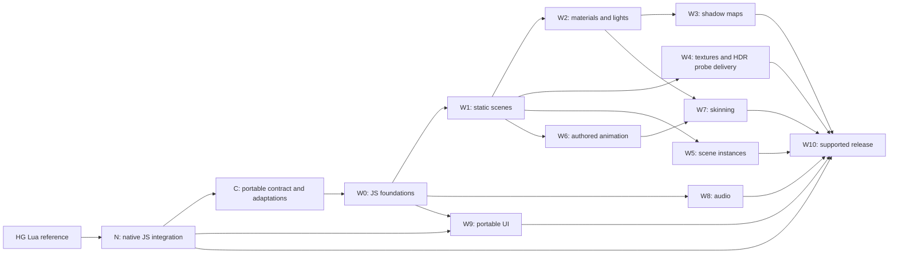

# Hybrid HARFANG: Delivery Slices And Acceptance Gates

Date: 2026-10-03

Status: proposed phased specifications; no implementation is claimed.

Architecture and source evidence: [Hybrid HARFANG Feasibility](SPECS_HYBRID_CPP_JS_WEBGL_FEASIBILITY.md). Native binding baseline: [QuickJS Language Integration Feasibility](../../FABGen/specifications/SPECS_QUICKJS_LANG_INTEGRATION_FEASIBILITY.md).

Primary acceptance suite: [Tutorial-Based Validation Matrix](SPECS_HYBRID_CPP_JS_WEBGL_TUTORIAL_VALIDATION.md), covering all 56 existing tutorial families with explicit retained/deferred/excluded decisions.

## 1. Fixed Constraints

### Compatibility precedence

The following order of constraints governs every slice and acceptance gate:

1. **Native HG JS prioritizes conformity with HG Lua.** For the same engine build options, HG Lua is the reference for engine functionality, API behavior, scene systems and resource handling. JavaScript language conventions may differ, but browser limitations must not reduce or redefine the native API.
2. **Web HG JS adapts on a best-effort basis to run native HG JS projects.** The validated native project is the starting point. The web implementation should preserve its code and behavior as far as browser capabilities allow, with explicit adapters, documented approximations and identified unsupported features.

The direction of compatibility is **HG Lua -> native HG JS -> web HG JS**. Squirrel and Python provide additional references; HG Lua takes priority when language bindings differ. Web parity is an adaptation goal, not a prerequisite for native functionality or a promise that every native project runs unchanged in a browser.

Portable profiles, browser resource budgets and the web exclusions below apply to web delivery and explicitly selected portability checks. They do not constrain the default native runtime. Unsupported required web features must produce clear diagnostics; approximations must not be reported as full equivalence. Native conformity and web compatibility are separate validation gates.

This precedence supersedes any earlier proposal in the related specifications that would make native HG JS conform to a browser-defined subset.

### Target constraints

- The native product uses HARFANG C++ with a JavaScript API, initially through QuickJS.
- The browser engine is **pure JavaScript + WebGL 2**. There is no C++ engine/service ported to Wasm and no shipped Wasm codec dependency.
- Native C++ tools, including `assetc` and offline encoders, remain permitted in the build pipeline.
- The shared content is the same **uncompiled** asset tree. Existing native `assetc` output is shared by HG Lua, Python and HG JS native. Web uses a **separate standalone native desktop compiler in `harfangjs/tools/native/`**, with its own compilation logic and release lifecycle, to produce WebGL 2 assets. No merger into native `assetc` is planned.
- The Web compiler must cover scenes, models, textures and HDR probes, and ship for Windows/macOS/Linux on x86-64 and ARM64. Keep `assetc` positional syntax and retained option aliases, with no graphics-backend selection initially. The [compiler contract](SPECS_HARFANG_WEB_ASSETC.md) defines packaging, CLI and acceptance; the Python/C++ prototype does not fulfill those release requirements.
- Shared application behavior is written in JavaScript. Essential project-specific C++ behavior needs a JS implementation.
- Desktop `main.js` replaces `main.lua` and owns its native loop. Portable applications may expose `init`, `update`, `render`, and `dispose` for reuse with browser `requestAnimationFrame` scheduling.
- The authoring scene remains a HARFANG scene. Web-specific assets are generated offline and addressed through stable logical names.
- **Physics and video playback/replay are excluded from the initial web profile.** Audio is included as an independently deliverable web slice. Navigation, VR, AAA effects, and general shader transpilation are also outside that profile. Native HG JS retains the corresponding HG Lua functionality when enabled by the build.
- A portable UI subset uses Dear ImGui through native bindings on desktop and JavaScript with DOM/CSS in the browser; full ImGui emulation and Wasm UI libraries are excluded.
- Each completed slice adds declared capabilities. Unimplemented required features are build/load errors, not successful no-ops.

The goal is to release useful subsets progressively. Static scenes, scene instances, animation, skinning, audio, and portable UI each have a separate definition of done. Their delivery need not wait for complete native API coverage.

## 2. Workstreams And Dependency Graph

`N` implements the native JS target against HG Lua. `C` records the portable contract and adaptations derived from that native reference. `W0` through `W10` build the browser engine, its assets, and the portable UI. These identifiers describe work packages, not existing repository modules. Native and web work may progress in parallel; the arrows establish which contract is authoritative.



Testing and resource accounting start in W0. W10 consolidates production behavior; it is not the first time error handling or conformance is implemented.

Scene instancing and GPU draw instancing are different features. W5 implements scene semantics. Draw batching/instancing is an optimization that can follow wherever it improves measured performance.

### Tutorial-Based Acceptance

Validate each slice primarily by porting the applicable existing tutorials to shared JS and comparing native JS with the pure-JS browser runtime. Keep desktop lifecycle calls explicit in `main.js`. Existing native tutorials remain unchanged; excluded examples are removed from the acceptance scope, not deleted.

The detailed matrix classifies **25 retained, 12 deferred, and 19 excluded families**. A language variant is not another independent test. Staged derivatives have separate case IDs; passing a reduced derivative does not imply passing the original complete scenario.

| Slice | Primary existing tutorial coverage | Essential supplement or qualification |
| --- | --- | --- |
| C/N | Every retained shared-JS tutorial; `scene_lua_script` reworked as JS behavior communication | Native ownership, type conversion, and exact-value boundaries still need focused tests |
| W0 | `basic_loop`, keyboard/mouse basics and transitions, `draw_lines`, `draw_lines_starfield`, resize | Browser async/cancellation/focus behavior; no busy-loop translation |
| W1 | `draw_model_no_pipeline`, `filesystem_assets`, `picture_load`, structural stage of `scene_pbr` | Small direct-drawing/program subset; malformed/missing dependencies and rollback |
| W2 | `scene_pbr`, `material_update_value`, `scene_light_priority` | Support the used `default.hps` family as well as PBR; retain material texture/variant transitions |
| W3 | `scene_spot_shadow_clip`, shadow-enabled retained scenes | Spot case is conditional on declared spot support; add directional/cascade and alpha-cut fixtures |
| W4 | `filesystem_assets`, `picture_load`, `scene_pbr`, `material_update_value` across texture routes | Add compressed mip/fallback/color-space cases and actual HDR probe sampling |
| W5 | Static stage of `scene_instances`, `game_mouse_flight`, full `mouse_scene_projection` | The projection scene contains an instance; add nesting/cycle/destruction cases |
| W6 | Animated stage of `scene_instances` using authored idle/walk/run clips | Fixed-time interpolation, seek/loop, and timestamp fixtures |
| W7 | No existing tutorial establishes weighted skinning | Add a two-bone weighted mesh and representative character; the current biped scene lacks object/material skinning markers |
| W8 | `audio_play_sound_stereo`, spatialized variant when that capability ships | Activation/lifetime checks; OGG streaming remains deferred |
| W9 | `imgui_basic`, `imgui_edit`, `imgui_mouse_capture` through the portable facade | Stable IDs, focus/composition, and explicit adaptations of native-only controls |
| W10 | Whole applicable retained suite, `scene_many_nodes`, `game_mouse_flight` | Separate reduced correctness cases from original stress workloads; device/lifetime/zero-Wasm checks |

The fixtures below supplement these tutorial gates where needed; they are not a request to replace the tutorial corpus with unrelated demos. No validation runs are claimed in these specifications. Deferred capabilities do not enter the current estimate merely because their tutorial exists.

## 3. Effort Allocation

Engineer-weeks for a supported first release, subject to the feasibility study's assumptions. The allocation includes implementation and meaningful per-slice tests. It excludes physics, video, a runtime universal texture transcoder, and speculative pure-JS codec development.

| Work package | Estimate | Primary output |
| --- | ---: | --- |
| C: portable contract and native facade | 3-5 | API/profile manifest, async host contract, cross-backend fixtures |
| N: native QuickJS binding and scene execution | 12-20 | Native launcher, generated bindings, script lifecycle, packaging |
| W0: browser foundations | 3-5 | Math, handles, scheduler, resources, JS script dispatcher |
| W1: static scenes and initial web asset path | 4-6 | Native JSON scene reader, mesh buffers, separate native Web compiler and assetc-compatible CLI |
| W2: material families and forward lights | 3-5 | Approved PBR/unlit families and bounded light rig |
| W3: shadow maps | 2-3 | Directional shadows, then agreed cascade/spot quality tier |
| W4: GPU texture and HDR probe delivery | 2-4 | Offline texture/probe processing, pure-JS container reader, capability selection and environment sampling |
| W5: scene instances | 2-4 | Nested subscenes, reference remapping, isolated mutable state |
| W6: authored animation | 3-5 | Transform/property tracks, playback, seeking, loop semantics |
| W7: skinning | 3-5 | Joint palettes, weight/bind-pose support, animated color/shadow passes |
| W8: audio | 2-3 | Portable source controls and browser activation lifecycle |
| W9: portable UI subset | 4-7 | Dear ImGui native facade, pure-JS DOM/CSS backend, state/input conformance |
| W10: release hardening | 7-12 | Device coverage, compatibility enforcement, startup/memory work, packaging/docs |
| **Web/UI subtotal W0-W10** | **35-59** | Browser engine, asset target, and both portable UI adapters |
| Hybrid integration contingency | 8-12 | Toolchain, content, driver, and cross-target surprises |
| **Hybrid V1 total** | **58-96** | C + N + W0-W10 + contingency |

N retains the conservative planning range from the QuickJS study. Native physics-specific bindings remain part of HG Lua conformity when physics is enabled; their exclusion from the web profile does not remove this requirement. No unmeasured schedule discount is assumed. The 4-6 engineer-week feasibility spike is the first portion of these packages, not an additional line item.

W9 includes the portable UI facade on both hosts. N supplies the underlying generated Dear ImGui calls, while C specifies the generic lifecycle; their estimates do not duplicate W9's widget implementation and tests.

The 2026-10-05 standalone compiler clarification assigns CLI/independent tooling
to W1, texture/HDR processing to W2/W4, and all six desktop host packages to W10.
The ranges above predate that explicit packaging matrix and have not been
re-estimated. Review W1/W4/W10 effort after the host and encoder portability work;
no revised effort total is claimed here.

If only a viewer is needed first, stop at the corresponding release below. The total is not a prerequisite to seeing useful output.

## 4. C: Portable Contract And Host Facade

**Result:** native and browser implementations agree on what a portable JavaScript application can rely on.

Deliver:

- A checked-in symbol/capability inventory derived from the actual binding declarations, with portable, approximation, native-only, and unsupported classifications.
- Math naming, `BigInt` time values, output arrays, copy/reference semantics, explicit disposal, and error rules.
- Shared async initialization and asset APIs; synchronous update/render callbacks.
- Explicit desktop bootstrap ownership: the launcher provides runtime/events/jobs, while `main.js` invokes lifecycle functions and owns loop sequencing.
- Module resolution for `harfang`, native extensions, and scene-referenced behaviors.
- A versioned profile describing supported scene components, material families, light/shadow limits, and resource budgets.
- Optional native portability checks so desktop development can identify unsupported web calls/content without restricting normal native execution.

Acceptance:

1. One application module imports the same `harfang` name and moves a named node on both hosts; desktop `main.js` calls it explicitly and browser bootstrap schedules it.
2. Get/change/set of a transform produces the same observable behavior; returned value mutation is tested separately from scene mutation.
3. Multi-result order, invalid handles, integer boundaries, and lifecycle exceptions have matching documented outcomes.
4. Async initialization prevents premature updates. Stop during loading prevents later callbacks from entering a disposed scene.
5. The supported profile rejects a native-only dependency with its source location or logical asset path.

The contract should be ratified by executable fixtures. Generated declarations are useful, but a `.d.ts` file alone does not prove compatibility.

## 5. N: Native JS Integration

**Result:** native HG JS exposes the HG Lua engine functionality through JavaScript while the C++ engine retains its rendering, resources and existing Lua scene systems.

Follow the QuickJS reference for the FABGen backend, value ownership, class registry, overload conversion, launcher, module loading, job scheduling, and Windows toolchain gate. Validate against HG Lua for the same build options, including physics when enabled. The web profile does not set the native feature scope.

Sequence the native work:

1. Build the pinned runtime and a generated class/module in the actual Windows configuration.
2. Generate the native binding from the same declarations as HG Lua and render a native scene from a desktop `main.js` that owns its loop.
3. Preserve access to existing Lua scene components and systems from JavaScript, including value exchange and physics integration when enabled.
4. Complete native conformity tests, release packaging and docs independently of web coverage.
5. Keep QuickJS in the external language layer. A future JS scene dispatcher or portable facade is separate work and must preserve the native reference API.

Acceptance includes repeated VM creation/destruction, owned/borrowed object safety, retained callback cleanup, script parameters, useful errors, filesystem JS imports, explicit asset mounts from application code, and bounded Promise-job service. A Node addon is not part of N.

For the async asset example, a proposed `await ctx.nextFrame()` yields between explicit loop iterations. The native launcher services I/O/jobs while JS is yielded and settles frame waits on close. It must not secretly dispatch application callbacks or run pending jobs reentrantly from arbitrary bindings. Verify startup-await, window-close-during-await, and rejected-entry-module completion.

The native engine retains its embedded Lua VM. QuickJS provides the external JavaScript binding; adding JavaScript scene components is separate work. Do not load the same scene component into two language VMs by accident.

## 6. W0: Browser Foundations

**Result:** a small JS runtime with predictable math, scheduling, handles, and resource ownership.

Deliver:

- JS math types matching the portable contract; typed-array storage where it benefits hot paths.
- Generation-checked node/resource handles and explicit disposal.
- Canvas creation/integration, resize, input snapshots, and the browser scheduler.
- A resource manager with asynchronous fetch, cancellation, deduplication, and logical-ID resolution.
- A JS scene-script manager with per-component factory instances and defined callback ordering.
- Renderer initialization, capability detection, and a visible diagnostic frame.
- The minimal dynamic-line drawing path and known program/layout mappings needed by the retained drawing tutorials.

Acceptance fixtures:

- Matrix composition and projection against native outputs, including nonuniform and negative scale.
- One loop advancing shared update logic at varying callback intervals.
- Pause/resume without a large simulation jump; blur without stuck input.
- Two components using the same JS module with independent mutable state.
- Cancelled initialization and repeated start/stop without callbacks into disposed objects.
- Browser network/module inspection showing no Wasm payloads or embedded Wasm code paths.

The first scheduler supports variable delta. A bounded fixed-step mode can follow without changing the callback contract.

## 7. W1: Static Scenes And Initial assetc Web Output

**Result:** a HARFANG-authored static scene loads and renders through the browser JS engine.

Supported content:

- Nodes, transforms, parent hierarchy, perspective/orthographic cameras, current-camera selection, and enabled/disabled state.
- Static indexed geometry with submeshes/material assignments and bounds.
- Minimal cube/plane construction and direct model drawing for `draw_model_no_pipeline`; general `ModelBuilder` remains deferred.
- A simple unlit material and ordinary JPEG/PNG images before W2/W4.
- Core scene metadata and compiled dependency references.

Deliver a JS reader for the existing JSON scene representation and the first content slice of the separate native Web compiler: scene JSON, explicit mesh descriptors/buffers, and a manifest. The compiler follows the [assetc CLI contract](SPECS_HARFANG_WEB_ASSETC.md#4-assetc-compatible-cli), discovers the source tree without a required per-scene Python command, and runs independently of an installed HARFANG build. Existing native compiled `.geo` files are not passed through as browser mesh buffers. Basic W1 content alone does not complete the required texture/HDR or six-host compiler gates.

Acceptance fixture: a room with two cameras, a parented prop, a negative-scale object, UV seams, multiple material slots, and a disabled node. Build it from one source tree into native and web asset directories. Both targets must reproduce hierarchy, transforms, material assignment, visibility, and camera selection.

Also verify:

- Direct reading of the unmodified supported JSON scene body with web-compiled dependencies.
- Native binary scene input converted offline to the web representation.
- No dependency on source asset directories at runtime.
- Missing/corrupt resources produce complete cleanup and an asset-specific error.
- Required instance, animation, skinning, physics, or video features cannot silently pass a profile that does not implement them.

Inert physics authoring metadata may be explicitly stripped by the compiler with a report, but this does not claim physical behavior. The portable project must not require it.

**Release opportunity:** a pure-JS static scene viewer, even before lighting and shadows are complete.

## 8. W2: Materials And Forward Lighting

**Result:** authored material controls and a small forward light rig produce a usable interactive scene.

Deliver approved unlit, historical `default.hps`, and HARFANG PBR program adapters, with the channel/parameter mapping documented in the feasibility study. The default-family subset preserves the diffuse/specular/self values and diffuse-map toggling used by retained tutorials; do not silently replace it with PBR. Support base opacity, ORM, normal and self/emissive inputs in the PBR family; alpha cut; depth/culling/write controls; and agreed blend modes.

Start with one directional light and two points. Extend to the agreed eight-slot profile with spot attenuation, priorities, diffuse/specular intensities, and a stable overflow policy. Add fog and one environment-lighting path by the supported V1 gate, consuming HDR probes prepared by the separate desktop compiler in W4. An explicit ambient approximation is acceptable in the first pilot but does not fulfill the HDR compiler/runtime requirement.

Acceptance fixture: material spheres/planes under a controllable light rig, including metal/dielectric extremes, roughness variation, a normal map, foliage alpha cut, emissive content, and transparent overlaps.

Validate source shader behavior, not merely generic PBR plausibility: map-versus-uniform selection, channel layout, alpha threshold, attenuation, and output color conversion. Unknown custom program paths fail unless a reviewed adapter is declared.

Keep shader-family source, variant keys, and visual fixtures together. Every new feature must account for its variant-count and startup impact.

## 9. W3: Shadow Maps

**Result:** the lit scene has stable shadows at a documented quality tier.

Deliver one directional shadow map first. Add one/two directional cascades and an optional single spot map for V1 if they fit the pilot budgets. Four native PSSM cascades and point-light cube shadows are not mandatory.

Acceptance fixture:

- A moving camera crossing the shadowed region, to reveal instability and cascade transitions.
- Objects at several scales and slopes, to test bias/acne/detachment.
- An alpha-cut caster, to verify shadow cutouts.
- A spotlight with explicit near/far settings when the spot tier is enabled.
- A skinned caster added to this fixture during W7.

Count all shadow submissions separately from main-pass draws. Verify depth framebuffer completeness and restoration after context loss. Material/shader failures must identify the relevant shadow variant.

**Release opportunity:** the shared-JS interactive static-scene pilot, with native/web comparison and measured rendering/transfer budgets.

## 10. W4: GPU-Friendly Textures And HDR Probe Delivery

**Result:** web content can use smaller resident GPU textures without adding a Wasm transcoder.

Deliver:

- Offline ASTC 6x6 candidates, selected higher/lower-quality block sizes, and appropriate ETC/BC variants.
- A pure-JS reader for a restricted, versioned container subset, initially native GPU payloads without codec-specific supercompression.
- Runtime capability selection before payload download.
- JPEG/PNG fallback with a memory-aware resolution policy.
- Explicit color space, alpha, channel, orientation, sampler, and mip metadata.
- Reproducible encoder settings/cache keys and a size/quality report per asset.
- Offline HDR probe generation by the separate native Web compiler: diffuse irradiance, prefiltered radiance/roughness mips and BRDF data/reference, with HDR encoding and cube-face orientation metadata. Compile from the same uncompiled environment source used by native `assetc`.
- Browser loading and sampling of those probe outputs; ambient-only replacement or preserved native probe paths cannot count as completion.

Use the main study's texture corpus and memory arithmetic. Select quality per usage: albedo and normals need different criteria; alpha coverage and material-channel error matter independently of color metrics.

Acceptance:

1. A 2048 texture produces the expected block payload and mip sizes for each variant.
2. The browser selects and downloads only the chosen variant under normal operation.
3. Disabling a compressed-format capability produces a valid fallback with bounded memory.
4. Upload, context restoration, and material sampling preserve orientation and color-space behavior.
5. The browser bundle contains no Wasm texture/mesh decoder.
6. Measured render quality justifies the selected ASTC presets; lower bpp is not the sole pass condition.
7. An HDR source with values above 1 survives compilation and browser sampling; face-direction, roughness-mip and metal/dielectric fixtures validate the environment path.

XUASTC/Basis comparisons may be run offline to inform a later pure-JS codec proposal. Such a codec needs its own feasibility/effort estimate. The current tranche does not assume that a JS wrapper around a Wasm transcoder satisfies the requirement.

## 11. W5: Scene Instances

**Result:** a scene can contain independently functioning instances of another HARFANG scene.

Deliver nested dependency resolution, template caching, reference remapping, instance-root transforms, lifetime, and independent script/material state according to the contract. Preserve instance animation selections as data; execute them once W6 provides the corresponding capability.

Acceptance fixture: a building instance containing a repeated prop subscene, loaded multiple times at different transforms. Each top-level instance has independent state, while immutable meshes/textures share allocations.

Verify:

- Parent, camera, bone-placeholder, component, and animation references cannot escape into another instance accidentally.
- Identical node names in different instances remain distinguishable by scoped lookup/handles.
- Destroying one instance preserves the others and releases only resources no longer referenced.
- Editing a declared instance-local material does not recolor every copy.
- Build-time dependency cycles and runtime recursive instantiation are diagnosed.
- A load failure in a nested dependency does not leave half an instance in the live scene.

A GPU-instanced draw is optional. The functional acceptance test must pass even when instances render as separate draws.

## 12. W6: Authored Animation

**Result:** native scene animation data drives the same supported properties on both targets.

Start with position/rotation/scale and the exact track/interpolation variants used by the fixture corpus. Extend the advertised profile to additional scalar, boolean, color, and material properties only as their target-binding semantics are implemented and tested.

Deliver named scene-animation lookup, node-track binding, playing/stopped state, looping, speed, seek, and timestamp conversion. Preserve Hermite metadata and quaternion interpolation where used. Blending/crossfade behavior must be explicitly specified before it is advertised.

Primary acceptance uses the animated `scene_instances` tutorial and its instance-local idle/walk/run clips. Supplement it with a parented mechanical assembly or minimal authored tracks covering quaternion rotation, scalar/color properties, and nested instance animation where the tutorial does not exercise those semantics.

Sample native/web transforms and supported properties at a fixed list of times, including start, end, loop boundary, seek backward, and non-unit playback speed. Compare numerically with documented tolerances. Include a script that reads the animated transform to confirm callback order.

Validate the unsafe-JSON-integer policy. A timestamp outside the precise Number range must be rejected or handled through the versioned exact representation; it must not silently round.

No skinning is required to complete this tranche. Rigid objects animated through the node hierarchy are enough to prove the scene-animation system.

## 13. W7: Skinning

**Result:** a supported skinned character uses native HARFANG skeleton/animation data in the pure-JS/WebGL engine.

The existing `scene_instances` bipeds do not establish this feature: the inspected asset has hierarchical animation but no nonempty object `bones` references or `EnableSkinning` material markers. W7 therefore requires actual weighted-mesh fixtures in addition to the tutorial-based suite.

Depends on W6 playback and W2 material variants. Reuse W5 instance tests when animated characters are instantiated. Extend W3's shadow fixture when shadows are enabled.

Deliver joint-reference resolution, inverse bind poses, normalized weights, supported joint-index layout, palette upload, per-draw remapping, and skinned color/shadow shader variants. CPU evaluation and palette preparation are JavaScript; vertex deformation executes in GLSL on the GPU.

Begin with four influences per vertex and an explicitly measured palette limit. `assetc` reports excessive joints/influences and may split draws under a documented conversion rule. It cannot silently discard weights or bones.

Acceptance fixtures:

- A simple two-bone deformation with analytically predictable positions.
- A representative production character with multiple material slots.
- Two instances of that character playing different animations.
- A moving skinned shadow caster and an animated bounds/culling case.

Compare bind pose, several fixed animation times, attachment transforms, material assignment, and visible/shadow deformation against native. Report animated-character count, palette uploads, draw count, and CPU/GPU cost independently.

Morph targets, cloth, ragdolls, and general deformation plugins are excluded. Ragdolls would additionally violate the current exclusion of physics.

## 14. W8: Audio

**Result:** shared JS can control a small, predictable audio subset on native and browser hosts.

Depends on W0 lifecycle/resource services. W1/W5 integration is needed only for audio attached to loaded nodes/instances. It can proceed independently of skinning and advanced shadows.

Deliver load, play, stop, pause/resume, looping, gain, source lifetime, completion state/events, and basic spatial positioning if included in the selected profile. Keep long streaming music as an explicit optional extension if it would overrun the tranche.

Acceptance fixture: a short sound triggered by input, a looped ambience, and two independently controlled sources. Test fresh-page activation, suspended audio, resume, scene unload during loading/playback, and multiple instances sharing an audio asset.

Report encoded bytes, decoded memory, activation latency, and cleanup. A browser-restricted start must remain visible as a pending/blocked activation state rather than false playback success.

Audio remains separate from the render loop clock. Synchronization sufficient for ordinary interaction is required; sample-perfect equivalence and native plugin reproduction are not. Video and video-associated synchronization are excluded.

## 15. W9: Portable UI Subset

**Result:** the same JS inspector/control-panel code uses Dear ImGui on desktop and a pure-JS DOM/CSS implementation in the browser.

Depends on W0 scheduling/input and the native ImGui binding subset from N. A web-only prototype can proceed earlier; native/web conformance is the completion gate. The UI need not wait for instances, animation, skinning, or audio.

Deliver:

- A compact `harfang/ui` module with panel/window scopes, text, buttons, checkboxes, sliders/numeric input, text input, choices, and simple collapsible/tree controls.
- Explicit widget IDs; stable keyed DOM reconciliation rather than whole-panel replacement every frame.
- Application-owned values and a defined `[changed, value]` result convention.
- Queued browser input events consumed by the synchronous UI pass; normalized commit/cancel and validation behavior.
- Correct native Begin/End and ID-scope balance, including exceptions and collapsed panels.
- Host input capture so UI interaction does not also drive camera/application controls.
- Basic responsive sizing, high-DPI handling, focus/keyboard navigation, and accessible browser labels.

Evaluate UI once per displayed frame after simulation updates. Queue application-changing commands for the next update on both backends. Fixed-step catch-up and multiple render views must not duplicate UI events. The browser can use transient local edit state to keep text editing responsive between application commits.

Acceptance fixture: a scene inspector that selects a node, changes a transform/material scalar, toggles visibility, edits a name, and resets the camera. Reuse exactly the same panel function on desktop and web.

Verify:

1. A button produces one action, not one per rendered view or simulation substep.
2. Slider values and programmatic updates follow the same precedence and clamping rules.
3. Text editing preserves focus, cursor/selection, and composition across frames.
4. Reordering a node list does not transfer editing state to a different node.
5. Typing/dragging/wheeling over controls does not move the 3D camera.
6. Hiding, destroying, or replacing a panel cancels its pending events and releases state correctly.
7. Touch and keyboard interaction work for the supported widgets.
8. No Wasm UI dependency is loaded, including a JS-wrapped ImGui build.

Full Dear ImGui compatibility is excluded: docking, multiple OS viewports, draw-list APIs, arbitrary flag combinations, font-atlas objects, low-level custom widgets, and live GPU render-target thumbnails. Existing full native ImGui remains available outside the portable API. Visual similarity can be improved with a theme; pixel identity is not an acceptance requirement.

**Release opportunity:** a portable configurator or scene inspector, independently of character/audio support.

## 16. W10: Supported Release And Maintenance

**Result:** the implemented slices become a supportable product rather than a collection of demos.

Complete:

- Capability/version negotiation between runtime, assets, and project requirements.
- Tested deployment over HTTP(S), MIME types, relative paths, caching, and update consistency.
- Cross-backend conformance in the native launcher and actual browser engines.
- Device coverage spanning selected Windows/macOS desktops, Android, and iOS devices where relevant to the product audience; record exact versions and capabilities rather than assuming support.
- Context-loss recovery, repeated scene/instance unload, app suspension, error/cancellation behavior, and resource accounting.
- Cold-start and sustained performance measurements using the agreed pilot budgets.
- Samples showing the same JS application on native/browser, with explicit profile limitations.
- A release manifest that records engine/profile/asset-schema versions and proves the absence of Wasm runtime dependencies.
- Independent native Web compiler packages for all six Windows/macOS/Linux and x86-64/ARM64 combinations, tested on clean hosts without Python, Node.js or an existing HARFANG installation. Each compiles the same scene/model/texture/HDR-probe corpus with the assetc-compatible CLI; the browser loads the resulting assets.

The same retained tutorial ports and supplemental conformance fixtures must run after changes to native bindings, JS math, scene formats, shader families, or asset encoders. Release notes identify intentional rendering changes and asset rebuild requirements. Report original-native, JS-native, and JS-web results separately, with the adaptation record and exact content/quality settings; no missing required feature can be counted as a successful skip.

Repository areas: the Web compiler location is fixed by the current contract;
the other entries retain the study's proposed layout.

```text
languages/hg_quickjs/           native launcher/package
harfang/engine/scene_quickjs_*  native scene-script integration
web/src/core/                  math, handles, resources, lifecycle
web/src/scene/                 components, instances, animation
web/src/render/                WebGL resources, materials, passes
web/src/audio/                 browser audio adapter
web/src/ui/                    keyed DOM/CSS UI backend
shared/ui/                     portable UI contract and host-neutral helpers
web/conformance/               shared fixtures and browser harness
tools/assetc/                   existing compiler for all native runtime bindings
../harfangjs/tools/native/      separate native Web compiler sources/CMake target
```

Keep the public profile inventory and fixtures close to both implementations. Follow-up detailed specs can be created per slice when implementation starts; this document already supplies their boundaries and acceptance gates without inventing empty placeholder specifications.

## 17. Release Boundaries

| Release | Required slices | Deliberately incomplete capabilities |
| --- | --- | --- |
| Feasibility spike | Thin C/N/W0/W1 subset plus one W2/W3 fixture | Broad binding, complete material families, instances, animation, skinning, audio, full UI subset |
| Static viewer | C subset, native subset, W0-W1 | Advanced materials, shadows, instances, animation, skinning, audio |
| Interactive lit pilot | W2-W3 plus shared JS behaviors; initial W4 results | Instances, animation, skinning, audio; full release coverage |
| Instanced scene release | W5 plus previously selected visual slices | Animation/skinning unless separately enabled |
| Animated scene release | W6; W5 for instance animation | Skinning and audio unless separately enabled |
| Character release | W7 plus dependent slices | Audio if not yet delivered |
| Audio-enabled release | W8 plus the chosen visual release | No dependence on physics or video |
| Portable inspector release | W9 plus a chosen scene release | No dependence on skinning or audio |
| Supported hybrid V1 | C, N, W0-W10 for the declared profile | Physics, video, navigation, VR, AAA parity, Wasm, full ImGui emulation, arbitrary native plugins |

The application declares required capabilities rather than checking informal version names. For example, a character project requires `scene`, `animation`, and `skinning`; a static configurator does not need to load or depend on audio/skinning code.

A slice is complete when its content path, runtime semantics, disposal, errors, and measurable acceptance fixtures all work. Adding a method name or parsing a component field is not sufficient evidence of feature support.
