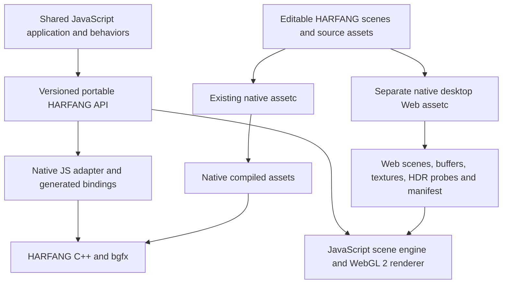

# Hybrid HARFANG: Native C++/JavaScript and JavaScript/WebGL Feasibility

Date: 2026-10-03

Status: architectural feasibility study and proposed implementation roadmap. No hybrid runtime, JavaScript binding, web asset compiler, or performance prototype was implemented for this study.

Baseline: HARFANG `27edc9be6a0454efdae4abd85c8f1fcb220d152b`; FABGen `3b8fd28b1f745a2ed52b51e91eb7a9b298310624`. The starting reference is [QuickJS Language Integration Feasibility](../../FABGen/specifications/SPECS_QUICKJS_LANG_INTEGRATION_FEASIBILITY.md), dated 2026-10-03. Its official QuickJS 2026-06-04 baseline and binding analysis are retained. The reference itself inspected an earlier FABGen revision; this document records the current checkout separately.

All new module names, command-line options, schemas, package names, profiles, and code examples below are **proposals**, unless explicitly identified as existing repository behavior. Estimates are planning ranges, not benchmark results or delivery commitments.

Scope refinement: the browser target is **pure JavaScript + WebGL, with no C++ engine or service ported to WebAssembly and no Wasm codecs**. Physics and video playback/replay are excluded from the initial web profile and its estimates. These exclusions do not restrict native HG JS. Audio and a portable UI subset are independent delivery slices. UI uses Dear ImGui on desktop and a pure-JS DOM/CSS backend on the web. Native C++ tools may still run offline. The feature-by-feature plan is in [Hybrid HARFANG Delivery Slices](SPECS_HYBRID_CPP_JS_WEBGL_DELIVERY_SLICES.md).

**Compatibility precedence: HG Lua -> native HG JS -> web HG JS.** Native HG JS prioritizes conformity with HG Lua for the same build options. Web HG JS adapts on a best-effort basis to run those native projects, with documented adaptations and limitations. The [normative compatibility precedence](SPECS_HYBRID_CPP_JS_WEBGL_DELIVERY_SLICES.md#compatibility-precedence) overrides earlier proposals that would restrict native functionality to a portable web subset. Portable-facade requirements below concern optional cross-host adaptation, not the default native API.

Validation policy: use the existing `tutorials/` scenarios as the primary per-slice acceptance suite. The [Tutorial-Based Validation Matrix](SPECS_HYBRID_CPP_JS_WEBGL_TUTORIAL_VALIDATION.md) inventories the corpus, records exclusions/adaptations, and identifies remaining coverage gaps.

## 1. Feasibility Verdict

**Native HG JS targets HG Lua conformity; the browser runtime supports a defined subset of native HG JS projects on a best-effort basis.** This requires two runtime implementations: the existing C++ engine exposed to JavaScript, and a smaller JavaScript engine that renders through WebGL 2. The browser implementation is a substantial engine project; FABGen cannot generate it from the C++ binding declarations.

The recommended architecture is:

1. **Native:** HARFANG C++ and bgfx remain responsible for rendering and engine services. QuickJS provides the external JavaScript host and binding, with HG Lua as the conformity reference. Existing Lua scene systems remain available; JavaScript scene components are separate work.
2. **Web:** browser JavaScript runs the same application modules against a JavaScript implementation of the portable API. A WebGL 2 forward renderer replaces bgfx. The browser package contains no C++ engine, QuickJS, or WebAssembly; GPU shaders remain GLSL as required by WebGL.
3. **Assets:** the same uncompiled source tree feeds existing native `assetc` and a separate native desktop Web compiler. Native compiled outputs are shared by Lua, Python and JS native; the Web compiler produces WebGL 2 assets. Its CLI follows `assetc` with fewer options. See the [standalone compiler contract](SPECS_HARFANG_WEB_ASSETC.md) for the Windows/macOS/Linux x86-64/ARM64 requirement and scene/model/texture/HDR-probe scope.
4. **Scenes:** directly support HARFANG's existing JSON scene representation for the agreed feature subset. Compile geometry, textures, shader descriptions, and dependency metadata into explicit web formats.
5. **Application lifecycle:** on desktop, **`main.js` replaces `main.lua` and owns the native loop**. Shared `init`, `update`, `render`, and `dispose` callbacks are an optional project structure for browser adaptation; the browser bootstrap schedules them through `requestAnimationFrame`.
6. **Compatibility:** derive and test a versioned web profile from the native API. Native APIs remain available through `harfang`, including features unsupported on the web. Unsupported required web features fail during web compilation or loading instead of silently disappearing.

Four qualifications determine the project's scope:

- **C++ application logic does not automatically run in a full-JavaScript browser engine.** Shared behavior must be JavaScript or have a JavaScript implementation. WebAssembly is excluded by the project constraint.
- **A JavaScript binding always needs a JavaScript runtime somewhere.** “Without an embedded VM” can mean a C++ engine library used by an external JS host, or a C++-only executable with scripting disabled. It cannot mean executing JavaScript without an engine.
- **The same API does not imply identical GPU output.** A lighter renderer can preserve scenes, material controls, transforms, and behavior while intentionally reducing shadows and effects.
- **JPEG and BC compression solve different problems.** JPEG can reduce transfer size, but decoding it to a GPU texture usually increases resident memory relative to BC. A web texture policy must budget download size, decode cost, and GPU memory separately.

The best initial product is a portable scene viewer or interactive application with authored meshes, animation, JS behaviors, basic PBR materials, a small light rig, and shadows. An arbitrary existing HARFANG application with C++ plugins, Lua behaviors, physics, custom bgfx shaders, and AAA effects is outside that promise.

## 2. What The Repository Already Provides

These observations come from the inspected checkout, rather than assumptions about a generic engine.

| Existing implementation | Evidence | Implication for the hybrid |
| --- | --- | --- |
| A broad generated binding surface | `binding/bind_harfang.py` | Reuse names and declarations for native JS bindings, type declarations, and compatibility inventories. It does not implement a browser backend. |
| Lua scene execution coupled to scene systems | `scene_lua_vm.*`, `scene_systems.cpp` | Reuse lifecycle concepts, but introduce a JS dispatcher and isolate language-specific integration. A public JS module alone does not replace scene Lua. |
| Public Lua and Squirrel launchers | `languages/hg_lua`, `languages/hg_squirrel` | Useful packaging and asset-resolution precedents. No QuickJS target was identified in these inspected runtime/binding directories. |
| Both JSON and binary scenes | `scene_load_json.cpp`, `scene_load_binary.cpp`, `scene.cpp` | Native scene semantics can be read in JS. `.scn` alone does not identify the representation. |
| Current binary scene version 11 | `GetSceneBinaryFormatVersion()` | Supporting a binary reader means tracking an explicit format version; the native binary loader currently requires an exact version match. |
| Scene compilation replaces JSON with binary at the same logical path | `assetc.cpp`, `ProcessScene` | Copying native compiled `.scn` files to a JSON-only browser loader will fail. |
| Source geometry and compiled models differ | `geometry.cpp`, `LoadGeometry`, `SaveGeometryModelToFile` | Asset roles must be explicit even though compilation preserves the `.geo` path. |
| Compiled models serialize `bgfx::VertexLayout` directly | `geometry.cpp`, `render_pipeline.cpp`, `LoadModel` | Existing compiled geometry is unsuitable as a durable browser interchange contract. |
| Material serialization contains meaningful properties | `SaveMaterial` and `LoadMaterial` in `render_pipeline.cpp` | Program names, uniform values, texture references, blend/depth/culling settings, and flags can be translated without reproducing bgfx handles. |
| Forward lighting already has a bounded design | `forward_pipeline.h`, `forward_pipeline.cpp` | Eight slots, one directional slot, and special directional/spot shadow paths provide a realistic reference for a smaller renderer. |
| Basic forward and AAA forward are distinct paths | `scene_forward_pipeline.h`, core shader sources | A web release can target the basic forward feature family without porting the AAA subsystem. |
| Asset compilation already handles substantial offline work | `tools/assetc/assetc.cpp` | Reuse dependency tracking, hashes, metadata, geometry conversion, texture processing, and shader feature discovery. |
| Emscripten configuration already exists | top-level `CMakeLists.txt`, platform and engine CMake files | There is prior work for a C++/WebAssembly route. Its current build health, browser behavior, and size were not established here. |

The existing Emscripten path is recorded only to avoid confusing prior repository work with this proposal. It is outside the selected architecture. Existing CMake flags are evidence of intent and infrastructure, not proof of a shipping browser runtime.

### 2.1 Specific Compatibility Traps Found In The Code

- Transform rotations are serialized in **degrees** in JSON and converted to radians when loaded. Camera and light fields must be interpreted according to their individual serializers; do not apply one blanket angular conversion to all components.
- Scene nodes refer into component arrays, and parent, bone, camera, instance, and animation references require remapping. Loading is more than constructing a node per JSON object.
- Animation JSON stores `time_ns` values as JSON numbers. JavaScript must validate safe integer ranges before treating those values as exact timestamps.
- Materials can refer to custom programs. A material containing valid JSON is not necessarily supported by a web renderer.
- The inspected PBR shader uses `uBaseOpacityColor`, `uOcclusionRoughnessMetalnessColor`, `uSelfColor`, corresponding texture names, and specific feature switches. These names provide a concrete initial material adapter.
- That shader uses a fixed alpha-cut threshold of `0.8`, reconstructs the normal's Z component from XY, and applies a gamma power in the non-AAA output path. A generic PBR implementation may produce visibly different output even with matching texture filenames.
- The native forward light allocator reserves the first slot for a linear/directional light and fills the remaining slots from prioritized local lights. The shader supports point/spot attenuation in local slots; the header's summary is less detailed. Port the selection behavior deliberately, including a stable policy for equal priorities.

## 3. Two Runtimes, One Product Contract



Three layers should be independently versioned:

| Contract | What it controls | Example proposed identifier |
| --- | --- | --- |
| JavaScript API | Names, types, return values, ownership, errors, lifecycle | `harfang-js/1` |
| Portable feature profile | Required engine features and permitted approximations | `web-lite/1` |
| Compiled asset schema | Manifest, mesh layout, material descriptors, dependencies | `harfang-web-assets/1` |

The same application imports `harfang`. Native module resolution maps that name to the generated C++ binding; browser resolution maps it to the web implementation and its compatibility adapters. Browser import maps or build-time bundling can resolve the bare module name. The browser import-map mechanism is defined by the [HTML module specification](https://html.spec.whatwg.org/multipage/webappapis.html#import-maps).

Keep the native engine API in `harfang`. A web capability inventory identifies unsupported calls and content; a native project does not need to move its APIs into a separate extension module merely because the browser cannot implement them. Any portable facade or native portability checker is opt-in.

A shared JS facade can implement convenience functions, lifecycle helpers, validation, and behavioral glue. Desktop `main.js` remains responsible for explicitly calling application lifecycle functions. Keep expensive scene and math operations in C++ on native targets, with equivalent JavaScript implementations in the browser. Avoid reducing the native engine to a WebGL-shaped abstraction merely to achieve file-for-file code sharing.

## 4. Native JavaScript Execution Options

| Mode | Where JavaScript executes | Extra work | Recommended role |
| --- | --- | --- | --- |
| HARFANG launcher with QuickJS | Runtime linked into `hg_quickjs` | FABGen backend, host services, lifecycle, packaging | First supported JS distribution |
| C++ application embedding QuickJS | Application-owned runtime/context | Host registration and scene integration | Native games/tools mixing C++ and portable JS |
| HARFANG module in an external QuickJS host | Host-owned compatible runtime | Compatible ABI, module registration, host-loop integration | Supported embedding arrangement after the launcher |
| HARFANG in Node.js | Node's runtime through a Node-API addon | Separate binding/adapter, event-loop integration, packaging | Optional later product; not obtained from a QuickJS backend |
| Native C++ application with scripting disabled | No JS executes | Remove unconditional scripting dependencies | C++-only build configuration |
| Browser web runtime | Browser's JavaScript engine | JS scene engine and WebGL renderer | The lightweight second implementation |

The reference study identifies a Windows limitation in the inspected official QuickJS loader: it does not provide the expected stock shared-library loading path there. Start with linked native module registration. A QuickJS DLL plugin mechanism is additional host work, not an assumed feature.

Node-API offers a distinct native-addon interface and ABI-stability rules. Those rules do not make QuickJS `JSValue` wrappers usable in Node, and do not automatically stabilize every other library used by an addon. See the [Node-API documentation](https://nodejs.org/api/n-api.html). Choose Node only if its ecosystem or host integration is an actual requirement.

### 4.1 Making JavaScript The Primary API

There are three separate changes:

1. **Primary application language:** new samples, launcher defaults, documentation, and project templates use JS.
2. **Scene scripting language:** scene components execute JS through a `SceneQuickJSVM` or equivalent runtime-neutral dispatcher.
3. **Dependency removal:** Lua can be excluded from a build without breaking scene systems, generated bindings, or applications.

Do the first two before removing legacy Lua support. Existing Lua scenes do not become JavaScript scenes automatically. A migration tool may rename entry points and produce diagnostics, but semantic translation is a separate effort.

The source shows direct Lua types, generated `hg_lua_*` callback calls, and `bind_Lua.h` in scene-system code. To offer a truly VM-free C++ build, introduce compile-time configuration and an internal script-dispatch interface that does not require Lua or QuickJS headers. Keep the public C++ API useful without any script dispatcher. Proposed build switches should distinguish native JS bindings, scene JS support, and Lua compatibility instead of one ambiguous “JS enabled” switch.

Within the JS product, prefer one runtime owner and a shared class registry where practical. If the application host and scene VM use separate QuickJS runtimes, exchange only explicitly supported data and rewrap native handles; do not promise shared closures or object identity across runtimes. The [QuickJS C API manual](https://bellard.org/quickjs/quickjs.html#QuickJS-C-API) describes the relevant runtime, value, class, and module mechanisms.

## 5. Define What “The Same API” Means

The strongest useful promise is:

> An application using the published portable profile runs from the same JavaScript sources on native HARFANG and HARFANG Web, with the same application-visible semantics and documented rendering reductions.

This is source and behavioral compatibility. It is not binary compatibility, universal support for every binding, pixel identity, or automatic execution of C++ code.

### 5.1 Proposed Compatibility Matrix

“MVP” below means the first useful pilot, after the smaller feasibility spike. “V1” means the supported portable release.

| Area | Native JS | Web MVP | Web V1 / boundary |
| --- | --- | --- | --- |
| Scalar/vector/matrix/quaternion/color math | Generated C++ bindings | Matching JS operations | Required numerical conformance within documented tolerances |
| Nodes, transforms, parenting, cameras | Existing engine | Required | Required, including invalid handles and destruction |
| HARFANG JSON scenes | Existing loaders through adapter | Supported subset | Versioned schema/profile, instances and dependency closure |
| Native compiled binary scenes/models | Existing engine | No direct browser support | Optional importer only if justified |
| Static indexed meshes and submeshes | Existing engine | Required | Required, with portable material slot mapping |
| Transform animation | Existing engine | Required subset | Defined supported track types and interpolation |
| Skeletal animation | Existing engine | May be deferred | Included for the agreed V1 fixtures and joint budgets |
| Arbitrary morph/deformation features | Native API dependent | Excluded | Separate scope after an inventory of actual content |
| Default/PBR/unlit materials | Native pipeline | Required subset | Explicit adapters for approved program families, including the historical default shader used by retained tutorials |
| Custom shaders | Native bgfx program path | Require a supplied web implementation | Fail if no web variant exists |
| Directional/point/spot lighting | Native forward pipeline | One directional and two point lights | Target eight slots, including spot lights |
| Shadow maps | Native directional/spot paths | One directional shadow map | One/two directional cascades and optional one spot shadow |
| Environment lighting | Native probes | Ambient approximation allowed explicitly | One prefiltered environment; advanced probe behavior excluded initially |
| AAA effects, SSR, SSGI, TAA, motion blur | Native extensions | Excluded | Excluded from `web-lite/1` |
| Resource loading | Native I/O | Promise-based preload | Same async contract on both targets |
| Native filesystem/process/plugin APIs | Native extensions | Unavailable | Explicitly outside portable profile |
| Keyboard/pointer input | Window APIs | Canvas/DOM adapter | Shared snapshot semantics; touch/gamepad as declared features |
| Audio | Native audio backend | Optional | Web Audio subset with explicit activation lifecycle |
| Physics and navigation | Native backends remain available | Excluded | Outside the current product and estimates |
| Portable UI subset | JS facade backed by Dear ImGui | Small JS DOM/CSS controls | Shared widget/state contract, independent delivery slice |
| Full Dear ImGui API | Native extension | Unavailable | No docking/draw-list/full-API emulation promise |
| Video playback/replay | Existing native facilities | Excluded | Explicitly outside the current product and estimates |
| VR/platform SDKs | Native extensions | Excluded | Separate integrations, not inferred from similar API names |
| Arbitrary C++ application modules | Native execution | Unavailable | A JS implementation is required for shared browser behavior |

Export a machine-readable inventory with statuses such as `portable`, `native-only`, `web-approximation`, and `unsupported`. Generate documentation from it. A count of matching function names is insufficient: constructor rules, errors, mutation, timing, and lifecycle need coverage too.

### 5.2 Language And Value Semantics

Retain the QuickJS study's central rules on both implementations:

- Standard JavaScript math uses named operations such as `a.add(b)` and `matrix.mul(v)`. Do not depend on historical QuickJS operator extensions. Their removal is recorded in the [official QuickJS changelog](https://bellard.org/quickjs/Changelog).
- Use `Number` for ordinary floating-point values and range-checked small integers; use `BigInt` for exact native 64-bit values and `time_ns`. Avoid 32-bit JS bitwise operations on 64-bit render flags.
- Multiple logical outputs use arrays in the same order on both implementations. A returned collection remains one logical value.
- Preserve value-copy semantics. For example, `GetPos()` returns a value; modifying its `x` must not silently mutate the scene in the browser if native code requires `SetPos()`.
- Specify `.equals()` separately from `===`. Do not promise identity equality for independently created wrappers to the same native handle.
- Resource and node validity are explicit. An invalid wrapper is still a truthy JS object.
- Owned resources need explicit disposal. Finalizers may provide a fallback but must not determine GPU release timing or application lifecycle.
- Typed arrays are suitable for bulk buffers. Start with copy semantics unless zero-copy ownership, detachment, and reallocation behavior are rigorously specified.

Use stable handles with generation checks for browser nodes/resources, rather than exposing internal array indices as permanent identities. Match native invalidation rules where portable behavior depends on them.

JavaScript arithmetic and native float arithmetic need not round at identical intermediate operations. Use numerical tolerances and matching matrix conventions; use `Math.fround` or float storage at deliberate boundaries where necessary. Do not claim bit-identical simulation merely because both backends expose `Vec3`.

### 5.3 Async I/O Is A Necessary API Adaptation

The existing bound `LoadSceneFromAssets` is synchronous and returns a boolean. Turning it into a Promise only in browsers would silently change the contract.

Add a shared asynchronous entry point, provisionally `LoadSceneFromAssetsAsync`, that resolves only when required dependencies are available and the scene can be attached safely. On native platforms it may wrap existing readers and staged work; wrapping a blocking load in a Promise alone does not make it nonblocking.

Retain synchronous loading in the native API, as in HG Lua. If a synchronous browser compatibility call is offered, it must operate exclusively on already-preloaded resources and fail clearly on a cache miss. It must never simulate blocking network I/O.

This is one of the acceptable “almost the same” differences relative to today's Lua/C++ API. New portable JS projects should use the shared async API from their first sample.

### 5.4 Modules And Scene Script Instances

Use ES modules and a factory that creates one mutable behavior instance per component. Preserve the reference study's attach/update/detach/destroy semantics and parameter notification rules. Module-level variables are shared within a module instance and must not accidentally become component-local state.

The browser version uses a script manager, not a second embedded interpreter. Resolve all scene script paths through a build-generated module registry or known imports, allowing bundling and static dependency checks. Do not rely on evaluating downloaded source strings. QuickJS uses its host loader for the same logical module names.

Use JS source or build-produced ordinary JS for cross-target sharing. QuickJS bytecode is version-dependent and cannot be loaded by browser engines. TypeScript can be an offline authoring option, but its output must satisfy the chosen common ECMAScript feature set; declaration files do not create implementations.

## 6. The Boundary Of C++/JS Project Portability

The user's PC workflow is achievable, with a deliberate placement of code:

| Project content | Can it be shared directly with the full-JS browser target? | Required action |
| --- | --- | --- |
| Portable JS application logic | Yes | Use the shared API and host services |
| C++ HARFANG engine internals | No source execution in the browser JS engine | Implement matching supported behavior in the JS runtime |
| Project-specific C++ gameplay or simulation | No | Move portable behavior to JS or maintain a JS equivalent |
| C++ offline generators/importers | Yes, as build tools | Generate web assets before deployment |
| Native-only tooling/editor code | Does not need to ship | Keep native; export compatible content |
| Native binary plugins and DLLs | No | Provide another implementation or exclude the feature |

A useful service boundary is a named capability such as `application.pathQuery`, with a native implementation and a JS implementation returning the same data. Batch calls and use plain data at the boundary. This still requires two implementations if the native code is essential.

No runtime Wasm escape hatch is part of this plan. C++ remains available for the native product, editor, asset compiler, encoders, and offline generators. Browser-side scene management, math, animation, skinning setup, audio integration, and resource loading are implemented in JavaScript and use standard browser APIs.

Make web portability an explicit project setting and validate it during native development. A native “portable profile” run should reject native-only calls and unsupported scene features early. It should also provide a constrained visual preview, although that preview cannot replace testing the actual WebGL renderer.

## 7. Reading HARFANG Scenes In JavaScript

### 7.1 Keep The Native Authoring Format

Do not replace HARFANG scenes with a new authoring format just to support the browser. Implement a JS importer for the existing JSON scene representation, with a published supported subset. Load from the compiled web asset namespace, even when the compiler has preserved JSON largely unchanged.

The initial loader should:

1. Parse and validate the scene document and required feature set.
2. Allocate component and node handles without assuming serialized indices are runtime indices.
3. Reconnect transforms, parent references, component assignments, and the current camera.
4. Resolve models, materials, textures, scripts, and later nested scene dependencies through the manifest.
5. Instantiate supported animation and script state only after their dependencies are ready.
6. Compute initial world matrices and bounds, then publish the completed scene atomically.

On failure, release partially allocated resources and return an error naming the scene, node/component, dependency, and unsupported feature. Cancellation should have the same cleanup path.

Source JSON without web metadata remains usable in a development import mode, provided dependencies have web-compiled representations. The production package declares its API/profile/compiler versions in its manifest. A standalone scene file is not an asset bundle: direct scene readability does not imply direct loading of every desktop dependency.

### 7.2 Native Binary Readers: Possible, But Not The First Deliverable

`DataView` can parse binary integers and floats. The difficulty is accurately preserving layout, field versions, enums, string encoding, reference fixups, animation blocks, and resource semantics.

The source geometry loader uses serialized native vectors/structures; the compiled model additionally embeds a raw `bgfx::VertexLayout`. Neither should be treated as a stable web wire format based on its extension. A JS importer for a pinned compiled-model layout is technically possible, but adds ABI/version coupling without reducing the rendering work.

Recommended policy:

- Accept existing native JSON `.scn` directly for the supported content profile.
- Use native readers offline to ingest native binary scenes and source geometry where necessary.
- Emit JSON scenes and explicit GPU-buffer descriptions for web output.
- Add a browser binary-scene parser only if measured JSON parsing or package size justifies the maintenance cost.

Avoid an MVP that converts the complete scene to glTF and then claims native scene compatibility. glTF may be useful for mesh transport or interchange, but it does not by itself encode HARFANG's script components, instance behavior, scene animation targets, or material program semantics.

### 7.3 Geometry Output Contract

Use a small versioned descriptor plus binary buffers. Specify:

- Triangle primitives, index type (`uint16` or `uint32`), submesh ranges, and material slots.
- Attribute names, component types, normalization, byte offsets, strides, and counts.
- Positions, normals, tangents/handedness, UV sets, optional colors, and bounds.
- Later, joint indices, weights, inverse bind matrices, and any per-draw bone remapping.
- Little-endian byte order, alignment, exact field sizes, and optional compression identifiers.

Triangulation, vertex splitting, tangent generation, index optimization, and optional quantization happen offline. Use existing geometry conversion machinery where possible, but write the web layout explicitly; do not serialize a C++ structure into the new format.

The first output is ordinary buffers delivered with HTTP compression. Mesh compression is a later option only if a suitable pure-JS decoder passes the size/performance gates. The repository's vendored `meshoptimizer/js/README.md` describes JavaScript/WebAssembly modules, so that runtime decoder is excluded. Offline meshoptimizer use for reordering and other build-time operations remains compatible with the project constraint. See the [upstream JS documentation](https://github.com/zeux/meshoptimizer/blob/master/js/README.md) for the distinction.

### 7.4 Scene Instances Deserve Their Own Milestone

A scene instance is a recursively loaded subscene with its own node/reference namespace, state, and lifetime. It is **not** synonymous with GPU instanced drawing.

Required semantics include nested path resolution, remapped references, independent transforms and script instances, animation start/loop settings, and correct unloading. Cache immutable scene templates and shared mesh/texture resources, while allocating mutable node and animation state per instance. Mutable materials need an explicit shared-versus-cloned policy.

Detect cyclic scene dependencies at build time. Keep a runtime cycle/depth guard for dynamically selected instances. Destroying one instance must not invalidate shared GPU resources still used by another. A scene with ten copies of the same subscene is a necessary acceptance fixture, not an optimization benchmark alone.

GPU instancing can be introduced independently for repeated compatible draws, after scene-instance semantics work. Different material state, animation palettes, transparency ordering, and skinning can prevent batching even when instances share a source scene.

### 7.5 Animation And Skinning Are Separate Deliverables

First reproduce authored transform/property animation: supported track types, Hermite parameters, quaternion interpolation, animation bindings, start/end times, speed, looping, seeking, and the order relative to scripts. Inspect each interpolation function instead of substituting linear interpolation for all tracks.

Then implement skinning: the bone references carried by object components, inverse bind poses, vertex joint/weight attributes, per-draw remapping, animated bounds, and matching skinning in color and shadow passes. Begin with four influences per vertex and a measured joint limit. Fail or split oversized palettes offline; do not silently truncate joints.

JSON timestamps beyond the safe integer range require special care: a normal `JSON.parse` followed by `BigInt(value)` cannot recover digits already lost. For the initial direct JSON reader, reject unsafe integer timestamps with a useful diagnostic. Offline native conversion can emit decimal strings under a versioned web extension; the loader converts those to `BigInt`. A token-preserving JSON reader is another later option if arbitrary native JSON timestamps must load unchanged.

### 7.6 Coordinate And Color Conformance

The native projection code depends on `NDCInfos`, including origin and depth-range conventions. Preserve HARFANG's scene-space math, then adapt clip-space and framebuffer conventions at the renderer boundary.

Use fixtures with asymmetric geometry, labeled axes, nonuniform and negative scale, an off-center camera, parented transforms, a normal map, and a spotlight. These expose transposed matrices, winding changes, UV flips, tangent signs, shadow-depth mistakes, and double color conversion more reliably than a spinning cube.

## 8. The Role Of assetc

**Keep native `assetc` and deliver a separate native desktop asset compiler for Web.** Both consume the same uncompiled source tree. Native Lua/Python/JS continue to share native compiled assets; the browser downloads the Web compiler's output. The [2026-10-05 compiler contract](SPECS_HARFANG_WEB_ASSETC.md) supersedes the earlier shared-executable web-target proposal: the separate product must run on Windows/macOS/Linux on x86-64 and ARM64, with an assetc-compatible CLI, fixed WebGL 2 output and scene/model/texture/HDR-probe support.

### 8.1 Existing Work Worth Reusing

Current `assetc` already classifies scenes, geometry, textures, shaders/pipeline shaders, scripts, physics, and navigation inputs. It tracks dependencies and compilation context, processes texture metadata, emits shader variants, generates environment data, and copies unprocessed files. Its scene and geometry handlers preserve logical paths while changing file content.

Keep Web discovery, preprocessing, conversion and encoding in the separate compiler at **`harfangjs/tools/native/`**, with its native sources and CMake target owned by that repository; these rules may diverge substantially from native compilation. Reusing stable readers or libraries is optional. Do not require a common conversion pipeline or schedule a future merger into native `assetc`. The temporary Python `assetc_web` helper and external C++ bridge can inform implementation, but they are not the independently distributed native desktop product.

The existing `-api`/`-platform` switches select native compilation behavior. A GLES shader target still emits assets for the native bgfx runtime. It does not establish that plain WebGL can consume them. Also, the source's internal metadata `profile` variable is not evidence of an already complete selectable web build profile.

### 8.2 Proposed Build Layout

```text
project/
  src/                         shared application JS modules
  assets/                      editable scenes, geometry, images, behaviors
  generated/                   offline-generated source inputs
  build/
    assets-native/             native runtime assets
    assets-web/                web runtime assets and dependency manifest
  dist/
    native/                    launcher/application and native assets
    web/                       HTML, JS runtime/application and web assets
```

Both runtime targets read only their compiled output namespace. Fonts, JSON configuration, and other pass-through assets are propagated by the build, not copied ad hoc by runtime code. The application bundler and `assetc` need one coordinated dependency graph or a clear handoff for scene-referenced JS modules.

Existing native syntax and the required future Web CLI (the `assetc-web` executable is **not yet delivered**):

```text
assetc assets build/assets-native
assetc-web assets build/assets-web
assetc-web -j 4 -progress assets build/assets-web
```

Retain native positional syntax and supported option spellings/aliases. The Web compiler has no `-api`, native `-platform`, or `--target` selection: the host package determines where the tool executes, and WebGL 2 is the initial output target. See the compiler contract for the reduced option inventory and six-host acceptance matrix.

### 8.3 Target Outputs

| Input | Native output | Proposed web output |
| --- | --- | --- |
| HARFANG scene | Current binary scene | Validated JSON, logical dependency IDs, feature report |
| Geometry | Current native model layout | Explicit mesh descriptor and binary buffers |
| Material/program reference | Pipeline program and native state | Approved material family, parameters, shader variant key |
| Shader source and `.hps` | bgfx shader binaries/variants | Reviewed GLSL ES 3.00 sources and variant metadata |
| Color/data images | Native texture build | Selected ASTC/ETC/BC candidates or ordinary-image fallback |
| Environment source | Native probe data | Web-compatible prefiltered cubemap/irradiance representation |
| JS behavior | Source modules initially | Ordinary JS modules, dependency registry, optional bundling |
| Lua behavior | Existing Lua processing | Build error unless explicitly omitted/replaced |
| Physics/navigation data | Existing backend-specific output | Outside profile; reject required usage or explicitly strip inert authoring metadata |
| Audio | Existing source/packaging path | Target-supported encoded variants and metadata |

### 8.4 A Logical Asset Manifest

Keep source-facing resource names stable while allowing hashed physical filenames and target-dependent encodings. For example, a material still refers to `textures/wall.png`, while the browser fetches `wall.<hash>.astc6x6.ktx2` when supported.

Illustrative abbreviated manifest:

```json
{
  "schema": "harfang-web-assets/1",
  "api": "harfang-js/1",
  "profile": "web-lite/1",
  "buildId": "example-build",
  "assets": {
    "scenes/main.scn": {
      "kind": "scene-json",
      "uri": "scenes/main.example.json",
      "dependencies": ["models/room.geo", "textures/wall.png"],
      "requires": ["scene", "forward-pbr", "directional-shadow"]
    },
    "models/room.geo": {
      "kind": "mesh",
      "uri": "models/room.example.mesh.json"
    },
    "textures/wall.png": {
      "kind": "texture",
      "usage": "base-color",
      "colorSpace": "srgb",
      "variants": [
        {"codec": "astc-6x6", "uri": "textures/wall.example.astc.ktx2"},
        {"codec": "etc2-rgb", "uri": "textures/wall.example.etc2.ktx2"},
        {"codec": "jpeg", "uri": "textures/wall.example.jpg"}
      ]
    }
  }
}
```

The completed schema also needs dimensions, mip counts, alpha mode, sampler state, sizes, hashes, decoder requirements, and schema compatibility ranges. Physical extensions and HTTP MIME types must agree; retaining `.png` for a KTX2 payload would make deployment unnecessarily fragile.

Select one appropriate texture variant before downloading its payload. Do not download all variants to discover which one works. Capability negotiation, quality settings, and memory budgets feed this choice.

### 8.5 Reproducibility And Validation

Include target, compiler/encoder versions, shader-family revision, material features, texture settings, mesh layout, and transitive dependency hashes in cache keys. Native and web targets must not share an output directory or an insufficiently qualified cache entry.

The web compiler should report:

- Unsupported programs, script languages, components, and required capabilities.
- Missing dependencies, path case mismatches, import failures, and cycles.
- Vertex/joint/light/sampler limits and incompatible texture usages.
- Transfer bytes, expected GPU storage, source-to-output mapping, and deliberate quality reductions.
- The exact nodes/assets responsible for each issue.

Use three explicit outcomes: **supported**, **approved approximation**, or **error**. Omission is permitted only when the project declares that feature optional. A desktop scene that requires collision behavior must not produce a browser build where objects silently fall through one another.

## 9. Textures: Better Than BC7, In Which Sense?

### 9.1 Three Different Compression Objectives

Measure three independent quantities:

1. **Transfer/storage size:** bytes downloaded or shipped on disk.
2. **Resident GPU texture size:** bytes sampled by the GPU, including mipmaps.
3. **Quality and latency:** visible error, offline encode time, runtime decode/transcode time, temporary memory, and upload stalls.

A JPEG can be much smaller than a raw BC7 payload on the network, while becoming an RGBA8 texture four times the BC7 base-level size on the GPU. The precise GPU layout is implementation-dependent; budget conservatively for RGBA8 rather than assuming an opaque image costs only three bytes per pixel.

BC3, BC5, and BC7 each use 16-byte blocks covering 4x4 texels: **8 bits per pixel**, excluding edge rounding and containers. Their WebGL access is through separate optional extensions: [S3TC for BC3/DXT5](https://registry.khronos.org/webgl/extensions/WEBGL_compressed_texture_s3tc/), [RGTC for BC5](https://registry.khronos.org/webgl/extensions/EXT_texture_compression_rgtc/), and [BPTC for BC7](https://registry.khronos.org/webgl/extensions/EXT_texture_compression_bptc/). None should be the only portable browser asset encoding.

### 9.2 ASTC Is The Main Candidate For Lower GPU Memory Than BC7

ASTC stores a 16-byte block with a selectable footprint. A 6x6 footprint is approximately **3.56 bpp**, and 8x8 is **2 bpp**, compared with BC7's 8 bpp. That is about **56%** and **75% less texture storage**, respectively, before edge rounding. ASTC 4x4 is 8 bpp and offers no storage reduction relative to BC7. Format details are described in Arm's [ASTC format overview](https://github.com/ARM-software/astc-encoder/blob/main/Docs/FormatOverview.md).

WebGL exposes ASTC through `WEBGL_compressed_texture_astc`; query the extension and its supported profiles. ASTC LDR availability does not imply ASTC HDR support, and OS/GPU branding is not a substitute for testing the actual browser context. See the [Khronos WebGL ASTC specification](https://registry.khronos.org/webgl/extensions/WEBGL_compressed_texture_astc/).

**Recommendation:** evaluate ASTC 6x6 as the first color-texture candidate, with 8x8 for forgiving/background content and 4x4 or another encoding for demanding normal maps, masks, or sharp alpha. These are starting points for a content benchmark, not guaranteed equal-quality replacements for BC7.

### 9.3 Concrete Memory Comparison

Calculated payload sizes for one 2048x2048 texture. Full-chain numbers sum all mip levels through 1x1, including rounded-up compressed blocks. They exclude containers, GPU allocation overhead, decode buffers, and duplicate CPU copies.

| GPU representation | Nominal bpp | Base level, MiB | Full mip chain, MiB | Quality/usage qualification |
| --- | ---: | ---: | ---: | --- |
| RGBA8, including a typical decoded JPEG/PNG upload | 32 | 16.000 | 21.333 | Ordinary-image fallback; largest resident footprint here |
| BC3 / BC5 / BC7 | 8 | 4.000 | 5.333 | Different channel/quality purposes despite equal block size |
| ASTC 4x4 | 8 | 4.000 | 5.333 | Flexible encoding; no size advantage over BC7 |
| ASTC 6x6 | 3.556 | 1.785 | 2.382 | Strong first candidate; inspect artifacts |
| ASTC 8x8 | 2 | 1.000 | 1.333 | More aggressive quality tradeoff |
| ETC2 RGB / BC1 | 4 | 2.000 | 2.667 | RGB-oriented alternatives; not general BC7-quality RGBA replacements |

For ASTC, calculate each level as `ceil(width / blockWidth) * ceil(height / blockHeight) * 16`. For BC3/BC5/BC7 use a 4x4 footprint. The table is arithmetic, not a device memory measurement.

ETC2 RGB is another 4 bpp option; full ETC2 RGBA uses 8 bpp. WebGL provides the [ETC extension](https://registry.khronos.org/webgl/extensions/WEBGL_compressed_texture_etc/). Detect the actual supported compressed formats and keep a fallback, including on WebGL 2; do not infer support for every compressed family from the context version.

### 9.4 KTX2, ETC1S, UASTC, And XUASTC

KTX2 is a **container**, not one compression algorithm. It can describe GPU formats, mip levels, and supercompressed payloads. A KTX2 file is not directly passed to WebGL: a loader reads the container, performs any necessary decompression/transcoding, and uploads individual mip payloads. The [KTX2 specification](https://github.khronos.org/KTX-Specification/ktxspec.v2.html) defines these distinctions.

For comparison with the selected direct-upload path, Basis Universal offers established ETC1S and UASTC LDR 4x4 delivery formats. ETC1S emphasizes smaller transport payloads with a quality tradeoff; UASTC is a higher-quality intermediate, optionally conditioned for further compression. GPU memory depends on the transcode output. Traditional UASTC LDR 4x4 to ASTC 4x4 still costs 8 bpp in GPU storage; a small `.ktx2` download does not imply a 6x6 ASTC texture. These are not baseline browser delivery formats here because a conforming pure-JS transcoder has not been established. See the [Basis Universal project documentation](https://github.com/BinomialLLC/basis_universal).

There is also a particularly relevant newer candidate in the upstream sources inspected for this study: **XUASTC LDR**, a supercompressed ASTC intermediate supporting multiple block sizes. It targets compact delivery followed by conversion to GPU textures, including ASTC and BC7. It is not a new block format sampled directly by existing GPUs. See the [upstream XUASTC description](https://github.com/BinomialLLC/basis_universal/wiki/XUASTC-LDR) and [usage guide](https://github.com/BinomialLLC/basis_universal/wiki/ASTC-and-XUASTC-LDR-Usage-Guide).

This makes **XUASTC 6x6 delivery to ASTC 6x6** an interesting research candidate if a practical pure-JS decoder becomes available or is implemented. It is not selected for the first browser release. If converted to BC7, it can improve delivery size, but resident GPU storage becomes BC7's 8 bpp. The benefit must be stated per output target.

Treat XUASTC as an offline evaluation track for now. Any future browser adoption must prove a pure-JS decode path, then measure decoder size, startup time, peak memory, fallback quality, and file compatibility. Do not assume an arbitrary KTX2 loader supports every newer payload. Upstream compression claims are not HARFANG measurements. Transcoding XUASTC offline and shipping raw ASTC preserves ASTC's GPU-memory advantage, but does not preserve the XUASTC network payload advantage by itself.

### 9.5 Selected Pure-JavaScript Distribution

Use offline GPU-format variants and a JS container reader:

| Policy | Texture path | Tradeoff |
| --- | --- | --- |
| Selected baseline | Offline ASTC/ETC/BC variants in directly readable containers, plus JPEG/PNG fallback | More server-side variants, no runtime universal transcoder required |
| Future pure-JS codec research | A JS decoder/transcoder with explicitly validated performance | Separate work; not assumed available or included in V1 estimates |

Use KTX2 without codec-specific supercompression, or another simple mip container, in the baseline. HTTP compression is distinct: the browser's network stack can decode it before the JS loader sees the response. Do not assume Zstd inside KTX2 is handled automatically as HTTP content encoding. For native GPU payloads, JS parses the header and passes typed-array blocks to WebGL; it does not need to decompress the GPU format into pixels.

No Wasm texture or mesh codec is included. Browser-provided image decoding and WebGL's GPU-format support are platform services, not shipped C++/Wasm modules. Keep ordinary-image fallback available, with a lower resolution if necessary to stay within memory budgets.

### 9.6 JPEG Still Has A Useful Place

Use JPEG for opaque color images where its artifacts are acceptable and simplicity matters. Use lossless image paths for masks, packed material channels, sharp alpha, or normal data unless a measured lossy preset passes visual/error thresholds. Chroma subsampling can damage unrelated packed channels and normals. JPEG has no alpha channel; splitting alpha into a second texture adds another resource and possibly another sample.

Generate mipmaps deliberately. For GPU-compressed output, emit the chain offline. For ordinary-image output, compare runtime mip generation against offline mip assets; account for startup cost, alpha coverage, and linear-light filtering. Record whether input values are sRGB color or linear data, and do color conversion exactly once.

Do not derive web variants from an already lossy desktop BC7 file when source images are available. Feed all target encoders from the highest-quality source.

### 9.7 Recommended Texture Experiment

Take a representative corpus: opaque albedo, painted gradients, detailed normals, packed occlusion/roughness/metalness, foliage alpha, UI/text, and an environment map. Compare at equal dimensions and complete mip chains:

- Existing BC7/BC5 output as the native reference.
- JPEG/PNG fallback.
- ASTC 4x4, 6x6, and 8x8 with a controlled encoder quality setting.
- ETC2 RGB/RGBA where appropriate.
- ETC1S, UASTC, and an explicitly pinned XUASTC path as offline research comparisons, outside the baseline runtime.

Report actual transfer bytes after the intended server compression, resulting GPU payload bytes, any JS decoder module bytes, load/upload time, and peak temporary allocations. Keep offline transcoder results separate from browser-runtime measurements. Inspect material renders in motion as well as static texture images; measure normal angular error and alpha-cut coverage separately from color error.

Arm provides the offline [astcenc encoder](https://github.com/ARM-software/astc-encoder). Integrating it into `assetc` is conventional host-tool work. The acceptance decision should be per texture usage and capability class, not a global replacement of all BC7 textures with one quality preset.

## 10. Reproducing A Smaller Forward Renderer

### 10.1 WebGL 2 Baseline

Target WebGL 2 first. It provides the relevant buffer, instancing, depth-texture, and shader facilities for this design. Require successful context creation and a capability probe; browser family alone does not guarantee a usable context. Avoid a WebGL 1 fallback in the first release because it adds another shader/capability matrix. The technical baseline is the [WebGL 2 specification](https://registry.khronos.org/webgl/specs/latest/2.0/).

Keep a narrow internal renderer interface for future evolution, but do not make WebGPU a prerequisite. No general bgfx emulation layer is needed: translate engine concepts into WebGL resources and passes directly.

### 10.2 Render Passes And Quality Levels

| Step | MVP | Supported V1 target |
| --- | --- | --- |
| Update render data | World matrices, bounds, visibility, material classification | Same plus animation/skinning data and resource residency |
| Select lights | One directional plus two points | Up to eight slots, with native-compatible priorities and spot parameters |
| Render shadows | One directional depth map | One/two directional cascades; optionally one spot map |
| Opaque/alpha-cut forward pass | Textured PBR subset and unlit | Normal/ORM/emissive inputs, skinning, environment lighting |
| Transparent pass | Sorted blended surfaces | Same documented ordering limits, matching blend/depth-write settings |
| Output | Direct color output with explicit transfer function | Optional linear offscreen color target and lightweight output pass |
| Diagnostics | Draws, triangles, resources, errors | Per-pass timing where measurable and capability/quality report |

The native header documents four directional PSSM splits and a spot shadow path. Reducing directional cascades is a declared profile choice. Point-light cube shadows are not required, and the web engine must not promise them merely because it supports point lights.

Publish actual limits through a capabilities object. Exceeding a required light/shadow budget produces a build diagnostic; optional extra lights follow a documented selection policy. Make quality selection reproducible so the same application can request a known tier.

### 10.3 Material Compatibility Is A Translation Table

Begin with a small registry of supported source program paths and aliases. For each family, define allowed parameters, textures, feature flags, render state, and shader variants. Tutorial-based acceptance requires both `core/shader/pbr.hps` and the used subset of the historical `core/shader/default.hps` family, alongside simple unlit/direct-drawing programs. A first mapping for the inspected PBR shader is:

| HARFANG material input | Proposed web interpretation |
| --- | --- |
| `program` naming the approved PBR family | Web PBR family identifier, independent of native shader binaries |
| `uBaseOpacityColor` / `uBaseOpacityMap` | Base RGB and opacity; reproduce source map-versus-value selection |
| `uOcclusionRoughnessMetalnessColor` / matching map | Occlusion R, roughness G, metalness B, interpreted as linear data |
| `uNormalMap` | Tangent-space normal XY reconstruction with tested handedness |
| `uSelfColor` / `uSelfMap` | Source emissive/self contribution, with explicit color-space policy |
| `EnableAlphaCut` | Initially match the source threshold `0.8`, including shadow pass |
| Culling, depth test, blend mode, write masks | WebGL state translated by semantic enum, not raw bgfx state bits |
| Skinning/UV/world-space-normal flags | Supported variant or explicit compile-time rejection |

The source sometimes selects the map instead of multiplying it by the uniform color. Do not import glTF material multiplication rules without checking HARFANG's shader. Likewise, preserve separate diffuse/specular light colors and intensity factors where authored content relies on them.

For unknown custom programs, require one of three explicit choices: supply a GLSL ES web variant, map it to a reviewed family, or mark it intentionally replaceable by a named fallback. Defaulting every unknown material to a generic grey PBR surface would hide portability failures.

The retained `material_update_value` and light/shadow tutorials use the [default shader](../tutorials/resources/core/shader/default_fs.sc) with `uDiffuseColor`, `uSpecularColor`, `uSelfColor`, and `uDiffuseMap`. Its inspected fragment source contains a Phong lighting model; preserve the tested behavior in a separate adapter instead of interpreting these values as generic PBR parameters. `material_update_value` specifically toggles a texture and updates the pipeline variant, so that transition is part of its acceptance test.

### 10.4 Shader Strategy

The current `.sc` shaders contain bgfx conventions: input declarations, macros, sampler helpers, includes, feature switches, and pipeline-specific uniforms. Compiled native shaders cannot be used directly as WebGL shader objects.

Recommended first implementation: hand-port the approved default/PBR/unlit/shadow families to GLSL ES 3.00, share mathematical snippets where practical, and generate a bounded set of variants from material features. Add reviewed simple programs/layouts for the retained line and direct-model tutorials. Keep provenance to the source shader and a visual fixture for each supported variant. A general shader transpiler is a separate project.

`assetc` can resolve includes, validate source, prune variants, and emit GLSL plus diagnostics. The browser still compiles and links against its driver; an offline build cannot ship a universally reusable WebGL GPU binary. Warm up the known variants during loading, and use [KHR_parallel_shader_compile](https://registry.khronos.org/webgl/extensions/KHR_parallel_shader_compile/) when available to poll completion without forcing the same blocking status checks.

Track variant counts. Combining every material flag, skinning mode, light count, shadow count, and output mode creates excessive compile work. Select a few quality configurations and build only reachable combinations plus declared dynamic variants.

### 10.5 Shadows, Transparency, And Color Are The Main Visual Risks

Implement depth-only framebuffers, verify completeness, and test bias against actual scene scale. Preserve shadow near/far values from authored spotlights. Directional shadows need camera-frustum fitting, stable texel alignment, cascade selection, and filtering. Reducing resolution alone does not fix unstable projections or self-shadowing.

Every shadow caster needs the correct transform, skinning, and alpha-cut variant. Foliage casting solid rectangles and animated characters casting bind-pose shadows are clear conformance failures.

Alpha blending requires a consistent straight/premultiplied policy across image decoding, texture upload, shaders, and blend state. Transparent-object sorting has inherent limits for intersecting geometry; document those limits and preserve stable ordering.

The native non-AAA PBR shader has its own gamma behavior. Choose and document either an intentionally matching basic-forward output mode or a corrected linear pipeline used by both portable targets. A physically cleaner web renderer can still break existing art direction if exposure or color conversion changes silently.

Floating-point render targets are optional quality features. For example, [EXT_color_buffer_float](https://registry.khronos.org/webgl/extensions/EXT_color_buffer_float/) expands color-renderable formats; it does not remove the need to validate the chosen target, filtering, blend, and multisample combinations. Keep an LDR baseline path.

### 10.6 Environment Lighting

A constant ambient contribution is sufficient for the first proof, but metallic materials need an environment to look convincing. Add a separately budgeted prefiltered environment path: irradiance approximation, roughness-indexed radiance mip chain, and the relevant BRDF lookup.

Precompute it offline in the separate native Web asset compiler, using the same authored HDR source as native `assetc`. HDR probe generation is required compiler scope: diffuse irradiance, prefiltered radiance/roughness mips and the BRDF dependency must be emitted with explicit orientation and HDR encoding metadata. Retaining probe paths or using ambient color does not satisfy this gate. Do not load native probe binaries and assume their formats, cube-face orientation, mip interpretation, or HDR encodings match WebGL. Start with one environment and omit parallax-corrected local probe volumes until there is an authored fixture requiring them.

### 10.7 Resource Lifetime And Context Loss

Maintain a registry of buffers, textures, programs, render targets, reference counts, and reconstruction data. Resource deletion must be explicit and safe when shared scenes/instances are unloaded.

WebGL context loss invalidates GPU resources. Pause submissions, retain logical state, rebuild GPU objects after restoration, and resume only when required resources are ready. If recovery fails, expose a restartable error state. Browser event behavior is specified in the [WebGL context-loss sections](https://registry.khronos.org/webgl/specs/latest/1.0/#5.15.2). Keeping every decoded image forever is one recovery strategy, but its memory cost may exceed re-fetching/re-decoding selected resources.

## 11. One Update Function, Two Schedulers

**Yes: the same update function can run inside an explicit desktop `main.js` loop and inside browser animation callbacks.** `main.js` replaces the customary `main.lua`; the launcher does not take over application lifecycle calls. JavaScript `while` loops are legal in a browser; the problem is an unbounded loop that prevents returning control for rendering, input, and other work.

Use a host-neutral application contract:

| Callback | Allowed behavior | Contract |
| --- | --- | --- |
| `init(context)` | May return a Promise | Load required assets and initialize state; no update/render before completion |
| `update(context, dtNs)` | Synchronous | Advance application behavior once for this simulation step |
| `render(context, alpha)` | Synchronous | Submit the current scene; `alpha` supports optional interpolation |
| `ui(context)` | Synchronous, optional | Evaluate portable controls once per displayed frame; queue actions for the next update |
| `resize(context, width, height)` | Synchronous | Respond to drawing-buffer dimensions |
| `suspend` / `resume` | Synchronous | Reset timing/input and handle foreground transitions |
| `dispose(context)` | Initially synchronous | Stop callbacks, cancel pending work, release scene/resource ownership |

The browser's animation callbacks and timestamps are defined by the [HTML animation-frame specification](https://html.spec.whatwg.org/multipage/imagebitmap-and-animations.html#animation-frames). The host must return to the browser after each frame; the app does not own a blocking event loop.

### 11.1 Shared Application Example

Illustrative proposed API, not runnable against the current checkout:

```javascript
import * as hg from "harfang";

export function createApplication() {
  let scene;
  let actor;
  const velocity = new hg.Vec3(0, 0, 1);

  return {
    async init(ctx) {
      scene = await ctx.assets.loadScene("scenes/main.scn");
      actor = scene.GetNode("Actor");
      if (!actor.IsValid()) throw new Error("Missing node: Actor");
    },

    update(ctx, dtNs) {
      const transform = actor.GetTransform();
      const dtSeconds = hg.time_to_sec_f(dtNs);
      transform.SetPos(transform.GetPos().add(velocity.mul(dtSeconds)));
      ctx.sceneSystems.update(scene, dtNs);
    },

    render(ctx, alpha) {
      ctx.renderer.submit(scene, { interpolation: alpha });
    },

    dispose(ctx) {
      if (scene) ctx.assets.releaseScene(scene);
    }
  };
}
```

`ctx.assets`, `ctx.sceneSystems`, and `ctx.renderer` are proposed convenience services over the shared API. The scene-systems call owns animation and scene-script advancement exactly once; rendering must not secretly advance it again. The sample's application-level transform edit occurs before that stage. If an animation also targets the same transform, define ownership/order rather than allowing accidental double control.

### 11.2 Desktop Host

The desktop entry point is ordinary application JavaScript. It imports the shared application and explicitly invokes its lifecycle, just as a HARFANG Lua entry script owns its frame loop today. Illustrative **proposed** `main.js`:

```javascript
import * as hg from "harfang";
import { createApplication } from "./application.js";

async function main() {
  const ctx = await hg.CreateDesktopContext({ width: 1280, height: 720 });
  const app = createApplication();
  try {
    await app.init(ctx);
    while (ctx.window.isOpen() && !ctx.stopRequested) {
      const frame = await ctx.nextFrame();
      if (frame.closed || ctx.stopRequested) break;

      app.update(ctx, frame.dtNs);
      if (app.ui) app.ui(ctx);
      app.render(ctx, 0);
      ctx.present();
    }
  } finally {
    ctx.cancelPendingApplicationWork();
    try {
      app.dispose(ctx);
    } finally {
      ctx.destroy();
    }
  }
}

// Proposed launcher convention: observe completion and report rejection.
export const completion = main();
```

`CreateDesktopContext`, `nextFrame`, and the completion convention are proposed host services. `nextFrame()` handles frame pacing/event collection and resolves with timing/close information; **it does not call `init`, `update`, `render`, `ui`, or `dispose`**. Those calls remain visible and editable in `main.js`. It must settle pending frame waits on window close so the script can leave its loop.

The `await` is a scheduling boundary for the QuickJS host, not a browser-style takeover of the application loop. After evaluating the entry module, the launcher services native events, I/O, and bounded Promise jobs while `completion` is pending. It resumes the script through Promise continuations. The launcher supplies runtime services; the script owns application sequencing.

An async `init` also requires the launcher to keep progressing I/O and Promise jobs. Do not block waiting for its Promise without servicing them, and do not attempt to drain QuickJS jobs reentrantly from an arbitrary JS-called native binding. Run jobs from the outer host when JS has yielded.

For a completely preloaded application with no asynchronous work after startup, a synchronous `while` loop is another desktop option. Its event/frame functions must still service the native window. A permanently running synchronous JS loop does not give the outer host opportunities to execute pending Promise jobs, so the yielding form is the recommended portable-asset example.

Budget pending jobs and use the native interrupt mechanism. A job count cannot interrupt one infinite JS job, and a JS interrupt cannot preempt a blocking C++ binding. Preserve the ownership and teardown rules detailed in the QuickJS reference study. The launcher reports a rejected `completion` and releases VM values after application/context cleanup; forced termination needs a separate last-resort cleanup path.

### 11.3 Browser Host

The browser adapter awaits initialization, schedules one animation callback, executes synchronous update/render work, and schedules the next callback while the application remains active. Keep explicit `initializing`, `running`, `suspended`, `stopping`, and `failed` states.

Illustrative scheduling core, with lifecycle/error/resource handling delegated to the host:

```javascript
let previousMs;
let frameRequest;
let running = false;

function frame(timestampMs) {
  if (!running) return;
  try {
    const rawSeconds = previousMs === undefined
      ? 0 : (timestampMs - previousMs) / 1000;
    previousMs = timestampMs;
    const seconds = Math.min(Math.max(rawSeconds, 0), 0.1);
    const dtNs = BigInt(Math.round(seconds * 1e9));
    host.runFrame(dtNs); // synchronous update + render, rejects Promise results
  } catch (error) {
    running = false;
    host.failAndDispose(error);
    return;
  }
  if (running) frameRequest = requestAnimationFrame(frame);
}

async function start() {
  await host.initialize();
  if (host.stopRequested) return;
  running = true;
  previousMs = undefined;
  frameRequest = requestAnimationFrame(frame);
}

function stop() {
  running = false;
  cancelAnimationFrame(frameRequest);
  host.cancelAndDispose();
}
```

The host must handle initialization rejection, stop-during-load races, visibility changes, resize, context loss, and idempotent disposal. The snippet shows scheduling only. On resume, reset `previousMs` rather than feeding a long hidden-tab delay into the simulation. Conversion to `BigInt` aligns units; it does not give the browser clock true nanosecond precision.

### 11.4 Timing And Callback Rules

- Choose a variable-step default for simple visualization. Offer a fixed-step accumulator for applications that need it, with a bounded number of catch-up steps and an explicit policy for discarded time.
- Pass the same delta and callback order to both implementations. Do not assume 60 animation callbacks per second.
- Keep `update` and scene `OnUpdate` synchronous. Returning a Promise is an error; overlapping asynchronous updates make ordering and object lifetime unpredictable.
- Async tasks post completed results to a queue consumed at a defined update boundary. Cancel or discard completions targeting a destroyed scene/instance.
- Browser Promise microtasks are controlled by the browser. The host cannot impose QuickJS-style per-frame job budgets on arbitrary native browser microtasks. Avoid self-perpetuating microtask chains and use staged tasks for heavy work. This follows the [HTML event-loop model](https://html.spec.whatwg.org/multipage/webappapis.html#event-loops).
- Match the current no-physics scene order where practical: previous/world matrix preparation, animation update, scene-script callbacks, world-matrix recomputation, and previous-matrix fixup. Any intentional ordering change belongs in the API contract.

The desktop `main.js` and browser bootstrap may share small frame helpers, but sharing the application functions is sufficient. A convenience automatic runner can be optional; it is not the desktop baseline. A C++ embedder may also explicitly call the same functions when integrating into its own application, without changing the standalone JS product's `main.js` ownership model.

## 12. Audio, Input, And Browser Packaging

### 12.1 Audio Is An Independent Slice

Add audio after the visual/runtime foundation, without waiting for physics or video. Define a portable subset: load, play, stop, pause/resume, loop, gain, and optional basic spatial positioning. Decide separately whether streaming music and precise scheduling belong in the first audio slice.

The web backend uses Web Audio; native uses the current engine backend behind the same application contract. Browsers can require user activation before audio starts. Expose an explicit activation state and connect it to a user interaction, rather than reporting successful audible playback when the context is suspended. The [Web Audio specification](https://www.w3.org/TR/webaudio/#allowed-to-start) defines the relevant start/resume constraints.

Keep encoded-audio transfer and decoded-audio memory separate, just as for textures. Fully decoded long tracks can be expensive. `assetc` selects supported variants and records duration/channel/sample-rate metadata where useful. Codec and streaming choices require device tests; no universal codec support is assumed here.

Pause/resume behavior, source lifetime, completion events, and app suspension need shared semantics. Sample-perfect native/browser audio parity is not a V1 promise. Native tracker plugins and arbitrary DSP plugins are outside the initial audio subset. **Video loading, playback, streaming, and replay are excluded entirely from this plan.**

### 12.2 Input And Canvas Integration

Poll a stable input snapshot in shared code, backed by native window input or browser events. Specify pressed/released transitions, repeat behavior, focus loss, pointer coordinates, wheel units, and clearing held state on blur. Treat touch as a declared input feature rather than silently pretending every gesture is a mouse.

Track CSS canvas size separately from drawing-buffer resolution. Apply a configurable pixel-ratio cap, because high device pixel ratios can multiply fragment and render-target cost. Fullscreen and pointer capture/lock require platform-specific interaction handling behind the host adapter.

### 12.3 Deployment

Produce a static web directory that can be served over HTTP(S): HTML shell, ordinary JS modules/bundle, manifest, shaders, and compiled assets. A local HTTP server is the development path; do not promise that opening `index.html` through `file://` reproduces network/module behavior.

Use correct MIME types, cache immutable hashed payloads, and keep manifest/runtime versions consistent during updates. Prefer same-origin assets initially. Cross-origin asset hosting must satisfy the [Fetch CORS protocol](https://fetch.spec.whatwg.org/#http-cors-protocol), including any image resources intended for GPU upload.

Keep deployment dependencies small: no requirement for server-side HARFANG, an embedded QuickJS interpreter in the page, shared memory, or a service worker in the baseline. Workers and offline caching can be added after startup and asset lifetime work reliably.

### 12.4 Portable UI: Dear ImGui On Desktop, Pure JS On The Web

The proposed UI split is feasible and fits the two-runtime architecture. Define a compact module, provisionally `harfang/ui`, implemented by a JS adapter over existing Dear ImGui bindings on native and by JavaScript with DOM/CSS controls on the web. Shared application code describes the same controls and reads the same values; the two backends need not draw identical pixels.

The inspected binding already exposes windows, ID scopes, text, buttons, checkboxes, text input, sliders, and frame entry points. These provide a native foundation. Dear ImGui's platform/renderer backends still rely on its core library, so using its WebGL backend would not produce a pure-JS implementation. This distinction is documented in the [official backend guide](https://github.com/ocornut/imgui/blob/master/docs/BACKENDS.md).

Use a deliberately bounded first subset:

| Portable concept | Desktop implementation | Web implementation |
| --- | --- | --- |
| Panel/window, heading, separator, row/group | Dear ImGui windows and layout calls | Keyed DOM containers and CSS layout |
| Text, button, checkbox | Existing native widgets | Text nodes, buttons, checkbox inputs |
| Integer/float slider, numeric field | Native scalar widgets | Range/number inputs with normalized validation |
| Text field | Native text widget adapter | Input/textarea with composition and focus handling |
| Choice list, collapsible section, simple tree | Native corresponding controls | Select/details or small JS widgets |
| Enabled/disabled, tooltip, basic sizing/theme | Selected native flags/styles | Attributes, CSS, accessible labels |

Do not expose arbitrary ImGui flag bitfields, internal objects, native pointers, draw lists, font-atlas objects, docking, multiple OS viewports, or custom low-level widgets through this portable API. Retain full ImGui access as a native extension for tools that need it. GPU texture thumbnails require a separate resource bridge; a WebGL texture cannot simply become the source of an HTML image. Exclude live render-target thumbnails from the first UI slice.

#### State And Immediate-Mode Semantics

Keep the application's values in JS. Use explicit stable widget IDs, independent of visible text and list ordering. Each frame, application code declares the visible controls; the web implementation reconciles them against persistent keyed DOM nodes. It must not destroy/recreate text inputs every frame, which would lose focus, selection, and IME composition.

Browser event handlers record input changes in a UI event queue. A synchronous `ui` callback consumes that queue and returns button events or `[changed, value]` results, matching the native facade's convention. Define event-versus-programmatic-update precedence, disabled-widget behavior, numeric clamping, text commit/cancel, and removal of focused widgets. Keep transient focus/drag/expanded state in the UI backend; keep application state outside it.

Dear ImGui also relies on stable identities and explicit input-capture handling; its [FAQ on IDs and input](https://github.com/ocornut/imgui/blob/master/docs/FAQ.md) is useful background for the native adapter. The portable contract should define its own restricted rules rather than inheriting every ImGui corner case.

Illustrative proposed API:

```javascript
// Called once per displayed frame on both platforms.
function drawInspector(ui, state, commands) {
  ui.window("inspector", { title: "Scene" }, () => {
    ui.text("Scene controls");
    const [changed, value] = ui.sliderFloat(
      "roughness", "Roughness", state.roughness, 0, 1
    );
    if (changed) commands.push({ type: "setRoughness", value });
    if (ui.button("reset", "Reset camera")) {
      commands.push({ type: "resetCamera" });
    }
  });
}
```

The scoped `window` helper guarantees native Begin/End balance and provides a DOM reconciliation scope. The native adapter must handle collapsed windows and cleanup even if the callback throws. Additional compatibility helpers can resemble existing `hg.ImGui*` calls, but full drop-in compatibility is not the V1 goal.

#### Frame Order And Input Ownership

Use one documented frame sequence: collect input, run simulation updates using commands queued previously, evaluate UI once, submit the scene, and flush the UI backend. New UI commands affect the next simulation update on both platforms. Rendering multiple views must not evaluate a button twice; a fixed-step simulation with several catch-up steps must still build UI only once per displayed frame.

Route keyboard/pointer capture through the host so typing or dragging a slider does not move the 3D camera. The browser backend uses DOM focus/hit testing and the native backend uses ImGui capture state with the appropriate frame timing. Include touch, wheel, blur, keyboard navigation, high DPI, and text composition in acceptance tests.

DOM/CSS is the recommended first web backend because it supplies browser text editing and layout services without a C++/Wasm library. A Canvas/WebGL UI renderer could offer tighter visual matching later, but would add text layout, selection, accessibility, clipping, and input work. Pixel-identical desktop/web UI is not required for a shared application contract.

## 13. Performance And The Meaning Of “Lightweight”

“Lightweight” must be measured along several axes. A small JS download can still allocate large textures or submit excessive draw calls; omitting C++ does not automatically make the renderer faster or smaller for a given feature set.

Proposed pilot budgets, to calibrate after the first representative scene:

| Metric | Initial engineering target | Measurement condition |
| --- | --- | --- |
| Engine + loader + required shader delivery | At most 1 MiB compressed | Exclude application/assets; include all shipped JS loaders; no Wasm modules |
| First interactive scene transfer | At most 10 MiB | Empty cache; include all assets required before interaction |
| Scene content | Around 100k visible triangles, 150 main-view draws | Report shadow draws and total draws separately |
| Rendering | 60 Hz desktop at 1280x720; 30 Hz selected mobile devices | Publish exact hardware/browser, quality level, and percentile frame times |
| CPU update/submission | Target under 5 ms at p95 on reference desktop | Separate application, JS scene engine, native binding, and renderer costs |
| GPU texture payload | Initial ceiling 128 MiB | Include mip chains, environments, fallbacks, and all simultaneously resident scenes |
| GPU render targets | Separate budget | Include shadows, depth, multisample storage, and postprocess buffers |

These are acceptance proposals, not claims that HARFANG Web already achieves them. Agree on representative devices and content before turning them into release gates. A constrained mobile class may need lower transfer, resolution, and memory limits.

Optimize the architecture before micro-optimizing arithmetic:

- Keep data in typed arrays for hot transform/animation/buffer paths; reduce per-frame allocation.
- Cache GL state, material variants, and uniform bindings; avoid redundant state queries.
- Cull before drawing and track main/shadow-pass costs independently.
- Share immutable GPU assets across scene instances, with bounded lifetime and reference accounting.
- Prefer bulk native operations on QuickJS: thousands of fine-grained JS/C++ crossings can cost more than one native scene update.
- Stage decode/transcode/uploads across loading work; avoid compiling a new shader family in the middle of an interaction.
- Measure transfer, parsing, JS compile, resource creation, first frame, and first interaction independently.

Use CPU timing and GPU timer queries where available, discarding invalid/disjoint samples. Browser memory instrumentation is incomplete; combine available telemetry with deterministic resource accounting. Include long-running create/destroy tests and context restoration, not just peak FPS.

## 14. Architecture Alternatives And Selection

| Approach | Strength | Main cost or mismatch | Assessment |
| --- | --- | --- | --- |
| Dedicated HARFANG JS scene engine + direct WebGL 2 | Full control over API, semantics, bundle, and quality tiers | Most renderer/resource/lifecycle work is owned by this project | Recommended when durable HARFANG identity and a small controlled core are priorities |
| HARFANG JS facade over an existing JS renderer | Faster access to established rendering/resource mechanisms | Material, scene, animation, and lifecycle semantics still need adaptation | Good spike candidate; compare before committing to a complete renderer |
| C++ HARFANG compiled to Wasm | Reuses engine behavior and C++ algorithms | Violates the pure-JS requirement | Rejected for this project |
| Remote rendering streamed to the browser | Preserves server-side native rendering | Requires a server and streaming architecture; not a local web engine | Outside scope, also inconsistent with the exclusion of video |

Three.js is one concrete existing-renderer candidate: its current `WebGLRenderer` uses WebGL 2 and exposes resource, shadow, color-output, and compilation controls. See the [official renderer documentation](https://threejs.org/docs/pages/WebGLRenderer.html). Its existence does not eliminate HARFANG-specific scene parsing or material equivalence work. Do not expose its object types in the portable public API if backend independence matters.

The excluded Emscripten route would also need browser loop adaptation and asset/host integration, as described in its [runtime-environment documentation](https://emscripten.org/docs/porting/emscripten-runtime-environment.html). Its presence in the repository does not reduce the work of implementing the selected pure-JS runtime. No Emscripten experiment is required by this plan.

A sensible early comparison is the same HARFANG JSON fixture rendered through a minimal direct-WebGL backend and a facade over an existing renderer. Measure adapter complexity, shader control, bundle size, and visual mismatch. Keep the scene/resource/API contracts stable so this renderer decision does not force a project-wide rewrite.

## 15. Delivery Strategy, Estimates, And Decision Gates

Deliver the engine in explicit slices: foundation, static scenes, materials/lights, shadows, scene instances, animation, skinning, audio, portable UI, and production hardening. Each slice has its own profile capability and fixture. A viewer can ship before characters or audio are implemented.

The detailed dependencies, proposed follow-up specifications, and acceptance criteria are in [Hybrid HARFANG Delivery Slices](SPECS_HYBRID_CPP_JS_WEBGL_DELIVERY_SLICES.md).

The [tutorial validation matrix](SPECS_HYBRID_CPP_JS_WEBGL_TUTORIAL_VALIDATION.md) makes those criteria concrete: 25 of the 56 inspected tutorial families are retained, 12 are deferred as additional capabilities, and 19 are excluded from the web profile. Compare the original native scenario, its shared-JS native port, and that same JS port on the web. Record staged variants separately, especially scene loading versus PBR and static versus animated instances. The current biped scene does not establish weighted skinning, so W7 still needs a dedicated fixture. These are planned gates, not executed test results.

### 15.1 Planning Ranges

Assumptions: engineers familiar with HARFANG/FABGen and WebGL; access to representative authored assets; one controlled portable profile; a pure-JS browser runtime; no physics, navigation implementation, video, VR, general shader transpiler, Node addon, or runtime universal texture transcoder. The web range assumes a maintained direct WebGL renderer; an existing-renderer adapter could change the allocation after a spike.

| Workstream | Engineer-weeks | Scope |
| --- | ---: | --- |
| Native QuickJS integration | 12-20 | Retained from the reference study, including broad FABGen coverage and scene execution; conservative because its physics-callback combinations are now out of scope |
| Shared portable contract and native adapter | 3-5 | API inventory, facade, async lifecycle, portable-mode enforcement |
| Web engine, assets, and release slices | 35-59 | Detailed allocation in the companion document; includes instances, animation, skinning, basic audio, portable UI, and first compressed-texture policy |
| Integration contingency across the new hybrid work | 8-12 | Cross-backend drift, device failures, toolchain and content surprises |
| **Total supported hybrid V1** | **58-96** | Excludes exploratory codec research beyond the initial texture path |

These are effort totals, not calendar durations. A two-person team cannot automatically divide the total by two: API decisions, the first asset contract, renderer foundations, and final integration sit on the critical path. A supported product is a multi-month commitment, plausibly on the order of a year for a small team depending on scope and available experience.

Do not add the feasibility spike again to the full total if its implementation is reused: it is the first portion of these workstreams. Likewise, the native/shared/web allocation is intended to avoid counting the same lifecycle or asset work twice. The UI slice includes its native facade and web backend; N covers the underlying generated native bindings, not another implementation of that facade.

A focused **4-6 engineer-week hybrid spike** should answer the decisive questions with a small binding subset and one static scene; it does not replace the reference study's full native integration. A useful static-scene pilot could be reached in approximately **14-24 cumulative engineer-weeks**, with broad API coverage, instances, animation, skinning, and audio still explicitly deferred. Re-estimate after that pilot using measured work and actual scene complexity.

### 15.2 Gates Before Expanding Scope

1. **Native build and ownership:** a generated QuickJS subset builds in the actual Windows toolchain, runs callbacks, and tears down without stale native references.
2. **API contract:** the same JS module moves an actor and controls a camera on native and browser targets, using matching value/time semantics.
3. **Content path:** one source scene compiles to both targets without manual runtime asset copies; the JS loader reads the native JSON representation and resolves web dependencies correctly.
4. **Visual path:** approved PBR inputs, normal mapping, alpha cut, lighting, and a directional shadow pass survive the coordinate/color fixtures.
5. **Lightweight claim:** cold-start bytes, first interaction, CPU/GPU frame cost, and resource memory pass agreed budgets on reference devices.
6. **Product scope:** scene instances, animation, skinning, audio, and portable UI each pass their own fixtures before entering the supported profile.

If a gate fails, revise the corresponding choice within the pure-JS constraint: use an existing JS renderer, reduce supported material families, change the texture delivery path, or narrow the application features requiring a JS implementation. Do not expand the public compatibility claim to conceal an unresolved gate.

### 15.3 Highest Risks

| Risk | Early evidence/test | Consequence if unresolved |
| --- | --- | --- |
| “Same API” hides divergent semantics | Cross-backend value/handle/callback tests | Shared scripts become target-specific despite matching names |
| Asset graph omits instance or script dependencies | Nested-scene and dynamic-asset fixtures | Browser builds work only on the developer's machine/cache |
| Material approximation changes art direction | Controlled native/web captures | Content requires per-target authoring rather than portable assets |
| Too many shader variants | Count and warm-up timing | Long startup or interactive stalls |
| Texture savings move cost to CPU or memory | Cold-load/transcode/peak-memory benchmark | Smaller files produce slower or unstable loads |
| QuickJS integration fails Windows assumptions | Minimal generated native class/module build | Native schedule expands before web work can be validated end to end |
| Scene/instance disposal leaks shared assets | Repeated load/unload and context-loss tests | Long sessions exhaust resources |
| Scope grows toward all native features | Machine-readable capability inventory | A lightweight engine turns into a full rewrite without a release boundary |

### 15.4 Recommended Decision

Proceed with a gated hybrid spike and make **portable JS + the same uncompiled HARFANG assets + destination-specific compiled outputs** the product contract. Keep existing native `assetc` for all native bindings and deliver the separate desktop Web compiler, start with a small forward renderer, and grow through independent feature slices.

For textures, prioritize **offline ASTC 6x6 where supported**, retain capability-selected GPU variants and an ordinary-image fallback, and parse/upload them in JS. Keep **XUASTC/Basis** as separate research until a practical pure-JS decoder is established. No browser-side Wasm dependency is part of the recommendation.

For application architecture, share the callbacks while keeping their desktop invocation explicit in `main.js`, the replacement for `main.lua`; the browser bootstrap uses animation-frame scheduling. Keep portable behavior in JS and native C++ services behind explicit boundaries. Use a shared UI subset with Dear ImGui on desktop and JS DOM/CSS in browsers. Physics and video remain excluded; scene instances, animations, skinning, audio, and UI can be added one at a time without changing the overall design.

## 16. Sources And Validation

### 16.1 Local Primary Sources

Paths below are relative to the HARFANG repository unless specified otherwise. They identify the source baseline behind the feasibility claims, not implemented hybrid components.

| Source | Relevant evidence |
| --- | --- |
| [QuickJS reference study](../../FABGen/specifications/SPECS_QUICKJS_LANG_INTEGRATION_FEASIBILITY.md) | Native binding/runtime scope, JS semantics, scene VM, Windows limitations, effort baseline |
| [Binding declarations](../binding/bind_harfang.py) | Existing methods, output conventions, synchronous scene loading, scene-system and material API surface |
| [Root CMake](../CMakeLists.txt) | Existing Emscripten flags and configuration constraints |
| [Scene JSON loader/writer](../harfang/engine/scene_load_json.cpp) | Components, references, materials, instances, scripts, environment, animation links |
| [Scene binary loader/writer](../harfang/engine/scene_load_binary.cpp) | Version 11 and binary compatibility checks |
| [Scene entry points](../harfang/engine/scene.cpp) | JSON/binary detection and scene-loading dispatch |
| [Geometry conversion](../harfang/engine/geometry.cpp) | Source geometry format, triangulation/build path, raw vertex-layout serialization |
| [Rendering and resources](../harfang/engine/render_pipeline.cpp) | Material serialization, model loading, bgfx resource creation, load queues |
| [Forward pipeline header](../harfang/engine/forward_pipeline.h) and [implementation](../harfang/engine/forward_pipeline.cpp) | Light slots, selection, shadow data and passes |
| [Scene forward pipeline](../harfang/engine/scene_forward_pipeline.h) | Basic/AAA distinction and submission API |
| [Scene systems](../harfang/engine/scene_systems.cpp) | Lua coupling, attach/update/detach paths, current update ordering |
| [Scene Lua VM](../harfang/engine/scene_lua_vm.h) | Existing script lifecycle abstraction |
| [Animation JSON](../harfang/engine/anim_load_json.cpp) | Track groups, interpolation metadata, integer nanosecond serialization |
| [Projection math](../harfang/foundation/projection.cpp) | NDC origin/depth dependence and perspective conventions |
| [Asset compiler](../tools/assetc/assetc.cpp) | Classification, conversion, target/API handling, metadata, dependency hashing and copy path |
| [PBR shader](../physics-qa/assets/core/shader/pbr_fs.sc), [feature descriptor](../physics-qa/assets/core/shader/pbr.hps), [pipeline uniforms](../physics-qa/assets/core/shader/forward_pipeline.sh) | Inspected checked-in shader copy: actual names, channel use, lighting, alpha threshold, non-AAA gamma behavior |
| [Vendored meshoptimizer JS notes](../extern/meshoptimizer/js/README.md) | Evidence that the existing JS-facing decoder includes Wasm and is excluded from this runtime |

The shader copy happens to live under `physics-qa`; using it as source evidence does not include physics in the proposed product. The implementation must select and pin the canonical shader assets used by the actual distribution.

### 16.2 External Sources

Primary external documentation was consulted on 2026-10-03 and linked beside the relevant claims: official QuickJS, Node-API, WHATWG HTML/Fetch, Khronos WebGL/extensions/KTX2, Web Audio, Emscripten, Three.js, Dear ImGui, Arm ASTC, and Binomial Basis/XUASTC sources. Living standards and upstream `master`/wiki pages can change; pin exact tool/library revisions for the spike. In particular, newer codec availability in upstream documentation is not evidence of compatibility with HARFANG's current tools.

### 16.3 What Was And Was Not Verified

Performed for this study: reference-document review, local code inspection, primary-source verification of browser/codec mechanisms, arithmetic verification of texture payload sizes, and document/link consistency checks.

Not performed: native QuickJS compilation, browser engine implementation, asset conversion prototype, GPU compression quality comparison, target-device testing, audio codec testing, performance benchmarking, or Emscripten build validation. Those remain explicit delivery gates.
