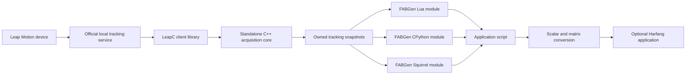

# Leap Motion through FABGen: Engine-Independent Plugin Feasibility

**Date:** 6 October 2026  
**Status:** Feasibility study and proposed API; no production plugin implemented.  
**Baseline:** [Leap Motion: Native C/C++ Integration Guide](SPECS_Leap_Motion_Native_CPP_Integration_Guide.md).  
**Primary target:** Windows x64, original Leap Motion Controller, official local tracking service.  
**Secondary target:** macOS arm64 after Windows validation.  
**Languages:** Lua, CPython, Squirrel.  
**Constraint:** No technical dependency on Harfang; exchange numerical vectors, rotations and matrices.

## 1. Feasibility verdict

**Proceed with a standalone C++ library over LeapC, with three native modules generated from one FABGen binding description.** Harfang should be an optional application consuming those modules through small script adapters.

The acquisition library, public data types, generated bindings and standalone examples can all build without Harfang. The library still requires LeapC and the official Ultraleap tracking service for live tracking. FABGen generates the language boundary; it does not acquire camera data or implement hand recognition.

| Requirement | Assessment | Main condition |
| --- | --- | --- |
| Read hands while Harfang renders | Feasible | Dedicated native acquisition thread and synchronized snapshots |
| Lua API | High confidence | Build against the same Lua ABI as the host |
| CPython API | High confidence | Validate extension packaging and interpreter versions |
| Squirrel API | Feasible with additional host work | Use the existing local FABGen backend and a compatible native-module loader |
| No Harfang dependency | Straightforward architectural choice | Own the math types; convert scalar components at the application boundary |
| Responsive interactive input | Plausible, unmeasured | Measure latency, stale-data behavior and binding overhead with hardware |
| Hard real-time guarantees | Not supported by this design | Desktop OS scheduling, USB, vendor service and script garbage collection remain involved |

The principal risks are object ownership, reconnection behavior, coordinate conversion and runtime packaging. Creating a new Squirrel generator is **not** on the critical path: this workspace already contains one.

Recommended scope for the first release: one selected device, one user with up to two hands, latest-frame consumption, palm and full finger/arm data, connection diagnostics, and independent console examples in all three languages.

## 2. Evidence and limits of this study

### 2.1 Local source inspection

The inspected revisions were:

| Repository | Commit |
| --- | --- |
| `harfang3d` | `b8c7de675e36714f4a38e0c670994d77ff92c3db` |
| `FABGen` | `0a56627085ac0298ded11da4402100854de16694` |

Both worktrees were clean before this document was added. The following conclusions come from source inspection, not from assumptions about upstream FABGen releases:

| Evidence | Consequence |
| --- | --- |
| [FABGen command-line driver](../../FABGen/bind.py) exposes `--lua`, `--cpython`, `--squirrel` and `--prefix` | A shared description can generate all three modules; public helper symbols can have a plugin-specific prefix |
| [Squirrel generator](../../FABGen/lang/squirrel.py), [standard converters](../../FABGen/lib/squirrel/std.py), and [test harness](../../FABGen/tests.py) exist | Squirrel support is implemented in this checkout; pin this fork/revision |
| [Lua generator](../../FABGen/lang/lua.py) emits `luaopen_<module>` | Normal Lua native-module loading is available |
| [CPython generator](../../FABGen/lang/cpython.py) emits `PyInit_<module>` and defines `Py_LIMITED_API` | A native Python extension is supported; broad binary compatibility still needs packaging validation |
| [Squirrel launcher](../languages/hg_squirrel/launcher.cpp) resolves `sqmodule_<module>` | The local `hg_squirrel` host already has a relevant loader convention |
| [Harfang bindings](../binding/bind_harfang.py) expose `Vec3`, the 12-scalar `Mat4` constructor, and `Transform.SetWorld` | A script can construct Harfang values without sharing native types |

The local Lua header identifies **Lua 5.4.4**; the vendored Squirrel sources identify **Squirrel 3.2**. These are integration targets for this workspace, not claims that one binary works with every Lua or Squirrel runtime. See [Lua headers](../extern/lua/src/lua.h), [Squirrel headers](../extern/squirrel/include/squirrel.h), and [Squirrel numeric configuration](../extern/squirrel/include/sqconfig.h).

### 2.2 Generation probe performed

A temporary binding description outside the repository was run with Python 3.12 and the local FABGen revision. It covered a noncopyable `Tracker`, a caller-owned `FrameBuffer`, `Hand`, `Vec3`, `Mat4`, signed 64-bit fields, value-returning accessors, and `bool read_latest(FrameBuffer&)`.

All three generators completed successfully. Inspection of their generated C++ confirmed:

- Entry points `luaopen_leap_input`, `PyInit_leap_input` and `sqmodule_leap_input`.
- A normal reference parameter produces `_self->read_latest(*arg0)` and one Boolean return.
- Value-returning hand, vector and matrix accessors use FABGen's `Copy` ownership policy.
- Generated tracker destruction calls the C++ destructor.

The probe also confirmed why direct nested-member bindings need care: [FABGen's member binding implementation](../../FABGen/gen.py) derives a reference-returning getter. The proposed API therefore uses value-returning accessors for nested objects.

**This was generation and emitted-source inspection only.** No plugin was compiled, loaded into an interpreter, benchmarked, or connected to hardware. The default Windows SDK header path from the baseline guide was absent on this machine; custom installations were not exhaustively searched. No vendor software was installed or device configuration changed.

### 2.3 Vendor information checked

The original-controller download page lists Hyperion 6.2.0 packages for Windows and Apple Silicon, consistent with the baseline guide. Package availability supports the proposed platform plan; it does not validate the user's particular controller. [Ultraleap downloads](https://www.ultraleap.com/downloads/leap-controller/).

LeapC documents a polling loop, SDK-owned event data and hand/bone structures. Those are sufficient primitives for the proposed wrapper. [Using LeapC](https://docs.ultraleap.com/api-reference/tracking-api/leapc-guide/using-leapc.html), [LeapC functions](https://docs.ultraleap.com/api-reference/tracking-api/group/group___functions.html), [hand data](https://docs.ultraleap.com/api-reference/tracking-api/struct/struct_l_e_a_p___h_a_n_d.html).

## 3. Architecture and dependency boundary



Use a working package name such as `leap_input`, with native C++ types in namespace `li`. It is a language extension that happens to be usable alongside Harfang, rather than a Harfang engine plugin.

| Layer | Allowed dependencies | Responsibility |
| --- | --- | --- |
| Public data/API headers | Standard C++ headers | Owned values, snapshots, lifecycle and diagnostics |
| Native live backend | Standard C++, OS facilities, LeapC | Service connection, event processing, normalization and publication |
| Generated language module | Core and selected language C API | Conversion, object ownership, errors and module initialization |
| Optional script adapter | `leap_input` and `harfang` | Convert numbers, apply calibration, update scene objects |
| Test/replay backend | Core data contract | Deterministic input without a device or vendor service |

The first three layers must have no `hg::` types, Harfang headers, engine libraries, asset compiler, scene objects, renderer, or dependency on Harfang's CMake project. Do not use FABGen `extern` types to import `hg::Vec3` or `hg::Mat4`.

The core can be a private static library linked into each language module. Three modules built from the same implementation do not imply one universal binary. Supporting several language VMs in the same process with one shared tracker would require an explicit ownership arrangement and is outside the MVP.

Use C++17 as a project baseline. Hide LeapC handles and worker implementation behind an opaque implementation object. Avoid exposing a separately distributed C++ binary ABI initially; if unrelated native clients later need one, add a versioned C interface with opaque handles and explicitly sized records.

## 4. Acquisition, synchronization and lifetime

### 4.1 Native acquisition

One worker owns each connection and executes the create/open/poll/close/destroy lifecycle. LeapC event pointers expire at the next poll or when the associated connection/device closes; polling the same connection concurrently is invalid. Copy selected fields and pointed-to hand data before continuing the poll loop. Copying only `LEAP_TRACKING_EVENT` would retain SDK pointers. [LeapC polling contract](https://docs.ultraleap.com/api-reference/tracking-api/group/group___functions.html).

Recommended implementation policy:

1. `start()` creates the worker and returns without waiting for a hand or device; readiness is asynchronous.
2. Use a finite poll timeout, initially around 20 ms, to keep shutdown and command handling responsive. A returned event is processed immediately.
3. Build a complete application-owned snapshot in worker-private memory.
4. Publish it under a short mutex, along with connection state and an epoch number.
5. Continue polling independently of the render rate. Consumers read the latest completed snapshot and may skip intermediate tracking frames.
6. Handle status events and reconnect with bounded backoff; do not spin on a disconnected service.

A short mutex around a fixed-size copy is the first implementation to benchmark. Do not hold it during SDK calls, allocation, logging or script execution. `read_latest()` does not wait for a new event, but mutex contention can still delay it; there is no hard timing guarantee. If measurements require a non-waiting path, use `try_lock` and retain the previous coherent snapshot while still checking its age.

A two-buffer arrangement with only an atomic active index is insufficient if the producer can overwrite a buffer still being read. Use actual ownership or synchronization before considering a lock-free replacement.

### 4.2 State, freshness and identity

Expose states such as `Stopped`, `Connecting`, `ServiceConnected`, `DeviceReady`, `Reconnecting` and `Error`. Keep tracking validity separate: a valid, current frame containing **zero hands** is different from a missing, stale or disconnected stream.

The proposed snapshot contains a plugin publication sequence and connection/device epoch, separate from the SDK frame ID. Reset hand-dependent application state on epoch changes, disappearance or stale data. Use `(epoch, device_id, hand_id)` as the tracking identity; a reacquired physical hand can receive a new SDK ID. The documented `confidence` field is not a useful quality indicator because it is currently fixed at 1.0. [LEAP_HAND](https://docs.ultraleap.com/api-reference/tracking-api/struct/struct_l_e_a_p___h_a_n_d.html).

Initially use a configurable stale threshold of **100 ms** as an application policy to evaluate, not as a sensor specification. Invalidate actionable poses on device/service loss immediately, and on expiry even if no new event arrives. Never preserve the last pinch indefinitely after tracking stops.

Retain both SDK capture time and a local monotonic receive time. Calculate source age at receipt in the Leap clock domain, then add elapsed host monotonic time when reading. Do not subtract a Harfang clock value from a Leap timestamp. This also detects old queued frames that have only just arrived.

### 4.3 Script ownership and shutdown

The worker never calls Lua, CPython, Squirrel, or Harfang APIs. Script objects are created and accessed only on their owning VM thread. The native worker does not need the Python GIL because it handles only native storage.

`FrameBuffer` owns its copied contents. `get_hand()`, `get_bone()`, `get_palm_position()` and `get_palm_pose()` return independent values; keeping their results after another read or after `stop()` remains safe. Do not expose raw SDK pointers or references into a reusable producer buffer. Do not assume a wrapper for a nested member automatically keeps its parent alive.

Make `Tracker` noncopyable. `stop()` must be idempotent: request cancellation, join the worker, and finish connection cleanup in a defined order. The destructor provides the same cleanup as a fallback, but examples call `stop()` explicitly. Join workers before unloading the native library and keep module code loaded until VM objects have been destroyed. The local Squirrel launcher already closes its VM before unloading native modules; confirm the complete lifecycle for a new standalone host.

For Python, assess GIL release around any potentially slow start/stop operation explicitly; FABGen generation alone does not establish that behavior. Initially support one conventional interpreter/VM per module instance; Python subinterpreters and free-threaded Python require separate audits.

## 5. Engine-independent data contract

### 5.1 Public values

The following names and fields are a **proposed** contract, not currently available plugin functions.

| Value | Contents and meaning |
| --- | --- |
| `Vec3` | Three float32 values `x`, `y`, `z` |
| `Quat` | Float32 `x`, `y`, `z`, `w`; identity `(0,0,0,1)`; normalized rotation |
| `Mat4` | Sixteen float32 values, column-major serialization; `get(row, column)` uses zero-based mathematical indices |
| `Bone` | Validity, previous/next joint positions, width, length, orientation and a pose accessor |
| `Hand` | Validity, ID, handedness, palm pose/velocity, normal/direction, five digits, arm, pinch/grab values |
| `FrameBuffer` | Validity, sequence, epoch, device ID, SDK frame ID/timestamp, age, hand count and owned hand records |
| `Status` | Connection state, last error, device information, received/published frame counts, overflow and reconnect counters |

Scalar properties can be read-only in scripts. Nested records use value-returning methods. An invalid index is a programming error translated into the target language's error mechanism; check indices in the native facade before accessing storage. Optional bulk-copy accessors can later fill caller-owned storage if profiling shows excessive wrapper allocation.

Use five explicit digit identifiers and four bone identifiers per digit. Preserve the SDK's four-bone thumb representation, including its zero-length metacarpal; do not normalize a zero-length segment when deriving direction. The arm is an additional bone record. A rigged model may have different joints and bind poses, so skeleton retargeting remains application work. [Leap concepts](https://docs.ultraleap.com/api-reference/tracking-api/leapc-guide/leap-concepts.html).

For the MVP, reserve two hand slots and support one selected device. This is a product limit, not an assertion about every service capability. If more hands are reported, retain previously selected IDs where possible, choose remaining candidates deterministically, and expose truncation. Do not rely on array position as identity. Multi-device fusion is a separate extension.

### 5.2 Units and transforms

The core should normalize all distances to **meters** and velocities to **meters per second**, while retaining Leap's right-handed sensor axes. Angles remain radians, and SDK timestamps remain signed 64-bit microseconds. Leap itself reports distances in millimeters and time in microseconds. [Coordinate system and units](https://docs.ultraleap.com/api-reference/tracking-api/leapc-guide/leap-concepts.html).

Matrix contract:

```text
p_parent = M_parent_from_local * [p_local.x, p_local.y, p_local.z, 1]^T
M = [ R00 R01 R02 tx ]       array index = column * 4 + row
    [ R10 R11 R12 ty ]       translation indices = 12, 13, 14
    [ R20 R21 R22 tz ]       affine bottom row = 0, 0, 0, 1
    [  0   0   0  1 ]
```

Matrices represent poses in sensor space, not parent-relative rig animation. `get_palm_pose()` uses palm position as origin and the SDK palm orientation. The documented palm basis is `{normal cross direction, -normal, -direction}`. [LeapC structures](https://docs.ultraleap.com/api-reference/tracking-api/group/group___structs.html).

For a bone pose, choose `prev_joint` as the origin and convert its SDK rotation into the matrix; preserve `next_joint` and length separately. The SDK documents the rotation and endpoints, but the application's model axes still require a calibration test before attaching meshes. [LEAP_BONE](https://docs.ultraleap.com/api-reference/tracking-api/struct/struct_l_e_a_p___b_o_n_e.html).

Declare quaternion multiplication and matrix conversion consistently, test them against known rotations, and avoid Euler angles at the interface. Reject nonfinite input and guard degenerate orientations. A pose must not silently turn into a scaled or reflected matrix.

### 5.3 Conversion to Harfang

Harfang documents a left-handed coordinate system with X right, Y up and Z away from the viewer, and meter units. Its `Mat4` stores an affine transform with 12 floats, despite its name. See [Harfang coordinate conventions](../doc/doc/man.CoordinateAndUnitSystem.md) and [Mat4 declaration](../harfang/foundation/matrix4.h).

For a desktop sensor aligned with the chosen application axes, let `C = diag(1, 1, -1)`. From an already normalized plugin pose `(R, p)`:

```text
p_hg = C * p
R_hg = C * R * inverse(C)
T_world_from_hand = T_world_from_sensor * [R_hg, p_hg; 0, 1]
```

The conjugation converts both the sensor basis and the local pose basis. Applying only `C * R` introduces a reflection and is unsuitable as a pure rotation. An application's mesh bind-pose correction is a separate transform. Convert velocity and direction using `C` without translation. A sensor mount or headset pose must be supplied explicitly; selecting an HMD tracking mode does not provide the headset's world pose.

Example: an SDK point `(100, 200, 300)` mm becomes `(0.1, 0.2, 0.3)` in the plugin and `(0.1, 0.2, -0.3)` in an aligned Harfang scene. Unit conversion happens once, inside the core.

This Lua adapter uses the existing 12-scalar Harfang constructor. `m` is a proposed plugin `Mat4`; its accessors are not Harfang functions:

```lua
local function to_hg_pose(hg, m)
    return hg.Mat4(
         m:get(0, 0),  m:get(1, 0), -m:get(2, 0),
         m:get(0, 1),  m:get(1, 1), -m:get(2, 1),
        -m:get(0, 2), -m:get(1, 2),  m:get(2, 2),
         m:get(0, 3),  m:get(1, 3), -m:get(2, 3))
end

-- In an application that owns these Harfang objects:
-- transform:SetWorld(sensor_world * to_hg_pose(hg, hand:get_palm_pose()))
```

Python and Squirrel use the same scalar mapping with their own call syntax. For positions, construct `hg.Vec3(p.x, p.y, -p.z)` before applying the sensor's world transform.

**Do not reinterpret memory or pass a plugin `Vec3` directly to a function expecting `hg::Vec3`.** Similar shape and a common binding generator do not imply matching type tags, ABI, matrix storage or lifetime. The small numerical copy is deliberate and preserves independence.

## 6. Proposed scripting API

The common facade should stay small:

```cpp
namespace li {
class Tracker {                       // noncopyable; owns worker and connection
public:
    Tracker();
    ~Tracker();
    bool start();                    // worker started; device readiness is asynchronous
    void stop();
    bool read_latest(FrameBuffer &destination);
    Status get_status() const;       // owned value
};

// On FrameBuffer: Hand get_hand(int index) const;
// On Hand: Vec3 get_palm_position() const;
//          Mat4 get_palm_pose() const;
//          Bone get_bone(int digit, int bone) const;
}
```

`read_latest()` returns true when it copies a newer tracking frame, including a frame with zero hands. It returns false if there is no newer tracking frame. **On every call**, refresh validity, age and current state: false must not imply that a previously valid hand remains usable. Clear validity and hand count when disconnected, stopped, not yet initialized or stale. A recent unchanged frame can remain valid.

Initialize a new `FrameBuffer` with `valid = false` and `hand_count = 0`. Scope its sequence comparison to its tracker and epoch. Status errors are owned numeric codes plus copied diagnostic text; expected timeouts/disconnections should not throw every render frame.

Bind the destination as a normal class reference:

```python
tracker = gen.begin_class('li::Tracker', noncopyable=True, bound_name='Tracker')
gen.bind_method(tracker, 'read_latest', 'bool', ['li::FrameBuffer &destination'])
```

Avoid `arg_out`/`arg_in_out` for this call. They add returned values, and the local Squirrel generator packages multiple results into an array, whereas Lua and Python have different return conventions. One caller-owned buffer and one Boolean keep semantics consistent.

These examples illustrate the proposed API. Each `update_input` function is called once per host update; the application owns the loop and cleanup path.

### Lua

```lua
local leap = require("leap_input")
local tracker = leap.Tracker()
local frame = leap.FrameBuffer()
assert(tracker:start())

local function update_input()
    tracker:read_latest(frame)
    if frame.valid and frame.hand_count > 0 then
        local hand = frame:get_hand(0)
        local p = hand:get_palm_position()
        -- Consume p.x, p.y, p.z or hand:get_palm_pose().
    end
end

-- Call tracker:stop() from the application's guaranteed cleanup path.
```

### Python

```python
import leap_input as leap

tracker = leap.Tracker()
frame = leap.FrameBuffer()
assert tracker.start()

def update_input():
    tracker.read_latest(frame)
    if frame.valid and frame.hand_count > 0:
        hand = frame.get_hand(0)
        p = hand.get_palm_position()
        # Consume p.x, p.y, p.z or hand.get_palm_pose().

# Put the host loop in try/finally and call tracker.stop() in finally.
```

### Squirrel

```squirrel
// Requires a host providing the sqmodule_<name> loading convention.
local leap = require("leap_input");
local tracker = leap.Tracker();
local frame = leap.FrameBuffer();
assert(tracker.start());

local update_input = function() {
    tracker.read_latest(frame);
    if (frame.valid && frame.hand_count > 0) {
        local hand = frame.get_hand(0);
        local p = hand.get_palm_position();
        // Consume p.x, p.y, p.z or hand.get_palm_pose().
    }
};

// Call tracker.stop() on normal exit and in the host's error cleanup path.
```

Getter indices are zero-based in all languages, including Lua; they are method arguments rather than native Lua table indices. Absolute IDs/timestamps use signed 64-bit integers. Require 64-bit `lua_Integer` and `SQInteger` in supported builds; never route absolute microsecond timestamps through Squirrel's default float32 numeric path. Expose small relative durations separately for convenience.

## 7. Build, loading and distribution

### 7.1 Standalone project layout

```text
leap-input/
  CMakeLists.txt
  cmake/FindLeapC.cmake
  include/leap_input/       # public API and owned values; no SDK/engine includes
  src/                     # lifecycle, snapshot store, LeapC backend
  bindings/bind_leap_input.py
  hosts/squirrel/          # optional independent host with native-module loading
  examples/standalone/     # Lua, Python, Squirrel
  examples/harfang/        # optional script adapters and visualizers
  tests/                   # fixtures, fake backend, lifecycle and contract checks
  build/                   # generated bindings and binaries; not editable source
```

Generation commands, run from this proposed project root with configured paths:

```text
python <FABGEN_ROOT>/bind.py bindings/bind_leap_input.py --lua --prefix leap_input --out build/generated/lua
python <FABGEN_ROOT>/bind.py bindings/bind_leap_input.py --cpython --prefix leap_input --out build/generated/python
python <FABGEN_ROOT>/bind.py bindings/bind_leap_input.py --squirrel --prefix leap_input --out build/generated/squirrel
```

Use distinct module output directories because Lua and Squirrel can both produce a file named `leap_input.dll`. Keep generated helper symbols hidden where possible and use the plugin prefix to reduce collisions with Harfang's generated binding. `gen.start('leap_input')` controls the language module name; the helper prefix is a separate concern.

FABGen and its Python dependencies are build tools, not end-user runtime dependencies. The local generator imports `pypeg2`; use a pinned generator environment instead of installing every old testing dependency from its historical requirements file uncritically.

### 7.2 Language-specific packaging

| Target | Module boundary | Packaging work |
| --- | --- | --- |
| Lua | `luaopen_leap_input` | Match Lua version, architecture and numeric configuration; Windows DLL linkage must use the host-compatible Lua runtime |
| CPython | `PyInit_leap_input` | Ship an extension/wheel for validated OS/architecture/interpreter combinations; audit Limited API usage before choosing `abi3` tags |
| Squirrel | `sqmodule_leap_input` | Match Squirrel ABI, `_SQ64`, `SQUSEDOUBLE` and character configuration; supply a loader or embed registration in the host |

The local FABGen README predates its Squirrel support and makes broad historical CPython compatibility claims. The emitted Limited API definition is evidence of intent, not a complete test matrix. Start with the available Python 3.12 environment and explicitly declare additional tested versions. Do not promise PyPy, subinterpreters or free-threaded builds from this study.

Squirrel's language/runtime should not be assumed to provide a universal Lua-style native `require`. The existing [Harfang Squirrel feasibility study](SPECS_SQUIRREL_LANG_INTEGRATION_FEASIBILITY.md) and launcher show the chosen host convention. Provide a small independent host implementing the same convention, or document host-side registration. Users may also load the plugin from `hg_squirrel`; that is a consumer option, not a build dependency.

The loader must keep libraries alive through VM destruction. Use the same compatible Squirrel runtime instance as the host; do not accidentally link another private interpreter copy into the module. On macOS, explicitly reconcile filenames with the loader: the current Squirrel launcher searches `.dylib`, while other language modules commonly use `.so`.

### 7.3 SDK and platform deployment

Start with normal linking against a matching LeapC client library. On Windows, the architecture-compatible DLL must be discoverable when the language imports the module; a missing DLL can cause an import error before `Tracker` exists. A missing service, by contrast, can be reported through tracker status. Delayed loading is an optional later improvement if import-without-LeapC is required.

Keep headers, client library and service from a validated combination. The baseline guide documents the SDK/client transition around Gemini 5.2; source compatibility does not imply arbitrary binary compatibility. Record exact runtime and SDK versions with each release. [Ultraleap migration guide](https://docs.ultraleap.com/hand-tracking/gemini-migration.html).

For macOS arm64, validate native library architecture, install names, runtime search paths, signing and actual device tracking. The common API need not change. Linux can follow with the same architecture, but is not part of the first acceptance gate.

The [local FABGen README](../../FABGen/readme.md) states that the generator is GPLv3 and its output is not subject to that license. Keep generator licensing distinct from generated modules, copied support code, interpreter licenses, and Ultraleap redistribution terms. Package vendor binaries only under applicable terms; installing the official service remains a separate prerequisite. This study does not establish a new redistribution grant.

## 8. Performance and interaction behavior

Hand tracking is a small numerical stream compared with images. As a planning envelope, a 16 KiB snapshot at an assumed 120 updates/s represents about **1.9 MiB/s per full copy**. Two copies are about 3.8 MiB/s. These are arithmetic estimates, not measured frame rates or an actual struct-size audit.

The likely optimization targets are repeated cross-language calls, object allocation, synchronization tails and unnecessary conversion, rather than byte-copy bandwidth alone. Reuse `FrameBuffer`; copy only the values needed by the application; avoid constructing nested dictionaries/tables every render frame. Full skeleton rendering may justify a reusable bulk buffer after profiling.

Provisional acceptance budgets on an agreed reference PC:

| Measure | Initial target, subject to measurement |
| --- | --- |
| `read_latest()` p99 execution time | Below 0.5 ms |
| Read and convert two full hands to script/application data, p99 | Below 1 ms |
| Sustained application run | 60 Hz for 30 minutes with no unbounded plugin memory growth |
| Stop during ordinary operation | Below 250 ms, including bounded poll wait |
| Stale-input handling | Actionable poses invalidated by the configured timeout plus one host update |

Measure service/USB tracking age, plugin processing time, script consumption and render/display delay separately. These budgets concern application overhead; they do not guarantee motion-to-photon latency or vendor-service CPU usage. Report median, p95, p99, worst stalls, frame gaps and reconnect counts.

Use latest samples for the MVP. Interpolation/extrapolation can be added later, with explicit clock synchronization, target time and fallback when history is unavailable. LeapC provides clock-rebasing and frame-interpolation examples. [Interpolated frames example](https://docs.ultraleap.com/api-reference/tracking-api/examples/interpolated-frames-example.html).

Expose pinch/grab scalars without declaring them application events. A script can add hysteresis, for example pinch-on at 0.8 and pinch-off at 0.6, with state keyed by hand identity and cancelled on tracking loss. These thresholds are tunable design defaults. Latest-only consumption may miss a brief transition between render frames; applications needing every transition should add a bounded native event queue with overflow reporting. Such a queue is separate from the pose snapshot.

## 9. Alternatives and why this scope fits

| Approach | Benefit | Tradeoff for this requirement |
| --- | --- | --- |
| Standalone C++ facade + FABGen | One data/ownership contract for all three languages | Requires native packaging per runtime |
| Bind raw LeapC declarations directly | Less initial facade code | Exposes event pointers, unions, lifetime rules and SDK changes to scripts |
| Official Python CFFI bindings | Useful Python-only prototype and diagnostic reference | Does not provide the same Lua/Squirrel API; a shared standalone facade would still be needed |
| Legacy LeapCxx/SWIG route | Can help preserve an existing old Leap API application | Adds a legacy object model and a different binding toolchain |
| Add Leap directly to Harfang bindings | Convenient engine-native math objects | Violates the requested independence |
| Separate tracking process with IPC | Process isolation and several consumers | Protocol, deployment and latency work unnecessary for the first in-process plugin |

The Python and legacy-wrapper options are described in the baseline guide and their official repositories: [leapc-python-bindings](https://github.com/ultraleap/leapc-python-bindings), [LeapCxx](https://github.com/leapmotion/LeapCxx). They are useful references, not required dependencies of this design.

## 10. Delivery plan and effort estimate

Estimates are engineering judgment for one developer familiar with C++, CMake and FABGen, with a working controller and tracking installation available. They are not measurements or fixed commitments.

| Phase | Deliverable and exit condition | Estimated effort |
| --- | --- | --- |
| 0. Hardware/SDK baseline | Native console receives both hands; exact device/runtime versions recorded | 0.5-1 day |
| 1. Standalone core | Owned snapshots, unit conversion, lifecycle, reconnection and fake-input path | 2-3 days |
| 2. Lua and Python | Two loadable modules and independent scripts using the same contract | 1.5-2.5 days |
| 3. Squirrel | Loadable module and independent compatible host, lifecycle validation | 1.5-3 days |
| 4. Harfang demonstration | Optional adapters, palm axes and bone-line visualization, calibration checks | 1-2 days |
| 5. Reliability and packaging | Disconnect/stale/GC checks, soak measurements, installation instructions | 2-3 days |
| **Windows MVP total** | All three languages plus optional Harfang demonstration | **8.5-14.5 engineer-days** |
| macOS arm64 follow-up | Build, packaging and hardware validation on a Mac | **Additional 2-4 days** |

A focused C++ plus one-language demonstration should be achievable earlier; the complete three-language package needs the ABI and shutdown work above. Additional SDK installation problems, redistribution review, generator defects or unavailable hardware can extend the schedule. Full hand-rig retargeting, multi-device tracking and historical gesture recognition are not included.

## 11. Validation gates and risks

### Required acceptance checks

1. **Independence:** configure and build from a standalone checkout without Harfang source, libraries or environment variables. Standalone scripts must run without importing Harfang.
2. **Binding parity:** feed the same synthetic frame through Lua, Python and Squirrel; compare positions, matrices, IDs, timestamps and empty-frame behavior. Verify large integer precision.
3. **Ownership:** retain a hand, bone, vector and matrix across new reads, garbage collection and tracker shutdown. Their values remain accessible and unchanged. Exercise VM teardown with live tracker objects.
4. **Tracking lifecycle:** zero/one/two hands, disappearance/reacquisition, USB unplug/replug, service restart, no device at startup, repeated start/stop, stale queued frames and capacity overflow.
5. **Spatial contract:** known millimeter inputs, translation, identity, 90-degree rotations, matrix serialization, positive rotation determinant, handedness round trip, zero-length thumb bone and a nonidentity sensor mount.
6. **Harfang coexistence:** import modules in both orders, display palms and every bone, verify left/right identity, pinch reset, correct scale, camera movement and cleanup under rendering load.
7. **Performance:** record the agreed latency and memory metrics for each language; do not infer one runtime's results from another's.
8. **Deployment:** test supported packages outside the developer environment, including missing service and missing client-library diagnostics. Repeat platform gates on actual Apple Silicon hardware before claiming support.

| Risk | Impact | Proposed mitigation |
| --- | --- | --- |
| SDK pointers or borrowed member wrappers escape | Corruption/crashes after another frame or GC | Owned snapshots and value-returning nested accessors |
| Worker outlives module/VM | Crash or hang at exit | Explicit stop, joining destructor, loader lifetime discipline |
| Coordinate or unit mismatch | Mirrored, rotated or incorrectly scaled hands | Written numerical contract and known-pose fixtures |
| Local Squirrel fork assumed to exist upstream | Reproducibility failure | Pin the inspected FABGen fork/commit |
| Interpreter ABI mismatch | Load failure or runtime corruption | Separate builds and a declared runtime matrix |
| Old pose survives disconnection | Stuck interaction | Independent freshness checking and state cancellation |
| Tracking service competes with rendering | Missed application frame budget | Measure total machine load with the actual scene |
| Proprietary tracking stack changes | Deployment/preservation failure | Archive permitted installers, version manifest and replay fixtures |

**Decision gate:** implement the Windows standalone prototype first. Proceed to packaging only after live tracking, owned snapshots and one-language loading pass. The evidence supports the architecture and availability of all three generators; compiled interoperability, hardware behavior and performance remain the work needed to turn this feasibility result into a supported plugin.
